# Aerospace Reliability Patterns for Agentic Systems

**Extending the Unified Theory with Mission-Critical Fault Tolerance**

---

## Abstract

This document extends the [Unified Theoretical Framework](10_UNIFIED_THEORY.md) with **aerospace-grade reliability engineering principles**. By incorporating NASA/ESA heritage from 40+ years of mission-critical systems, we transform the 4-dimensional design space into a **5-dimensional space** that formally captures fault tolerance strategies.

**Key Contributions:**

1. **5th Dimension (D₅)**: Fault Tolerance Strategy = {None, Retry, Redundant, FDIR}
2. **FDIR Semantics**: Formal Fault Detection, Isolation, and Recovery for agents
3. **ECSS E1-E4 Mapping**: European Space Agency autonomy levels mapped to agent patterns
4. **Reliability-Aware Operators**: Extended composition algebra with fault tolerance
5. **Complete Pattern Library**: Retry, Circuit Breaker, TMR, Voting, Fallback, Health Monitor

The extended framework transforms agentic design from **best-effort systems** to **mission-critical deployments** with provable reliability properties.

**Target Audience**: System architects building production AI agents requiring high availability, fault tolerance, and graceful degradation.

> **Note on Theorem Numbering:** This document continues theorem numbering from [10_UNIFIED_THEORY.md](10_UNIFIED_THEORY.md), which contains Theorems 1-6. Theorems in this document are numbered 7-16 to maintain consistency across the unified framework.

---

## Table of Contents

1. [Introduction](#i-introduction)
2. [The 5-Dimensional Design Space](#ii-the-5-dimensional-design-space)
3. [FDIR Semantics for Agentic Systems](#iii-fdir-semantics-for-agentic-systems)
4. [Reliability-Aware Composition Operators](#iv-reliability-aware-composition-operators)
5. [ECSS Autonomy Levels](#v-ecss-autonomy-levels)
6. [Pattern Implementations](#vi-pattern-implementations)
7. [Decision Frameworks](#vii-decision-frameworks)
8. [Application Examples](#viii-application-examples)
9. [Theoretical Properties](#ix-theoretical-properties)
10. [Conclusion](#x-conclusion)
11. [References](#references)

---

### Key Terminology

This document uses precise terminology that distinguishes between related concepts:

| Term | Context | Meaning |
|------|---------|---------|
| **Parallel** | D₁ (Execution) | Concurrent execution topology—agents run simultaneously |
| **Parallel** | Reliability | Failure logic where system fails only if ALL components fail |
| **Sequential** | D₁ (Execution) | Pipeline execution—agents run one after another |
| **Series** | Reliability | Failure logic where system fails if ANY component fails |
| **Redundant** | D₅ (Fault Tolerance) | Replicated execution for fault tolerance (e.g., TMR) |
| **Redundancy** | General | Any duplication for reliability (may include spares, backups) |
| **;f** | Operator | Fallback composition—try first agent, then second on failure |
| **⊗ᵣ** | Operator | Redundant parallel—voting over concurrent replicas |
| **★ᵣ** | Operator | Resilient iteration—loop with retry/timeout protection |

> **Note:** When reading reliability formulas, "series" and "parallel" refer to *failure logic*, not execution topology. See Section IV.3 for details.

---

## I. Introduction

### 1.1 Motivation: From Best-Effort to Mission-Critical

The [Unified Theoretical Framework](10_UNIFIED_THEORY.md) established a rigorous mathematical foundation for agentic design patterns. However, as Section X.4 explicitly acknowledges:

> **"Fault Tolerance: Extend theory to handle agent failures and retries"**

This gap becomes critical when deploying agents in production environments where:

- **API failures** occur (rate limits, timeouts, service outages)
- **LLM hallucinations** produce invalid outputs
- **Cascade failures** propagate through multi-agent systems
- **Partial failures** leave systems in inconsistent states

Aerospace systems have solved these problems for 40+ years. The **Space Shuttle** achieved 99.999% reliability through rigorous fault tolerance engineering. **Mars rovers** operate autonomously for years despite 20-minute communication delays. This document brings that heritage to agentic AI.

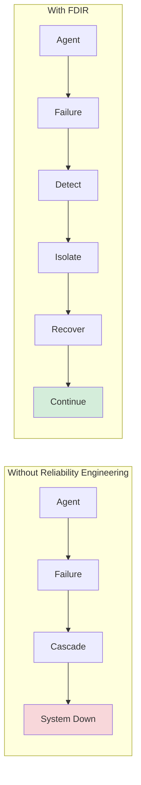
```mermaid
flowchart LR
    subgraph "Without Reliability Engineering"
        A1[Agent] --> F1[Failure]
        F1 --> C1[Cascade]
        C1 --> X1[System Down]
    end

    subgraph "With FDIR"
        A2[Agent] --> F2[Failure]
        F2 --> D2[Detect]
        D2 --> I2[Isolate]
        I2 --> R2[Recover]
        R2 --> OK2[Continue]
    end

    style X1 fill:#f8d7da
    style OK2 fill:#d4edda
```

*Figure 1: Unprotected vs FDIR-protected agent systems.*

### 1.2 Aerospace Heritage

#### FDIR: Fault Detection, Isolation, and Recovery

**FDIR** is the standard approach for autonomous fault management in spacecraft, defined by NASA and ESA over decades of space missions:

| Phase | Function | Aerospace Example | Agent Equivalent |
|-------|----------|-------------------|------------------|
| **Detection** | Identify anomaly | Sensor out of range | API timeout, invalid response |
| **Isolation** | Contain failure | Disconnect failed thruster | Mark agent as unhealthy |
| **Recovery** | Restore function | Switch to backup | Retry, fallback, degradation |

#### ECSS-E-ST-70-11C: Autonomy Levels

The **European Cooperation for Space Standardization** defines four autonomy levels (E1-E4) that map directly to agent reliability patterns:

| Level | Name | Description | Agent Equivalent |
|-------|------|-------------|------------------|
| **E1** | Ground Control | Real-time human supervision | No fault tolerance |
| **E2** | Event-Based | Pre-planned contingencies | Retry with backoff |
| **E3** | Goal-Based | Re-planning capability | Redundancy + voting |
| **E4** | Full Autonomy | Complete self-management | Full FDIR pipeline |

Current production agents typically operate at **E1-E2**. This document enables **E3-E4** autonomous operation.

### 1.3 Document Overview

This document extends the Unified Theory by:

1. **Adding D₅** to the 4-dimensional design space (Section II)
2. **Formalizing FDIR** semantics for agents (Section III)
3. **Extending composition operators** with reliability variants (Section IV)
4. **Mapping ECSS levels** to concrete patterns (Section V)
5. **Implementing all patterns** with runnable code (Section VI)
6. **Providing decision frameworks** for pattern selection (Section VII)

**Prerequisites**: Familiarity with [02_CORE_CONCEPTS.md](02_CORE_CONCEPTS.md) and [10_UNIFIED_THEORY.md](10_UNIFIED_THEORY.md).

---

## II. The 5-Dimensional Design Space

### 2.1 Extending the Unified Theory

The original framework defines a 4-dimensional design space:

```
Λ = D₁ × D₂ × D₃ × D₄

Where:
- D₁ (Temporal): {Parallel, Sequential, Iterative}
- D₂ (Communication): {State, Event, Tool}
- D₃ (Decision): {Rule, LLM, Condition}
- D₄ (Tools): {Built-in, Custom, Agent-as-Tool}

|Λ| = 3 × 3 × 3 × 3 = 81 configurations
```

We extend this to a **5-dimensional space**:

```
Λ' = D₁ × D₂ × D₃ × D₄ × D₅

Where:
- D₅ (Fault Tolerance): {None, Retry, Redundant, FDIR}

|Λ'| = 3 × 3 × 3 × 3 × 4 = 324 configurations
```

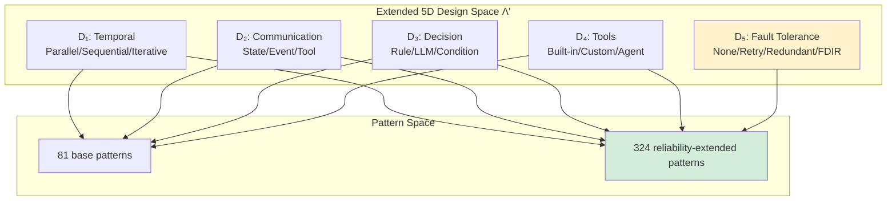
```mermaid
graph TB
    subgraph "Extended 5D Design Space Λ'"
        D1[D₁: Temporal<br/>Parallel/Sequential/Iterative]
        D2[D₂: Communication<br/>State/Event/Tool]
        D3[D₃: Decision<br/>Rule/LLM/Condition]
        D4[D₄: Tools<br/>Built-in/Custom/Agent]
        D5[D₅: Fault Tolerance<br/>None/Retry/Redundant/FDIR]
    end

    subgraph "Pattern Space"
        P1[81 base patterns]
        P2[324 reliability-extended patterns]
    end

    D1 & D2 & D3 & D4 --> P1
    D1 & D2 & D3 & D4 & D5 --> P2

    style D5 fill:#fff3cd
    style P2 fill:#d4edda
```

*Figure 2: The 5-dimensional design space extends the original 4D space with fault tolerance.*

### 2.2 Dimension 5 (D₅): Fault Tolerance Strategy

**D₅ = {None, Retry, Redundant, FDIR}**

D₅ controls **how** an agent handles failures. Each value represents increasing levels of protection:

#### D₅.1: None (No Fault Tolerance)

```
None: A fails → propagate failure
```

**Properties:**
- Default behavior in existing patterns
- Suitable for non-critical, idempotent tasks
- Zero overhead
- Maps to ECSS E1

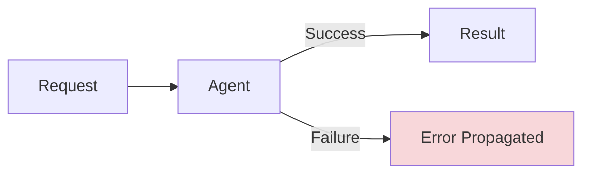
```mermaid
flowchart LR
    Input[Request] --> A[Agent]
    A -->|Success| Output[Result]
    A -->|Failure| Error[Error Propagated]

    style Error fill:#f8d7da
```

*Figure 3: D₅.None - failures propagate immediately.*

#### D₅.2: Retry (Simple Retry with Backoff)

```
Retry(A, n, backoff): A fails → wait(backoff) → retry up to n times
```

**Properties:**
- Handles transient failures (network glitches, rate limits)
- Exponential backoff prevents thundering herd
- Circuit breaker prevents cascade failures
- Maps to ECSS E2

**Formal Definition:**

```
Retry(A, max_attempts, base_delay, max_delay) =
  for i in 1..max_attempts:
    result = execute(A)
    if success(result): return result
    delay = min(base_delay × 2^(i-1) + jitter(), max_delay)
    wait(delay)
  return failure
```

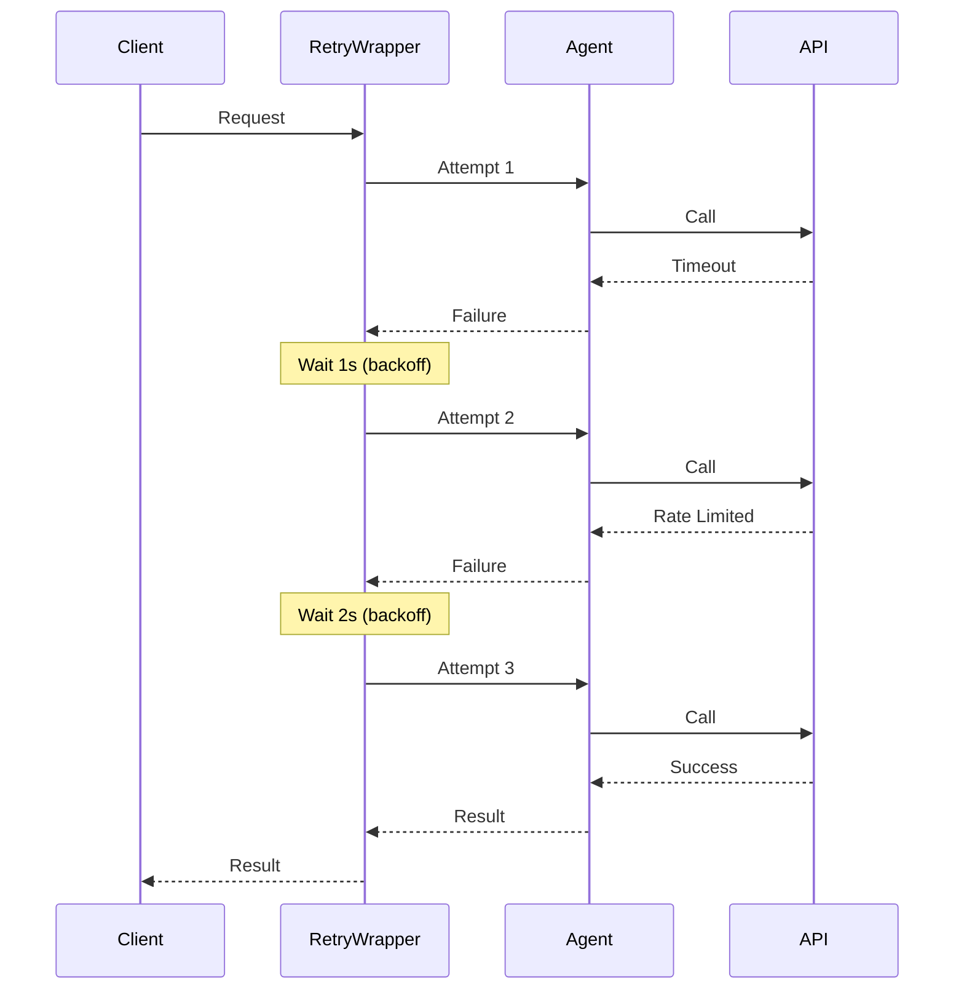
```mermaid
sequenceDiagram
    participant Client
    participant RetryWrapper
    participant Agent
    participant API

    Client->>RetryWrapper: Request
    RetryWrapper->>Agent: Attempt 1
    Agent->>API: Call
    API-->>Agent: Timeout
    Agent-->>RetryWrapper: Failure

    Note over RetryWrapper: Wait 1s (backoff)

    RetryWrapper->>Agent: Attempt 2
    Agent->>API: Call
    API-->>Agent: Rate Limited
    Agent-->>RetryWrapper: Failure

    Note over RetryWrapper: Wait 2s (backoff)

    RetryWrapper->>Agent: Attempt 3
    Agent->>API: Call
    API-->>Agent: Success
    Agent-->>RetryWrapper: Result
    RetryWrapper-->>Client: Result
```

*Figure 4: D₅.Retry - exponential backoff with jitter.*

#### D₅.3: Redundant (N-Modular Redundancy)

```
Redundant(A₁, A₂, ..., Aₙ, vote): Execute all → vote(results) → consensus
```

**Properties:**
- Tolerates minority **fail-stop** failures (TMR tolerates 1 of 3 crashes/omissions)
- Detects **fail-noisy** faults via disagreement (anomaly detection)
- Higher cost (N× API calls)
- Maps to ECSS E3

> **Note on Byzantine Faults:** TMR with simple majority voting tolerates fail-stop and fail-noisy faults, but NOT true Byzantine faults (where a malicious agent sends different values to different parties). For Byzantine Fault Tolerance (BFT), N ≥ 3f+1 agents are required to tolerate f Byzantine failures, using protocols like PBFT. TMR (N=3) can tolerate at most f=0 true Byzantine failures.

**Voting Strategies:**

| Strategy | Description | Use Case |
|----------|-------------|----------|
| Majority | >50% agreement | General reliability |
| Unanimous | 100% agreement | High-stakes decisions |
| Weighted | Confidence-weighted | Mixed-quality agents |
| LLM-Judge | LLM selects best | Quality-focused |

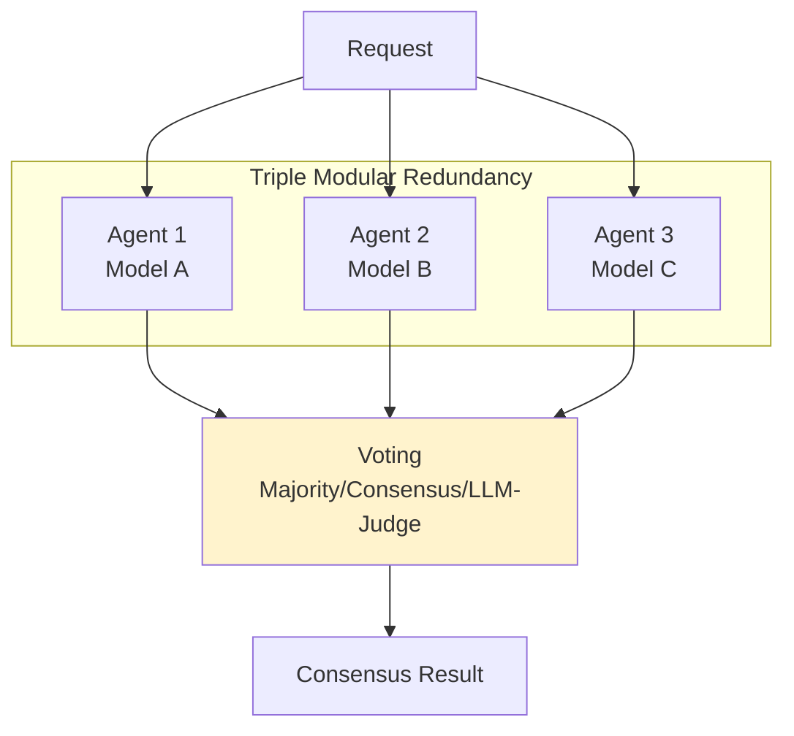
```mermaid
flowchart TB
    Input[Request]

    subgraph "Triple Modular Redundancy"
        A1[Agent 1<br/>Model A]
        A2[Agent 2<br/>Model B]
        A3[Agent 3<br/>Model C]
    end

    Vote[Voting<br/>Majority/Consensus/LLM-Judge]
    Output[Consensus Result]

    Input --> A1
    Input --> A2
    Input --> A3

    A1 --> Vote
    A2 --> Vote
    A3 --> Vote

    Vote --> Output

    style Vote fill:#fff3cd
```

*Figure 5: D₅.Redundant - Triple Modular Redundancy with voting.*

#### D₅.4: FDIR (Full Fault Detection, Isolation, Recovery)

```
FDIR(A, monitor, isolator, recovery_chain) =
  while true:
    health = monitor(A)
    if health == Failed:
      isolated = isolator(A)
      result = recovery_chain(isolated)
      if success(result): return result
    else:
      result = execute(A)
      if success(result): return result
```

**Properties:**
- Complete aerospace-grade protection
- Health monitoring (proactive detection)
- Blast radius limitation (isolation)
- Escalating recovery (retry → fallback → degradation → safe mode)
- Maps to ECSS E4

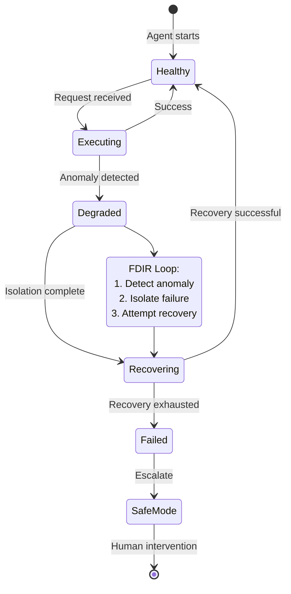
```mermaid
stateDiagram-v2
    [*] --> Healthy: Agent starts

    Healthy --> Executing: Request received
    Executing --> Healthy: Success
    Executing --> Degraded: Anomaly detected

    Degraded --> Recovering: Isolation complete
    Recovering --> Healthy: Recovery successful
    Recovering --> Failed: Recovery exhausted

    Failed --> SafeMode: Escalate
    SafeMode --> [*]: Human intervention

    state "FDIR Loop:<br/>1. Detect anomaly<br/>2. Isolate failure<br/>3. Attempt recovery" as FDIRNote
    Degraded --> FDIRNote
    FDIRNote --> Recovering
```

> **FDIR Loop:** When in Degraded state, the system executes: (1) Detect anomaly, (2) Isolate failure, (3) Attempt recovery.

*Figure 6: D₅.FDIR - Complete fault management state machine.*

### 2.3 Pattern Encoding in Extended Λ'

Each pattern is now a 5-tuple **(d₁, d₂, d₃, d₄, d₅) ∈ Λ'**:

| Pattern | D₁ | D₂ | D₃ | D₄ | D₅ |
|---------|----|----|----|----|-----|
| Basic ParallelAgent | Parallel | State | Rule | Any | None |
| Resilient ParallelAgent | Parallel | State | Rule | Any | Retry |
| TMR ParallelAgent | Parallel | State | Rule | Any | Redundant |
| FDIR ParallelAgent | Parallel | State | Rule | Any | FDIR |
| Basic SequentialAgent | Sequential | State | Rule | Any | None |
| Fallback SequentialAgent | Sequential | State | Rule | Any | Retry |
| Basic LoopAgent | Iterative | Event | Condition | Any | None |
| Resilient LoopAgent | Iterative | Event | Condition | Any | Retry |
| Goal Setting | Iterative | State | Condition | None | None |
| Resilient Goal Setting | Iterative | State | Condition | None | FDIR |

### 2.4 Theorem 7: Extended Completeness

**Theorem 7 (Extended Completeness):** The 5-dimensional space Λ' is **complete**—every reliability-aware agentic pattern can be encoded as a point in Λ'.

**Definition (Partial Order on D₅):** The fault tolerance strategies form a partial order by capability:

```
None ≤ Retry ≤ FDIR
None ≤ Redundant ≤ FDIR
```

Where ≤ means "is subsumed by" (higher levels include lower-level capabilities):
- FDIR includes retry mechanisms
- FDIR includes redundancy/voting capabilities
- Retry and Redundant are incomparable (neither subsumes the other)

**Proof:**

*Part 1 (Base pattern completeness):*
By the original Completeness Theorem (10_UNIFIED_THEORY.md, Theorem 1), every agentic pattern is encodable in Λ = D₁ × D₂ × D₃ × D₄.

*Part 2 (D₅ captures all fault tolerance):*
We show that D₅ captures all fault tolerance strategies by categorization:

1. **D₅.None**: No fault handling (identity transformation)
2. **D₅.Retry**: Strategies that retry the same operation (exponential backoff, timeout, jitter)
3. **D₅.Redundant**: Strategies that use multiple redundant executions (TMR, NMR, voting)
4. **D₅.FDIR**: Full fault management pipeline (detection + isolation + recovery)

*Part 3 (Mapping arbitrary strategies):*
For any fault tolerance strategy S:
- If S performs no fault handling → d₅ = None
- If S retries operations without redundancy → d₅ = Retry
- If S uses redundant execution with voting → d₅ = Redundant
- If S includes health monitoring, isolation, and recovery → d₅ = FDIR
- If S combines multiple strategies → d₅ = max(strategies) under the partial order

*Part 4 (Completeness):*
Since every fault tolerance strategy maps to exactly one d₅ ∈ D₅, and Λ captures all base patterns, Λ' = Λ × D₅ captures all reliability-aware patterns.

∎

**Corollary 1:** Λ ⊂ Λ' (the original space is a proper subset)

Setting d₅ = None recovers all original patterns: Λ = {(d₁, d₂, d₃, d₄, None) | (d₁, d₂, d₃, d₄) ∈ original Λ}

**Corollary 2:** The partial order enables systematic capability comparison—if S₁ ≤ S₂, then S₂ provides at least the same fault tolerance as S₁.

### 2.5 Theorem 8: D₅ Conditional Independence

**Theorem 8 (Conditional Independence):** D₅ is orthogonal to D₂, D₃, and D₄, but **partially constrains** D₁ for certain fault tolerance strategies.

**Statement:**

1. D₅ is fully independent of D₂, D₃, D₄: Any fault tolerance strategy works with any communication protocol, decision strategy, or tool type.

2. D₅ partially constrains D₁:
   - D₅.Redundant (TMR) **requires** D₁ = Parallel (voting needs concurrent results)
   - Operator ⊗ᵣ **requires** D₁ = Parallel
   - Operator ;f **requires** D₁ = Sequential (fallback is inherently sequential)

**Proof:**

*Part 1 (D₂, D₃, D₄ independence):*

For each d₂ ∈ D₂, d₃ ∈ D₃, d₄ ∈ D₄, and each d₅ ∈ D₅, the combination is valid:
- **D₂ × D₅**: State/Event/Tool communication works with any fault strategy
- **D₃ × D₅**: Rule/LLM/Condition decisions work with any fault strategy
- **D₄ × D₅**: Any tool type can be protected with any strategy

*Part 2 (D₁ constraints):*

For D₅.Redundant with voting:
- TMR requires comparing N concurrent outputs to vote
- Sequential execution produces outputs at different times with potentially different input states
- Therefore: D₅.Redundant ⟹ D₁ = Parallel

For fallback operator ;f:
- Fallback means "try A₁, then A₂ if A₁ fails"—inherently sequential
- Therefore: operator ;f ⟹ D₁ = Sequential

*Part 3 (No forbidden combinations):*

All remaining combinations (D₅.None, D₅.Retry, D₅.FDIR with any D₁) are valid.

∎

**Corollary:** The effective design space is:
- Full 324 configurations for (D₅.None, D₅.Retry) × D₁
- Constrained to D₁=Parallel for D₅.Redundant with TMR
- Constrained to D₁=Sequential for fallback patterns

---

## III. FDIR Semantics for Agentic Systems

### 3.1 Formal Model

We extend the Agent Computation Model from 10_UNIFIED_THEORY.md with failure semantics.

#### Definition 1: Agent Health State

An agent **A** has a health state **H(A)** at any time:

```
H: Agent → HealthState
HealthState = {Healthy, Degraded, Failed, Isolated}
```

**State Transitions:**

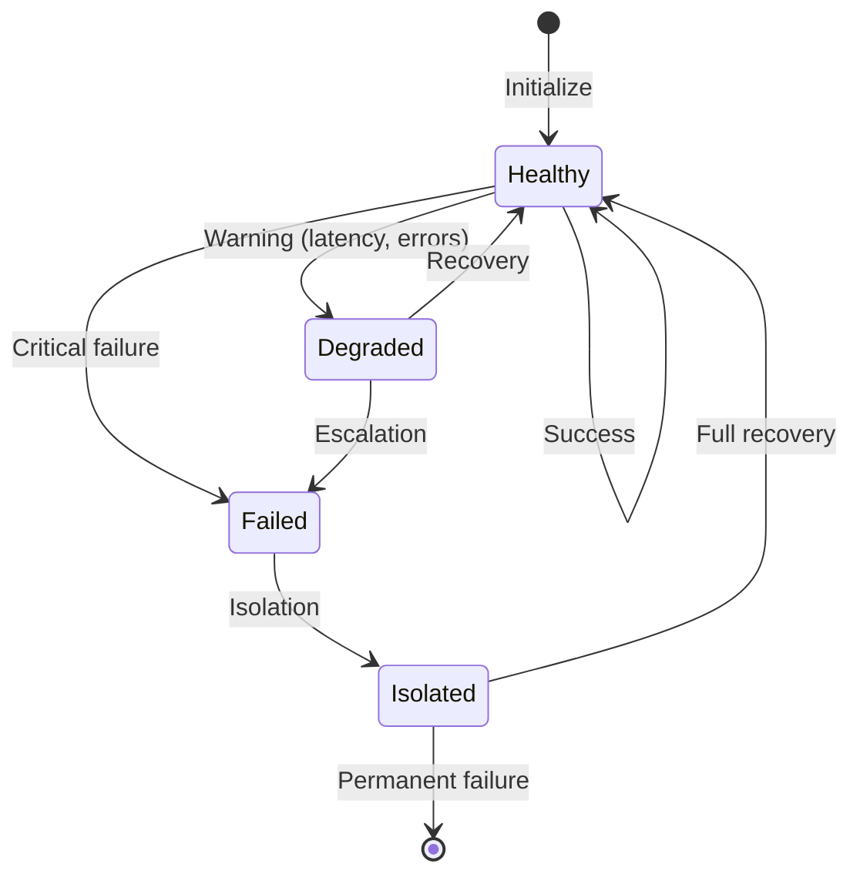
```mermaid
stateDiagram-v2
    [*] --> Healthy: Initialize

    Healthy --> Healthy: Success
    Healthy --> Degraded: Warning (latency, errors)
    Healthy --> Failed: Critical failure

    Degraded --> Healthy: Recovery
    Degraded --> Failed: Escalation

    Failed --> Isolated: Isolation
    Isolated --> Healthy: Full recovery
    Isolated --> [*]: Permanent failure
```

*Figure 7: Agent health state machine.*

#### Definition 2: Failure Event

A **failure event** F occurs when an agent cannot complete its task:

```
F = (agent, failure_type, timestamp, context)

FailureType = {
    Timeout,      // Response time exceeded threshold
    Exception,    // Runtime error
    InvalidOutput, // Output fails validation
    RateLimit,    // API quota exceeded
    Unavailable   // Service not reachable
}
```

#### Definition 3: FDIR Function

The **FDIR function** transforms a failing agent into a recovered state:

```
FDIR: Agent × FailureEvent × RecoveryStrategy → (Agent × HealthState)

FDIR(A, F, S) = (A', H')
where:
  A' = recovered agent (or fallback)
  H' = health state after recovery
```

### 3.2 Fault Detection

**Detection** identifies when an agent is failing or about to fail.

#### 3.2.1 Detection Strategies

| Strategy | Trigger | Latency | False Positives |
|----------|---------|---------|-----------------|
| **Timeout** | Response time > threshold | Low | Medium |
| **Exception** | Runtime error caught | Zero | Zero |
| **Health Check** | Periodic probe fails | Medium | Low |
| **Output Validation** | Response fails schema | Low | Low |
| **Anomaly Detection** | Statistical deviation | High | Variable |

#### 3.2.2 Formal Detection Function

```
detect: Agent × Context × Observation → DetectionResult

DetectionResult = {
    Healthy(confidence),
    Warning(anomaly_type, severity),
    Failure(failure_type, evidence)
}
```

**Detection Rules:**

```
Rule 1 (Timeout):
  if response_time > timeout_threshold:
    return Failure(Timeout, response_time)

Rule 2 (Exception):
  if caught_exception(e):
    return Failure(Exception, e)

Rule 3 (Validation):
  if not validate(output, schema):
    return Failure(InvalidOutput, output)

Rule 4 (Threshold):
  if error_rate > error_threshold over window:
    return Warning(HighErrorRate, error_rate)
```

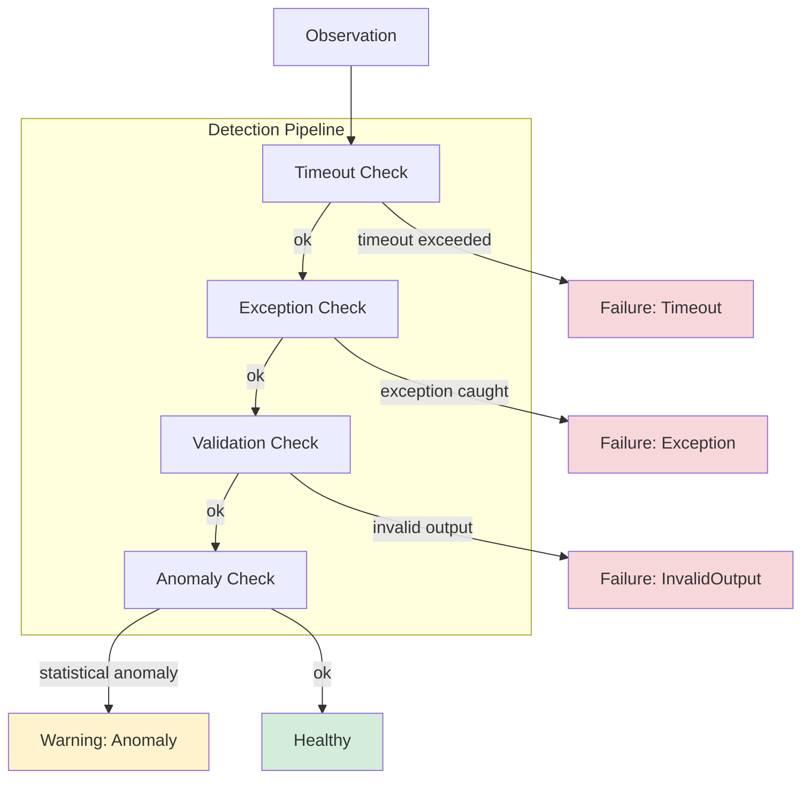
```mermaid
flowchart TB
    Obs[Observation]

    subgraph "Detection Pipeline"
        T[Timeout Check]
        E[Exception Check]
        V[Validation Check]
        A[Anomaly Check]
    end

    T -->|timeout exceeded| F1[Failure: Timeout]
    E -->|exception caught| F2[Failure: Exception]
    V -->|invalid output| F3[Failure: InvalidOutput]
    A -->|statistical anomaly| W1[Warning: Anomaly]

    T -->|ok| E
    E -->|ok| V
    V -->|ok| A
    A -->|ok| H[Healthy]

    Obs --> T

    style F1 fill:#f8d7da
    style F2 fill:#f8d7da
    style F3 fill:#f8d7da
    style W1 fill:#fff3cd
    style H fill:#d4edda
```

*Figure 8: Detection pipeline evaluates multiple failure conditions.*

### 3.3 Fault Isolation

**Isolation** contains the failure to prevent cascade effects.

#### 3.3.1 Isolation Strategies

| Strategy | Mechanism | Blast Radius | Recovery Speed |
|----------|-----------|--------------|----------------|
| **Hierarchical** | Parent isolates child | Subtree | Fast |
| **Half-Satellite** | Switch to redundant half | Half system | Immediate |
| **Circuit Breaker** | Block requests | Single agent | Configurable |
| **Bulkhead** | Resource partitioning | Partition | Fast |

#### 3.3.2 Hierarchical Isolation

In hierarchical FDIR, the parent agent isolates failed children:

```
isolate_hierarchical(parent, failed_child) =
  1. Mark failed_child as Isolated
  2. Disconnect failed_child from parent.sub_agents
  3. Preserve session state for recovery
  4. Return IsolatedSubsystem(failed_child, state_snapshot)
```

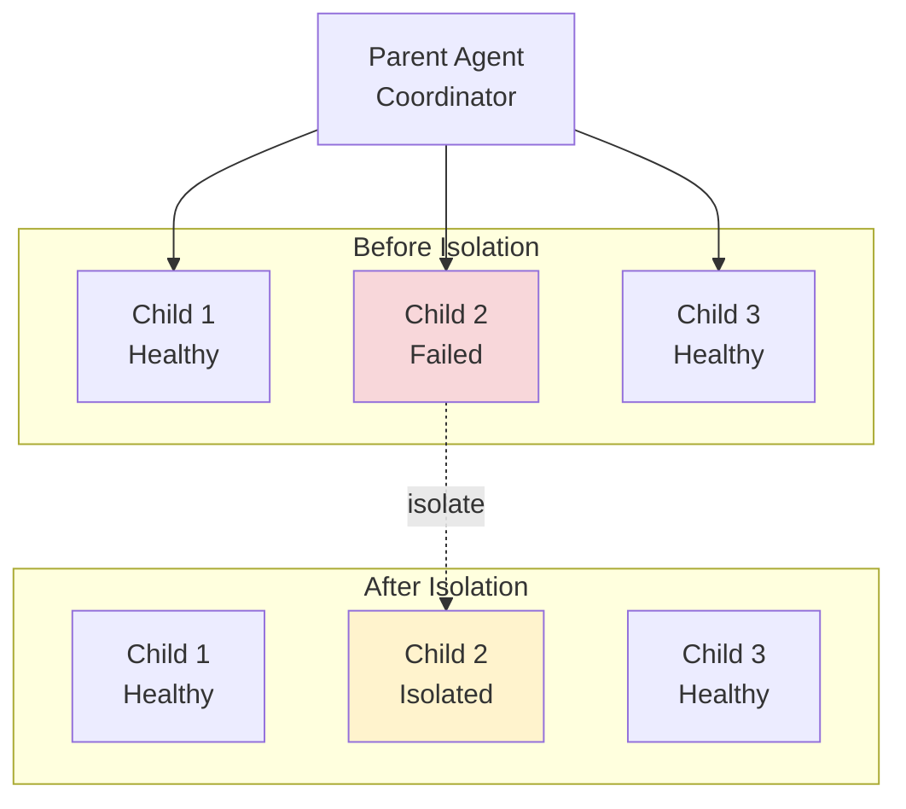
```mermaid
flowchart TB
    Parent[Parent Agent<br/>Coordinator]

    subgraph "Before Isolation"
        C1a[Child 1<br/>Healthy]
        C2a[Child 2<br/>Failed]
        C3a[Child 3<br/>Healthy]
    end

    subgraph "After Isolation"
        C1b[Child 1<br/>Healthy]
        C2b[Child 2<br/>Isolated]
        C3b[Child 3<br/>Healthy]
    end

    Parent --> C1a & C2a & C3a
    C2a -.->|isolate| C2b

    style C2a fill:#f8d7da
    style C2b fill:#fff3cd
```

*Figure 9: Hierarchical isolation - parent isolates failed child.*

#### 3.3.3 Circuit Breaker Isolation

The circuit breaker pattern prevents repeated calls to a failing service:

```
CircuitBreaker states:
  - Closed: Normal operation, requests pass through
  - Open: Failure threshold exceeded, requests blocked
  - Half-Open: Testing recovery, limited requests allowed

State transitions:
  Closed → Open: failure_count > threshold
  Open → Half-Open: after recovery_timeout
  Half-Open → Closed: success
  Half-Open → Open: failure
```

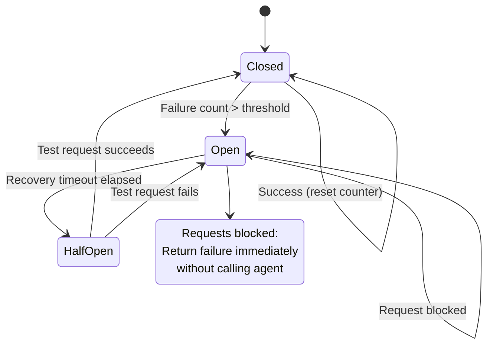
```mermaid
stateDiagram-v2
    [*] --> Closed

    Closed --> Closed: Success (reset counter)
    Closed --> Open: Failure count > threshold

    Open --> Open: Request blocked
    Open --> HalfOpen: Recovery timeout elapsed

    HalfOpen --> Closed: Test request succeeds
    HalfOpen --> Open: Test request fails

    state "Requests blocked:<br/>Return failure immediately<br/>without calling agent" as OpenNote
    Open --> OpenNote
```

> **Open State Behavior:** When circuit breaker is Open, all requests immediately return failure without calling the underlying agent.

*Figure 10: Circuit breaker state machine.*

### 3.4 Fault Recovery

**Recovery** restores system function after isolation.

#### 3.4.1 Recovery Escalation Ladder

Recovery strategies form an **escalation ladder** from least to most disruptive:

```
Level 0: Retry
  - Same agent, same request
  - Handles transient failures

Level 1: Fallback
  - Alternative agent/tool
  - Handles capability failures

Level 2: Degradation
  - Reduced functionality
  - Handles partial system failures

Level 3: Safe Mode
  - Minimal operation
  - Human escalation required
```

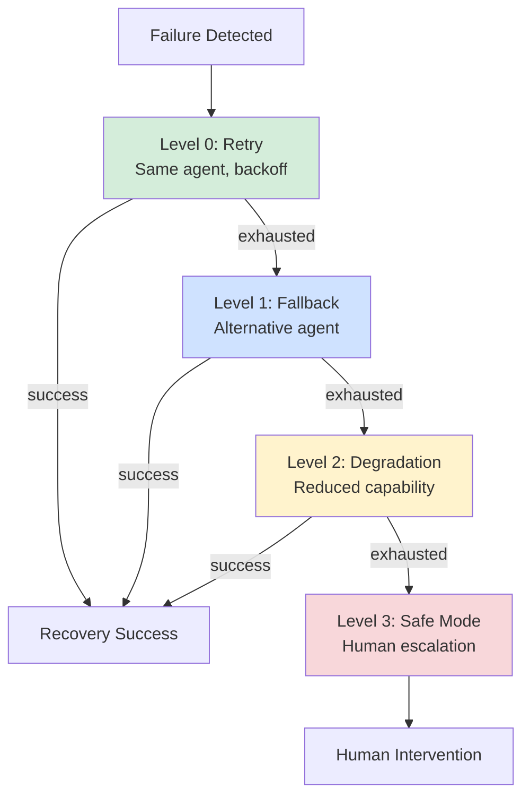
```mermaid
flowchart TB
    Failure[Failure Detected]

    L0[Level 0: Retry<br/>Same agent, backoff]
    L1[Level 1: Fallback<br/>Alternative agent]
    L2[Level 2: Degradation<br/>Reduced capability]
    L3[Level 3: Safe Mode<br/>Human escalation]

    Success[Recovery Success]

    Failure --> L0
    L0 -->|success| Success
    L0 -->|exhausted| L1
    L1 -->|success| Success
    L1 -->|exhausted| L2
    L2 -->|success| Success
    L2 -->|exhausted| L3
    L3 --> Human[Human Intervention]

    style L0 fill:#d4edda
    style L1 fill:#cfe2ff
    style L2 fill:#fff3cd
    style L3 fill:#f8d7da
```

*Figure 11: Recovery escalation ladder.*

#### 3.4.2 Formal Recovery Function

```
recover: IsolatedSubsystem × RecoveryStrategy → RecoveryResult

RecoveryResult = {
    Success(recovered_agent, health_state),
    Escalate(next_level, reason),
    Failure(permanent, evidence)
}

recover(isolated, strategy) =
  for level in strategy.levels:
    result = attempt_recovery(isolated, level)
    if success(result):
      return Success(result.agent, Healthy)
    if permanent_failure(result):
      return Failure(permanent, result.evidence)
  return Escalate(SafeMode, "all recovery levels exhausted")
```

### 3.5 FDIR Composition

How does FDIR compose with the standard operators?

#### 3.5.1 FDIR with Parallel Composition

```
FDIR(A₁ ⊗ A₂) vs FDIR(A₁) ⊗ FDIR(A₂)

Option 1: Outer FDIR (recommended)
  - Single FDIR wraps entire parallel execution
  - Simpler, lower overhead
  - Handles coordination failures

Option 2: Inner FDIR
  - Each agent has own FDIR
  - Independent recovery
  - Higher overhead, more robust
```

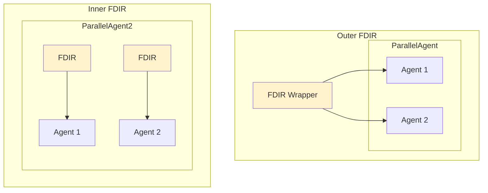
```mermaid
flowchart TB
    subgraph "Outer FDIR"
        FDIR1[FDIR Wrapper]
        subgraph "ParallelAgent"
            A1a[Agent 1]
            A2a[Agent 2]
        end
        FDIR1 --> A1a & A2a
    end

    subgraph "Inner FDIR"
        subgraph "ParallelAgent2"
            FDIR2a[FDIR] --> A1b[Agent 1]
            FDIR2b[FDIR] --> A2b[Agent 2]
        end
    end

    style FDIR1 fill:#fff3cd
    style FDIR2a fill:#fff3cd
    style FDIR2b fill:#fff3cd
```

*Figure 12: Outer vs Inner FDIR for parallel agents.*

#### 3.5.2 FDIR Composition Theorem

**Definition (Behavioral Equivalence ≈):** Two FDIR-protected systems A and B are behaviorally equivalent (A ≈ B) if and only if:

```
∀ context C, input I:
  1. A succeeds on (C,I) ⟺ B succeeds on (C,I)
  2. A fails on (C,I) ⟺ B fails on (C,I)
  3. A returns result r on (C,I) ⟹ B returns result r' where r = r'
  4. A recovers at level L on (C,I) ⟹ B recovers at level L' where |L - L'| ≤ 1
```

In other words: same success/failure outcomes, same results, and similar recovery behavior (within one escalation level).

**Theorem 9 (FDIR Composition):** FDIR composes with standard operators:

```
FDIR(A₁ ⊗ A₂) ≈ FDIR(A₁) ⊗ FDIR(A₂)  (parallel)
FDIR(A₁ ; A₂) ≈ FDIR(A₁) ; FDIR(A₂)   (sequential)
FDIR(A★) ≈ (FDIR(A))★                  (iterative)
```

**FDIR Nesting Semantics:** When FDIR wrappers are nested:
1. **Inner FDIR handles failures first** - attempts detection, isolation, recovery
2. **If inner recovery exhausts** - failure propagates to outer FDIR as atomic failure event
3. **Outer FDIR treats inner failure as single failure** - applies its own recovery chain
4. **Recovery level accumulates** - if inner reached L2 and outer reaches L1, effective level is max(L2, L1)

**Proof:**

*Parallel case:* FDIR(A₁ ⊗ A₂) applies unified monitoring to both. FDIR(A₁) ⊗ FDIR(A₂) monitors each independently. Both detect the same failures (eventually), recover via same strategies. Difference: unified FDIR has single health state; distributed has per-agent state. Both achieve same fault tolerance. ≈ holds.

*Sequential case:* FDIR(A₁ ; A₂) monitors pipeline. FDIR(A₁) ; FDIR(A₂) monitors stages. Both detect failures at same points. Recovery scope differs (pipeline vs stage) but outcome equivalence holds.

*Iterative case:* FDIR(A★) monitors loop. (FDIR(A))★ monitors each iteration. Per-iteration monitoring catches failures earlier but with higher overhead. Same convergence behavior.

∎

---

## IV. Reliability-Aware Composition Operators

### 4.1 Extended Operator Definitions

We extend the 4 composition operators from 10_UNIFIED_THEORY.md with reliability-aware variants.

#### 4.1.1 Redundant Parallel Composition (⊗ᵣ)

```
A₁ ⊗ᵣ A₂ ⊗ᵣ ... ⊗ᵣ Aₙ = RedundantParallel([A₁, ..., Aₙ], voting_strategy)
```

**Semantics:**
- All agents execute the **same task** concurrently
- Results are combined via **voting**
- Tolerates up to ⌊(n-1)/2⌋ failures (majority voting)

**Properties:**

1. **Commutative:** `A₁ ⊗ᵣ A₂ = A₂ ⊗ᵣ A₁`
2. **Associative:** `(A₁ ⊗ᵣ A₂) ⊗ᵣ A₃ = A₁ ⊗ᵣ (A₂ ⊗ᵣ A₃)`
3. **Fault Tolerant:** Tolerates minority failures
4. **Cost:** `cost(A₁ ⊗ᵣ A₂ ⊗ᵣ A₃) = 3 × cost(A₁)` (assuming equal cost)

**Comparison with Standard Parallel (⊗):**

| Property | Standard ⊗ | Redundant ⊗ᵣ |
|----------|-----------|--------------|
| Task | Different tasks | Same task |
| Output | Multiple results | Single consensus |
| Fault tolerance | None | Minority failures |
| Cost | N calls | N calls |
| Use case | Data gathering | Critical decisions |

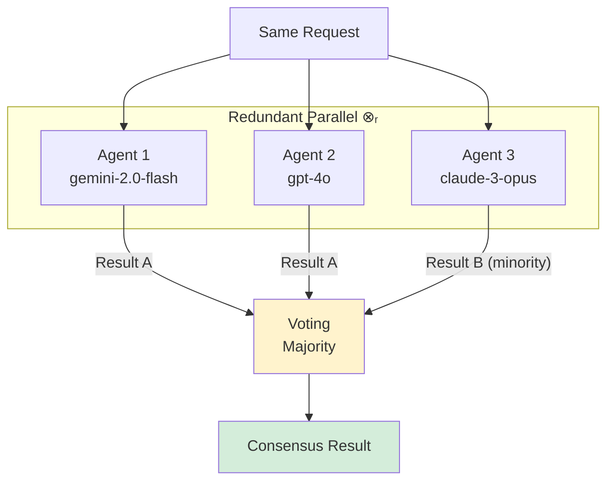
```mermaid
flowchart TB
    Input[Same Request]

    subgraph "Redundant Parallel ⊗ᵣ"
        A1[Agent 1<br/>gemini-2.0-flash]
        A2[Agent 2<br/>gpt-4o]
        A3[Agent 3<br/>claude-3-opus]
    end

    V[Voting<br/>Majority]
    Output[Consensus Result]

    Input --> A1 & A2 & A3
    A1 -->|"Result A"| V
    A2 -->|"Result A"| V
    A3 -->|"Result B (minority)"| V
    V --> Output

    style V fill:#fff3cd
    style Output fill:#d4edda
```

*Figure 13: Redundant parallel with majority voting.*

#### 4.1.2 Fallback Sequential Composition (;f)

```
A₁ ;f A₂ ;f ... ;f Aₙ = FallbackSequential([A₁, ..., Aₙ])
```

**Semantics:**
- A₂ executes **only if** A₁ fails
- First successful agent determines result
- Chain terminates on first success

**Properties:**

1. **Non-commutative:** `A₁ ;f A₂ ≠ A₂ ;f A₁` (order matters)
2. **Associative:** `(A₁ ;f A₂) ;f A₃ = A₁ ;f (A₂ ;f A₃)`
3. **Short-circuit:** Stops on first success
4. **Cost:** `cost(A₁ ;f A₂) ≤ cost(A₁) + cost(A₂)` (≤ because of short-circuit)

**Comparison with Standard Sequential (;):**

| Property | Standard ; | Fallback ;f |
|----------|-----------|-------------|
| Execution | All agents | Until success |
| Condition | Always proceed | Proceed on failure |
| Output | Last agent | First success |
| Use case | Pipeline | Degradation chain |

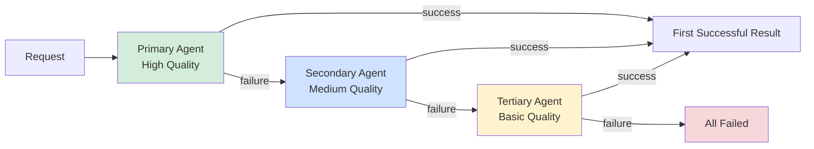
```mermaid
flowchart LR
    Input[Request]

    A1[Primary Agent<br/>High Quality]
    A2[Secondary Agent<br/>Medium Quality]
    A3[Tertiary Agent<br/>Basic Quality]

    Output[First Successful Result]

    Input --> A1
    A1 -->|success| Output
    A1 -->|failure| A2
    A2 -->|success| Output
    A2 -->|failure| A3
    A3 -->|success| Output
    A3 -->|failure| Error[All Failed]

    style A1 fill:#d4edda
    style A2 fill:#cfe2ff
    style A3 fill:#fff3cd
    style Error fill:#f8d7da
```

*Figure 14: Fallback sequential - chain until success.*

#### 4.1.3 Resilient Iterative Composition (★ᵣ)

```
A★ᵣ(cond, k, retries) = ResilientLoop(A, condition=cond, max_iter=k, max_retries=retries)
```

**Semantics:**
- Loop with per-iteration retry
- Continues despite transient failures
- Terminates on condition, max iterations, or retry exhaustion

**Properties:**

1. **Bounded:** Total attempts ≤ k × retries
2. **Resilient:** Transient failures don't break loop
3. **Convergent:** If condition is reachable, loop converges

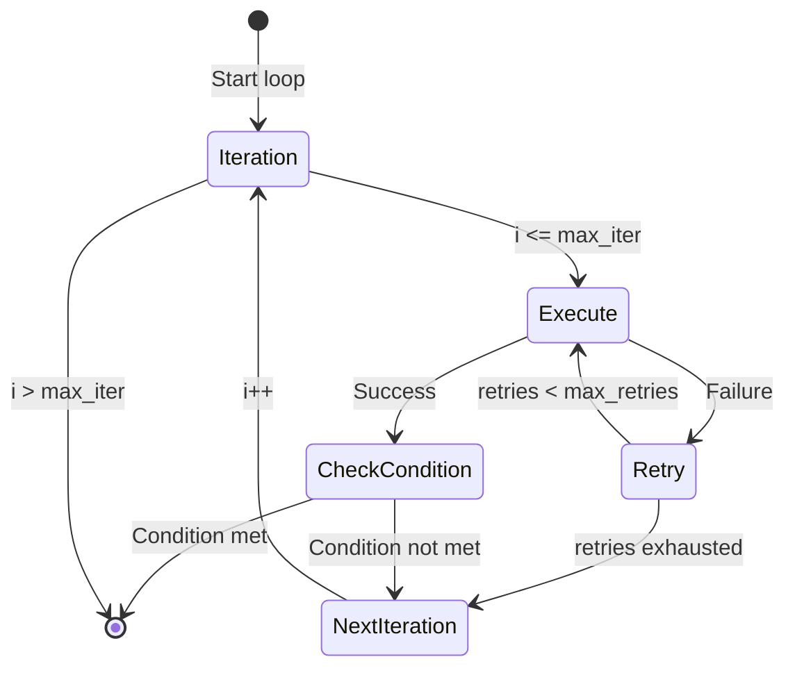
```mermaid
stateDiagram-v2
    [*] --> Iteration: Start loop

    Iteration --> Execute: i <= max_iter
    Execute --> CheckCondition: Success
    Execute --> Retry: Failure

    Retry --> Execute: retries < max_retries
    Retry --> NextIteration: retries exhausted

    CheckCondition --> [*]: Condition met
    CheckCondition --> NextIteration: Condition not met

    NextIteration --> Iteration: i++

    Iteration --> [*]: i > max_iter
```

*Figure 15: Resilient iterative with per-iteration retry.*

#### 4.1.4 Protected Tool Augmentation (+ₚ)

```
A +ₚ T = A with protected_tools={CircuitBreaker(T)}
```

**Semantics:**
- Tools wrapped with circuit breaker
- Failures don't crash agent
- Graceful degradation when tools unavailable

**Properties:**

1. **Safe:** Tool failures don't propagate
2. **Informative:** Agent receives failure info
3. **Recoverable:** Tools can recover after timeout

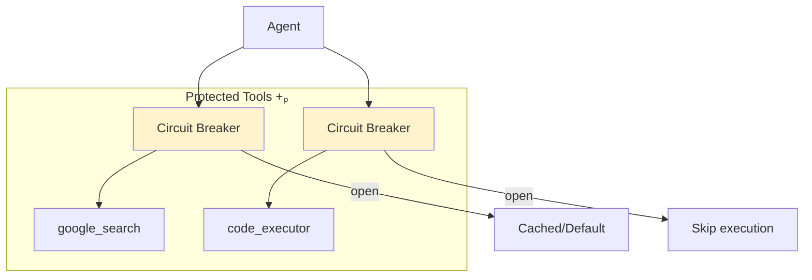
```mermaid
flowchart TB
    Agent[Agent]

    subgraph "Protected Tools +ₚ"
        CB1[Circuit Breaker]
        CB2[Circuit Breaker]
        T1[google_search]
        T2[code_executor]
    end

    Agent --> CB1 --> T1
    Agent --> CB2 --> T2

    CB1 -->|open| Fallback1[Cached/Default]
    CB2 -->|open| Fallback2[Skip execution]

    style CB1 fill:#fff3cd
    style CB2 fill:#fff3cd
```

*Figure 16: Protected tool augmentation with circuit breakers.*

### 4.2 Algebraic Properties

**Theorem 10 (Operator Closure):** The extended operators are closed under composition.

**Proof:**

- `A₁ ⊗ᵣ A₂` produces a RedundantParallelAgent (an Agent)
- `A₁ ;f A₂` produces a FallbackSequentialAgent (an Agent)
- `A★ᵣ` produces a ResilientLoopAgent (an Agent)
- `A +ₚ T` produces an Agent with protected tools

All operators map agents to agents.

∎

**Theorem 11 (Mixed Composition):** Reliability operators compose with standard operators.

```
(A₁ ⊗ᵣ A₂) ; A₃    // Redundant parallel, then sequential
A₁ ;f (A₂ ⊗ A₃)    // Fallback to parallel gathering
(A★ᵣ) ⊗ B          // Resilient loop in parallel with B
```

**Proof:** By closure, each sub-expression produces an agent, which can be composed further.

∎

### 4.3 Reliability Metrics

> **Terminology Note:** This section uses reliability engineering terminology where "series" and "parallel" refer to *failure logic*, not execution topology (D₁). A "series" system fails if ANY component fails; a "parallel" system fails only if ALL components fail. This is distinct from D₁.Parallel (concurrent execution) and D₁.Sequential (pipeline execution).

#### 4.3.1 MTBF Composition

**Mean Time Between Failures** composes according to *reliability topology* (failure logic):

**Series Reliability (all-must-succeed):**
```
MTBF(A₁ ⊗ A₂) = 1 / (λ₁ + λ₂) = 1 / (1/MTBF(A₁) + 1/MTBF(A₂))
```
System fails when ANY component fails. This applies to both D₁.Parallel and D₁.Sequential execution when all components must succeed.

**Parallel Reliability (any-can-succeed, hot standby):**
```
MTBF(A₁ ∥ A₂) = (MTBF(A₁) + MTBF(A₂)) / 2
```
System fails only when ALL components fail. For two identical components: MTBF_parallel = 1.5 × MTBF_single.

**2-out-of-3 TMR (Triple Modular Redundancy):**
```
MTBF(A₁ ⊗ᵣ A₂ ⊗ᵣ A₃) = (5/6) × MTBF(A)
```
System fails when MAJORITY (2+) fails (assuming equal MTBF).

**Derivation:** For 2-out-of-3 with exponential failures:
```
R_TMR(t) = 3R²(t) - 2R³(t)  where R(t) = e^(-λt)

MTBF_TMR = ∫₀^∞ R_TMR(t) dt
         = ∫₀^∞ [3e^(-2λt) - 2e^(-3λt)] dt
         = 3/(2λ) - 2/(3λ)
         = (9-4)/(6λ)
         = 5/(6λ)
         = (5/6) × MTBF_single
```

**Sequential Pipeline (series reliability):**
```
MTBF(A₁ ; A₂) = 1 / (1/MTBF(A₁) + 1/MTBF(A₂))
```
System fails when ANY component fails.

**Fallback Sequential (with coverage factor c):**
```
MTBF(A₁ ;f A₂) = MTBF(A₁) + c × MTBF(A₂)
```
Where c is the detection/switchover coverage (probability of successful failover). For perfect coverage (c=1): MTBF = MTBF(A₁) + MTBF(A₂). System fails when ALL components fail AND failover succeeds.

#### 4.3.2 Availability Bounds

**Availability** A = MTBF / (MTBF + MTTR)

**Theorem 12 (Availability Composition):**

For 2-out-of-3 TMR with identical components (availability A each):
```
A_TMR = 3A² - 2A³
```

**Example:** For A = 0.9 (90% availability):
```
A_TMR = 3(0.81) - 2(0.729) = 2.43 - 1.458 = 0.972 (97.2%)
```

**Bounds:**
```
A(A₁ ⊗ᵣ A₂ ⊗ᵣ A₃) ≥ max(A(A₁), A(A₂), A(A₃))  // TMR improves availability
A(A₁ ;f A₂) = 1 - (1-A(A₁))(1-A(A₂))            // Fallback (independent failures)
```

**Proof:**

For TMR: The system is available when ≥2 of 3 components are available. Using inclusion-exclusion with independent failures:
```
A_TMR = P(≥2 available) = C(3,2)A²(1-A) + C(3,3)A³ = 3A²(1-A) + A³ = 3A² - 2A³
```

For Fallback: The system fails only when both primary AND fallback fail:
```
P(fail) = P(A₁ fails) × P(A₂ fails) = (1-A₁)(1-A₂)
A_fallback = 1 - (1-A₁)(1-A₂)
```

∎

---

## V. ECSS Autonomy Levels

### 5.1 Overview

The **European Cooperation for Space Standardization (ECSS)** defines four mission execution autonomy levels in standard **ECSS-E-ST-70-11C**. These levels provide a formal framework for spacecraft autonomous operation that maps directly to agentic systems.

### 5.2 Level E1: Mission Execution under Ground Control

**Definition:** Real-time control from ground for nominal operations. Limited onboard capability for safety-critical issues only.

**Characteristics:**
- Human-in-the-loop for all decisions
- No autonomous error recovery
- Suitable for low-latency, supervised environments

**Agent Pattern Encoding:** `(*, *, *, *, None)`

```python
# E1: No fault tolerance
basic_agent = LlmAgent(
    name="E1Agent",
    model="gemini-2.0-flash-exp",
    instruction="Process the request. If you encounter an error, report it.",
    # No fault tolerance - failures propagate to caller
)
```

**Use Cases:**
- Development and testing
- Non-critical batch processing
- Human-supervised chatbots

### 5.3 Level E2: Execution of Pre-planned Operations

**Definition:** Capability to execute time-based commands from onboard scheduler. Event-based responses to predefined contingencies.

**Characteristics:**
- Pre-planned recovery procedures
- Retry-based fault handling
- Configurable timeouts and thresholds

**Agent Pattern Encoding:** `(*, *, *, *, Retry)`

```python
# E2: Retry with exponential backoff
from reliability_patterns import RetryAgent

e2_agent = RetryAgent(
    agent=LlmAgent(
        name="E2Agent",
        model="gemini-2.0-flash-exp",
        instruction="Process the request.",
    ),
    max_retries=3,
    base_delay=1.0,
    max_delay=30.0,
    backoff_factor=2.0,
)
```

**Use Cases:**
- API integrations with rate limits
- Network-dependent operations
- Production services with SLAs

### 5.4 Level E3: Execution of Adaptive Operations

**Definition:** Event-based autonomous operations with onboard re-planning capability.

**Characteristics:**
- Multiple recovery strategies
- Redundancy for critical paths
- Voting for consensus decisions

**Agent Pattern Encoding:** `(*, *, *, *, Redundant)`

```python
# E3: Triple Modular Redundancy
from reliability_patterns import TMRAgent

e3_agent = TMRAgent(
    agents=[
        LlmAgent(name="Agent1", model="gemini-2.0-flash-exp", ...),
        LlmAgent(name="Agent2", model="gpt-4o", ...),
        LlmAgent(name="Agent3", model="claude-3-sonnet", ...),
    ],
    voting_strategy="majority",
)
```

**Use Cases:**
- Financial decisions
- Medical diagnosis assistance
- Safety-critical recommendations

### 5.5 Level E4: Execution of Goal-Oriented Operations

**Definition:** Goal-oriented mission re-planning. Complete autonomous operation with self-diagnosis and recovery.

**Characteristics:**
- Full FDIR pipeline
- Health monitoring
- Graceful degradation
- Self-healing capability

**Agent Pattern Encoding:** `(*, *, *, *, FDIR)`

```python
# E4: Full FDIR
from reliability_patterns import FDIRAgent

e4_agent = FDIRAgent(
    primary_agent=LlmAgent(name="Primary", model="gemini-2.0-flash-exp", ...),
    fallback_chain=[
        LlmAgent(name="Fallback1", model="gpt-4o", ...),
        LlmAgent(name="Fallback2", model="claude-3-haiku", ...),
    ],
    health_monitor=HealthMonitor(
        timeout=30.0,
        error_threshold=0.1,
        check_interval=5.0,
    ),
    recovery_strategy=EscalationLadder([
        RetryStrategy(max_retries=3),
        FallbackStrategy(),
        DegradationStrategy(),
        SafeModeStrategy(),
    ]),
)
```

**Use Cases:**
- Autonomous vehicles
- Space mission operations
- Critical infrastructure management

### 5.6 Autonomy Level Comparison

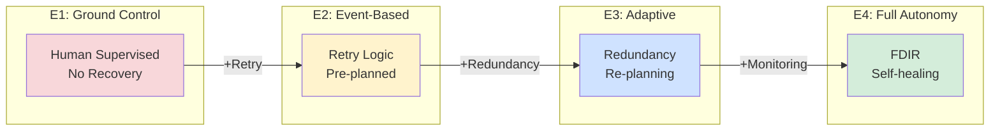
```mermaid
flowchart LR
    subgraph "E1: Ground Control"
        E1[Human Supervised<br/>No Recovery]
    end

    subgraph "E2: Event-Based"
        E2[Retry Logic<br/>Pre-planned]
    end

    subgraph "E3: Adaptive"
        E3[Redundancy<br/>Re-planning]
    end

    subgraph "E4: Full Autonomy"
        E4[FDIR<br/>Self-healing]
    end

    E1 -->|+Retry| E2
    E2 -->|+Redundancy| E3
    E3 -->|+Monitoring| E4

    style E1 fill:#f8d7da
    style E2 fill:#fff3cd
    style E3 fill:#cfe2ff
    style E4 fill:#d4edda
```

*Figure 17: ECSS autonomy level progression.*

| Property | E1 | E2 | E3 | E4 |
|----------|----|----|----|----|
| **D₅ Value** | None | Retry | Redundant | FDIR |
| **Recovery** | None | Retry | Vote | Full pipeline |
| **Monitoring** | External | Timeout | Health check | Continuous |
| **Degradation** | Crash | Error | Reduced | Graceful |
| **Human Role** | Supervisor | Monitor | Overseer | Auditor |
| **Cost Multiplier** | 1× | ~1.5× | 3× | 4-5× |
| **Availability** | 95% | 99% | 99.9% | 99.99% |

---

## VI. Pattern Implementations

### 6.1 RetryAgent

**Purpose:** Handle transient failures with exponential backoff.

**D₅ Value:** Retry

```python
import asyncio
import random
from typing import AsyncGenerator
from google.adk.agents import BaseAgent, LlmAgent
from google.adk.events import Event
from google.adk.runners import InvocationContext

class RetryAgent(BaseAgent):
    """
    Wraps an agent with retry logic using exponential backoff.

    Implements D5.Retry from the 5-dimensional design space.
    Maps to ECSS E2 (Event-Based Autonomy).
    """

    def __init__(
        self,
        agent: BaseAgent,
        max_retries: int = 3,
        base_delay: float = 1.0,
        max_delay: float = 60.0,
        backoff_factor: float = 2.0,
        jitter: float = 0.1,
        retryable_exceptions: tuple = (Exception,),
        name: str = None,
    ):
        super().__init__(
            name=name or f"Retry_{agent.name}",
            description=f"Retry wrapper for {agent.name}",
        )
        self.agent = agent
        self.max_retries = max_retries
        self.base_delay = base_delay
        self.max_delay = max_delay
        self.backoff_factor = backoff_factor
        self.jitter = jitter
        self.retryable_exceptions = retryable_exceptions

    def _calculate_delay(self, attempt: int) -> float:
        """Calculate delay with exponential backoff and jitter."""
        delay = min(
            self.base_delay * (self.backoff_factor ** attempt),
            self.max_delay
        )
        # Add jitter to prevent thundering herd
        jitter_range = delay * self.jitter
        delay += random.uniform(-jitter_range, jitter_range)
        return max(0, delay)

    async def _run_async_impl(
        self, context: InvocationContext
    ) -> AsyncGenerator[Event, None]:
        last_exception = None

        for attempt in range(self.max_retries + 1):
            try:
                # Execute the wrapped agent
                async for event in self.agent.run_async(context):
                    yield event
                return  # Success - exit retry loop

            except self.retryable_exceptions as e:
                last_exception = e

                if attempt < self.max_retries:
                    delay = self._calculate_delay(attempt)
                    yield Event(
                        author=self.name,
                        content=f"Attempt {attempt + 1} failed: {e}. "
                                f"Retrying in {delay:.1f}s..."
                    )
                    await asyncio.sleep(delay)
                else:
                    yield Event(
                        author=self.name,
                        content=f"All {self.max_retries + 1} attempts failed. "
                                f"Last error: {e}"
                    )

        # All retries exhausted
        if last_exception:
            raise last_exception
```

**Usage Example:**

```python
from google.adk.agents import LlmAgent
from google.adk.tools import google_search

# Create base agent
search_agent = LlmAgent(
    name="SearchAgent",
    model="gemini-2.0-flash-exp",
    instruction="Search for information about the given topic.",
    tools=[google_search],
    output_key="search_result",
)

# Wrap with retry logic
resilient_search = RetryAgent(
    agent=search_agent,
    max_retries=3,
    base_delay=1.0,
    backoff_factor=2.0,
)

# Execute
async def main():
    result = await resilient_search.run_async(context)
    # Handles transient failures automatically
```

### 6.2 CircuitBreakerAgent

**Purpose:** Prevent cascade failures by fast-failing when service is unhealthy.

**D₅ Value:** Retry (circuit breaker is a retry-adjacent pattern)

```python
import asyncio
import time
from enum import Enum
from typing import AsyncGenerator
from google.adk.agents import BaseAgent
from google.adk.events import Event
from google.adk.runners import InvocationContext

class CircuitState(Enum):
    CLOSED = "closed"      # Normal operation
    OPEN = "open"          # Failing fast
    HALF_OPEN = "half_open"  # Testing recovery

class CircuitBreakerAgent(BaseAgent):
    """
    Implements the circuit breaker pattern for agent fault isolation.

    States:
    - CLOSED: Normal operation, requests pass through
    - OPEN: Service unhealthy, requests fail immediately
    - HALF_OPEN: Testing if service recovered

    Maps to FDIR isolation strategy.
    """

    def __init__(
        self,
        agent: BaseAgent,
        failure_threshold: int = 5,
        recovery_timeout: float = 30.0,
        half_open_max_calls: int = 1,
        name: str = None,
    ):
        super().__init__(
            name=name or f"CircuitBreaker_{agent.name}",
            description=f"Circuit breaker for {agent.name}",
        )
        self.agent = agent
        self.failure_threshold = failure_threshold
        self.recovery_timeout = recovery_timeout
        self.half_open_max_calls = half_open_max_calls

        # State
        self._state = CircuitState.CLOSED
        self._failure_count = 0
        self._last_failure_time = 0
        self._half_open_calls = 0

    @property
    def state(self) -> CircuitState:
        """Get current circuit state, checking for timeout transitions."""
        if self._state == CircuitState.OPEN:
            if time.time() - self._last_failure_time >= self.recovery_timeout:
                self._state = CircuitState.HALF_OPEN
                self._half_open_calls = 0
        return self._state

    def _record_success(self):
        """Record successful call."""
        self._failure_count = 0
        if self._state == CircuitState.HALF_OPEN:
            self._state = CircuitState.CLOSED

    def _record_failure(self):
        """Record failed call."""
        self._failure_count += 1
        self._last_failure_time = time.time()

        if self._state == CircuitState.HALF_OPEN:
            self._state = CircuitState.OPEN
        elif self._failure_count >= self.failure_threshold:
            self._state = CircuitState.OPEN

    async def _run_async_impl(
        self, context: InvocationContext
    ) -> AsyncGenerator[Event, None]:
        current_state = self.state

        # OPEN: Fail fast
        if current_state == CircuitState.OPEN:
            yield Event(
                author=self.name,
                content=f"Circuit OPEN - failing fast. "
                        f"Recovery in {self.recovery_timeout - (time.time() - self._last_failure_time):.1f}s"
            )
            raise CircuitOpenError(f"Circuit breaker open for {self.agent.name}")

        # HALF_OPEN: Limited test calls
        if current_state == CircuitState.HALF_OPEN:
            if self._half_open_calls >= self.half_open_max_calls:
                yield Event(
                    author=self.name,
                    content="Circuit HALF_OPEN - max test calls reached"
                )
                raise CircuitOpenError("Half-open test limit reached")
            self._half_open_calls += 1

        # CLOSED or HALF_OPEN test: Execute agent
        try:
            async for event in self.agent.run_async(context):
                yield event
            self._record_success()
            yield Event(
                author=self.name,
                content=f"Circuit {self._state.value} - call succeeded"
            )

        except Exception as e:
            self._record_failure()
            yield Event(
                author=self.name,
                content=f"Circuit {self._state.value} - call failed: {e}"
            )
            raise

class CircuitOpenError(Exception):
    """Raised when circuit breaker is open."""
    pass
```

### 6.3 TMRAgent (Triple Modular Redundancy)

**Purpose:** Achieve fault tolerance through redundant execution and voting.

**D₅ Value:** Redundant

```python
import asyncio
from typing import AsyncGenerator, List, Callable, Any
from google.adk.agents import BaseAgent, ParallelAgent
from google.adk.events import Event
from google.adk.runners import InvocationContext

class TMRAgent(BaseAgent):
    """
    Triple Modular Redundancy agent.

    Executes the same task on 3 agents and uses majority voting
    to determine the result. Tolerates 1 Byzantine failure.

    Implements D5.Redundant from the 5-dimensional design space.
    Maps to ECSS E3 (Adaptive Autonomy).
    """

    def __init__(
        self,
        agents: List[BaseAgent],
        voting_strategy: str = "majority",
        custom_voter: Callable[[List[Any]], Any] = None,
        name: str = "TMRAgent",
    ):
        assert len(agents) >= 3, "TMR requires at least 3 agents"

        super().__init__(
            name=name,
            description="Triple Modular Redundancy with voting",
        )
        self.agents = agents
        self.voting_strategy = voting_strategy
        self.custom_voter = custom_voter

    def _majority_vote(self, results: List[str]) -> str:
        """Simple majority voting."""
        from collections import Counter
        if not results:
            raise ValueError("No results to vote on")
        counter = Counter(results)
        winner, count = counter.most_common(1)[0]
        if count <= len(results) // 2:
            raise ValueError(f"No majority: {counter}")
        return winner

    def _consensus_vote(self, results: List[str]) -> str:
        """Require unanimous agreement."""
        if len(set(results)) != 1:
            raise ValueError(f"No consensus: {set(results)}")
        return results[0]

    async def _run_async_impl(
        self, context: InvocationContext
    ) -> AsyncGenerator[Event, None]:
        yield Event(
            author=self.name,
            content=f"Starting TMR execution with {len(self.agents)} agents"
        )

        # Execute all agents concurrently
        results = []
        errors = []

        async def run_agent(agent: BaseAgent) -> str:
            """Run a single agent and collect its final output."""
            output = []
            try:
                async for event in agent.run_async(context):
                    if event.content:
                        output.append(event.content)
                return "".join(output)
            except Exception as e:
                return f"ERROR: {e}"

        # Run all agents in parallel
        tasks = [run_agent(agent) for agent in self.agents]
        agent_results = await asyncio.gather(*tasks, return_exceptions=True)

        # Separate successes and failures
        for i, result in enumerate(agent_results):
            if isinstance(result, Exception):
                errors.append((self.agents[i].name, str(result)))
            elif result.startswith("ERROR:"):
                errors.append((self.agents[i].name, result))
            else:
                results.append(result)

        yield Event(
            author=self.name,
            content=f"Collected {len(results)} results, {len(errors)} errors"
        )

        # Check if we have enough results for voting
        if len(results) < 2:
            raise ValueError(
                f"TMR failed: only {len(results)} successful results. "
                f"Errors: {errors}"
            )

        # Vote
        try:
            if self.custom_voter:
                winner = self.custom_voter(results)
            elif self.voting_strategy == "majority":
                winner = self._majority_vote(results)
            elif self.voting_strategy == "consensus":
                winner = self._consensus_vote(results)
            else:
                raise ValueError(f"Unknown voting strategy: {self.voting_strategy}")

            yield Event(
                author=self.name,
                content=f"TMR consensus reached: {winner[:100]}..."
            )
            yield Event(author=self.name, content=winner)

        except ValueError as e:
            yield Event(
                author=self.name,
                content=f"TMR voting failed: {e}"
            )
            raise
```

### 6.4 FallbackChainAgent

**Purpose:** Try agents in sequence until one succeeds.

**D₅ Value:** Retry (fallback is part of retry strategy)

```python
from typing import AsyncGenerator, List
from google.adk.agents import BaseAgent
from google.adk.events import Event
from google.adk.runners import InvocationContext

class FallbackChainAgent(BaseAgent):
    """
    Fallback chain agent - tries agents in sequence until success.

    Extends the basic fallback pattern from Chapter 12 with:
    - Configurable fallback chain
    - Per-agent timeout
    - Degradation tracking

    Implements fallback sequential composition (;f).
    """

    def __init__(
        self,
        agents: List[BaseAgent],
        timeout_per_agent: float = 30.0,
        name: str = "FallbackChain",
    ):
        super().__init__(
            name=name,
            description="Fallback chain with graceful degradation",
        )
        self.agents = agents
        self.timeout_per_agent = timeout_per_agent

    async def _run_async_impl(
        self, context: InvocationContext
    ) -> AsyncGenerator[Event, None]:
        last_error = None

        for i, agent in enumerate(self.agents):
            level = "Primary" if i == 0 else f"Fallback-{i}"
            yield Event(
                author=self.name,
                content=f"Trying {level}: {agent.name}"
            )

            try:
                # Execute with timeout
                result_events = []
                async for event in asyncio.wait_for(
                    self._collect_events(agent, context),
                    timeout=self.timeout_per_agent
                ):
                    result_events.append(event)

                # Success - yield all events and return
                yield Event(
                    author=self.name,
                    content=f"Success with {level}: {agent.name}"
                )
                for event in result_events:
                    yield event
                return

            except asyncio.TimeoutError:
                last_error = f"Timeout after {self.timeout_per_agent}s"
                yield Event(
                    author=self.name,
                    content=f"{level} timed out: {agent.name}"
                )

            except Exception as e:
                last_error = str(e)
                yield Event(
                    author=self.name,
                    content=f"{level} failed: {agent.name} - {e}"
                )

        # All agents failed
        yield Event(
            author=self.name,
            content=f"All {len(self.agents)} agents failed. Last error: {last_error}"
        )
        raise RuntimeError(f"Fallback chain exhausted: {last_error}")

    async def _collect_events(
        self, agent: BaseAgent, context: InvocationContext
    ) -> AsyncGenerator[Event, None]:
        """Collect events from agent execution."""
        async for event in agent.run_async(context):
            yield event
```

### 6.5 HealthMonitorAgent

**Purpose:** Continuous health monitoring with proactive failure detection.

**D₅ Value:** FDIR (monitoring is part of FDIR Detection phase)

```python
import asyncio
import time
from typing import AsyncGenerator, Callable, Optional
from google.adk.agents import BaseAgent
from google.adk.events import Event
from google.adk.runners import InvocationContext
from enum import Enum

class HealthStatus(Enum):
    HEALTHY = "healthy"
    DEGRADED = "degraded"
    UNHEALTHY = "unhealthy"

class HealthMonitorAgent(BaseAgent):
    """
    Health monitoring wrapper for agents.

    Implements FDIR Detection phase:
    - Response time monitoring
    - Error rate tracking
    - Output quality validation
    - Proactive health checks

    Maps to ECSS E4 (Full Autonomy).
    """

    def __init__(
        self,
        agent: BaseAgent,
        timeout: float = 30.0,
        error_threshold: float = 0.5,
        window_size: int = 10,
        health_check_fn: Optional[Callable[[str], bool]] = None,
        name: str = None,
    ):
        super().__init__(
            name=name or f"HealthMonitor_{agent.name}",
            description=f"Health monitor for {agent.name}",
        )
        self.agent = agent
        self.timeout = timeout
        self.error_threshold = error_threshold
        self.window_size = window_size
        self.health_check_fn = health_check_fn or (lambda x: bool(x))

        # Metrics
        self._response_times: List[float] = []
        self._error_history: List[bool] = []  # True = error
        self._last_health_status = HealthStatus.HEALTHY

    @property
    def health_status(self) -> HealthStatus:
        """Calculate current health status from metrics."""
        if not self._error_history:
            return HealthStatus.HEALTHY

        recent_errors = self._error_history[-self.window_size:]
        error_rate = sum(recent_errors) / len(recent_errors)

        if error_rate >= self.error_threshold:
            return HealthStatus.UNHEALTHY
        elif error_rate > 0:
            return HealthStatus.DEGRADED
        return HealthStatus.HEALTHY

    @property
    def avg_response_time(self) -> float:
        """Average response time over window."""
        if not self._response_times:
            return 0.0
        recent = self._response_times[-self.window_size:]
        return sum(recent) / len(recent)

    async def _run_async_impl(
        self, context: InvocationContext
    ) -> AsyncGenerator[Event, None]:
        start_time = time.time()

        try:
            # Execute with timeout
            output_parts = []
            async for event in asyncio.wait_for(
                self._run_monitored(context, output_parts),
                timeout=self.timeout
            ):
                yield event

            # Record success
            response_time = time.time() - start_time
            self._response_times.append(response_time)

            # Validate output
            full_output = "".join(output_parts)
            if self.health_check_fn(full_output):
                self._error_history.append(False)
            else:
                self._error_history.append(True)
                yield Event(
                    author=self.name,
                    content=f"Output validation failed"
                )

        except asyncio.TimeoutError:
            self._error_history.append(True)
            self._response_times.append(self.timeout)
            yield Event(
                author=self.name,
                content=f"Timeout after {self.timeout}s"
            )
            raise

        except Exception as e:
            self._error_history.append(True)
            self._response_times.append(time.time() - start_time)
            yield Event(
                author=self.name,
                content=f"Error: {e}"
            )
            raise

        finally:
            # Report health status
            status = self.health_status
            if status != self._last_health_status:
                yield Event(
                    author=self.name,
                    content=f"Health status changed: {self._last_health_status.value} -> {status.value}"
                )
                self._last_health_status = status

    async def _run_monitored(
        self, context: InvocationContext, output_parts: List[str]
    ) -> AsyncGenerator[Event, None]:
        """Run agent and collect output for validation."""
        async for event in self.agent.run_async(context):
            if event.content:
                output_parts.append(event.content)
            yield event
```

### 6.6 FDIRAgent (Complete Pipeline)

**Purpose:** Full FDIR implementation with detection, isolation, and recovery.

**D₅ Value:** FDIR

```python
import asyncio
from typing import AsyncGenerator, List, Optional
from google.adk.agents import BaseAgent
from google.adk.events import Event, EventActions
from google.adk.runners import InvocationContext

class FDIRAgent(BaseAgent):
    """
    Complete FDIR (Fault Detection, Isolation, Recovery) agent.

    Implements the full aerospace-grade fault management pipeline:
    1. Detection: Health monitoring, anomaly detection
    2. Isolation: Circuit breaker, blast radius limitation
    3. Recovery: Escalation ladder (retry -> fallback -> degradation -> safe mode)

    Maps to ECSS E4 (Full Autonomy).
    """

    def __init__(
        self,
        primary_agent: BaseAgent,
        fallback_agents: List[BaseAgent] = None,
        max_retries: int = 3,
        timeout: float = 30.0,
        circuit_breaker_threshold: int = 5,
        enable_safe_mode: bool = True,
        safe_mode_response: str = "Service temporarily unavailable. Please try again later.",
        name: str = "FDIRAgent",
    ):
        super().__init__(
            name=name,
            description="Full FDIR pipeline agent",
        )
        self.primary_agent = primary_agent
        self.fallback_agents = fallback_agents or []
        self.max_retries = max_retries
        self.timeout = timeout
        self.circuit_breaker_threshold = circuit_breaker_threshold
        self.enable_safe_mode = enable_safe_mode
        self.safe_mode_response = safe_mode_response

        # State
        self._failure_count = 0
        self._circuit_open = False
        self._in_safe_mode = False

    async def _run_async_impl(
        self, context: InvocationContext
    ) -> AsyncGenerator[Event, None]:
        # Check safe mode
        if self._in_safe_mode:
            yield Event(
                author=self.name,
                content=f"[SAFE MODE] {self.safe_mode_response}"
            )
            return

        # Check circuit breaker
        if self._circuit_open:
            yield Event(
                author=self.name,
                content="[CIRCUIT OPEN] Attempting recovery..."
            )

        # Recovery Ladder
        recovery_levels = [
            ("L0_RETRY", self._attempt_retry),
            ("L1_FALLBACK", self._attempt_fallback),
            ("L2_DEGRADATION", self._attempt_degradation),
        ]

        if self.enable_safe_mode:
            recovery_levels.append(("L3_SAFE_MODE", self._enter_safe_mode))

        for level_name, recovery_fn in recovery_levels:
            yield Event(
                author=self.name,
                content=f"[FDIR] Attempting recovery level: {level_name}"
            )

            try:
                async for event in recovery_fn(context):
                    yield event
                # Success - reset failure state
                self._failure_count = 0
                self._circuit_open = False
                yield Event(
                    author=self.name,
                    content=f"[FDIR] Recovery successful at {level_name}"
                )
                return

            except Exception as e:
                yield Event(
                    author=self.name,
                    content=f"[FDIR] {level_name} failed: {e}"
                )
                continue

        # All recovery levels exhausted
        yield Event(
            author=self.name,
            content="[FDIR] All recovery levels exhausted. Escalating to human."
        )
        raise RuntimeError("FDIR recovery exhausted")

    async def _attempt_retry(
        self, context: InvocationContext
    ) -> AsyncGenerator[Event, None]:
        """Level 0: Retry with exponential backoff."""
        for attempt in range(self.max_retries):
            try:
                async for event in asyncio.wait_for(
                    self._run_agent(self.primary_agent, context),
                    timeout=self.timeout
                ):
                    yield event
                return  # Success

            except Exception as e:
                delay = 2 ** attempt
                yield Event(
                    author=self.name,
                    content=f"[RETRY] Attempt {attempt + 1}/{self.max_retries} failed. "
                            f"Waiting {delay}s..."
                )
                await asyncio.sleep(delay)

        self._failure_count += 1
        if self._failure_count >= self.circuit_breaker_threshold:
            self._circuit_open = True

        raise RuntimeError("Retry exhausted")

    async def _attempt_fallback(
        self, context: InvocationContext
    ) -> AsyncGenerator[Event, None]:
        """Level 1: Try fallback agents."""
        for i, agent in enumerate(self.fallback_agents):
            try:
                yield Event(
                    author=self.name,
                    content=f"[FALLBACK] Trying fallback {i + 1}: {agent.name}"
                )
                async for event in asyncio.wait_for(
                    self._run_agent(agent, context),
                    timeout=self.timeout
                ):
                    yield event
                return  # Success

            except Exception as e:
                yield Event(
                    author=self.name,
                    content=f"[FALLBACK] {agent.name} failed: {e}"
                )

        raise RuntimeError("All fallbacks exhausted")

    async def _attempt_degradation(
        self, context: InvocationContext
    ) -> AsyncGenerator[Event, None]:
        """Level 2: Graceful degradation."""
        yield Event(
            author=self.name,
            content="[DEGRADATION] Attempting reduced functionality..."
        )
        # Return cached/default response
        yield Event(
            author=self.name,
            content="I apologize, but I'm currently operating in degraded mode. "
                    "Some features may be limited."
        )
        return

    async def _enter_safe_mode(
        self, context: InvocationContext
    ) -> AsyncGenerator[Event, None]:
        """Level 3: Enter safe mode."""
        self._in_safe_mode = True
        yield Event(
            author=self.name,
            content=f"[SAFE MODE] Entering safe mode. {self.safe_mode_response}"
        )
        raise RuntimeError("Entered safe mode")

    async def _run_agent(
        self, agent: BaseAgent, context: InvocationContext
    ) -> AsyncGenerator[Event, None]:
        """Run an agent and yield its events."""
        async for event in agent.run_async(context):
            yield event
```

### 6.7 Pattern Summary Table

| Pattern | D₅ Value | ECSS Level | Key Feature | Overhead |
|---------|----------|------------|-------------|----------|
| RetryAgent | Retry | E2 | Exponential backoff | ~1.5× |
| CircuitBreakerAgent | Retry | E2 | Fail-fast isolation | ~1× |
| TMRAgent | Redundant | E3 | Majority voting | 3× |
| FallbackChainAgent | Retry | E2 | Graceful degradation | ~1.5× |
| HealthMonitorAgent | FDIR | E4 | Proactive detection | ~1.1× |
| FDIRAgent | FDIR | E4 | Full pipeline | ~2-5× |

---

## VII. Decision Frameworks

### 7.1 Reliability Pattern Selector

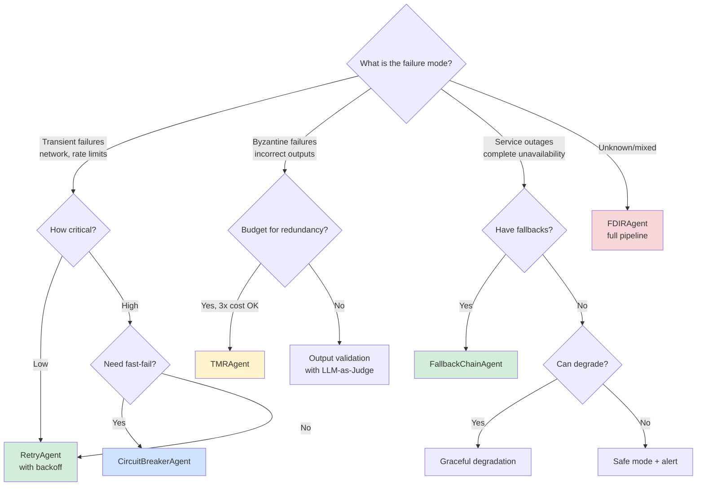
```mermaid
flowchart TD
    Start{What is the failure mode?}

    Start -->|Transient failures<br/>network, rate limits| Q1{How critical?}
    Q1 -->|Low| Retry[RetryAgent<br/>with backoff]
    Q1 -->|High| Q1a{Need fast-fail?}
    Q1a -->|Yes| CB[CircuitBreakerAgent]
    Q1a -->|No| Retry

    Start -->|Byzantine failures<br/>incorrect outputs| Q2{Budget for redundancy?}
    Q2 -->|Yes, 3x cost OK| TMR[TMRAgent]
    Q2 -->|No| LLMJudge[Output validation<br/>with LLM-as-Judge]

    Start -->|Service outages<br/>complete unavailability| Q3{Have fallbacks?}
    Q3 -->|Yes| Fallback[FallbackChainAgent]
    Q3 -->|No| Q3a{Can degrade?}
    Q3a -->|Yes| Degrade[Graceful degradation]
    Q3a -->|No| SafeMode[Safe mode + alert]

    Start -->|Unknown/mixed| FDIR[FDIRAgent<br/>full pipeline]

    style Retry fill:#d4edda
    style CB fill:#cfe2ff
    style TMR fill:#fff3cd
    style Fallback fill:#d4edda
    style FDIR fill:#f8d7da
```

*Figure 18: Reliability pattern selection flowchart.*

### 7.2 Cost-Reliability Trade-off Matrix

| Pattern | API Cost | Latency | Availability | Best For |
|---------|----------|---------|--------------|----------|
| None | 1× | Baseline | 95% | Dev/test |
| Retry(3) | ~1.5× | +50% worst | 99% | Production APIs |
| CircuitBreaker | 1× | Baseline | 99% | High-traffic |
| TMR | 3× | +10% | 99.9% | Critical decisions |
| Fallback(3) | ~1.5× | +100% worst | 99.9% | Degradation path |
| FDIR | 2-5× | +50% avg | 99.99% | Mission-critical |

### 7.3 Anti-Patterns

#### Anti-Pattern 1: Over-Protection

```python
# WRONG: Too many retries
retry_agent = RetryAgent(
    agent=base_agent,
    max_retries=100,  # Will burn API quota
    base_delay=0.1,   # Too aggressive
)
```

**Problem:** Excessive retries waste resources and can trigger rate limits.

**Fix:** Use reasonable limits (3-5 retries) with exponential backoff.

#### Anti-Pattern 2: Nested Circuit Breakers

```python
# WRONG: Circuit breakers at every level
outer_cb = CircuitBreakerAgent(
    agent=CircuitBreakerAgent(
        agent=CircuitBreakerAgent(
            agent=base_agent
        )
    )
)
```

**Problem:** Inner circuit breakers trip before outer ones, causing inconsistent behavior.

**Fix:** Single circuit breaker at the outermost level.

#### Anti-Pattern 3: Redundancy Without Voting

```python
# WRONG: Parallel agents without consensus
parallel = ParallelAgent(sub_agents=[agent1, agent2, agent3])
# Returns all 3 results - which one is correct?
```

**Problem:** No mechanism to determine correct result when agents disagree.

**Fix:** Use TMRAgent with voting strategy.

#### Anti-Pattern 4: Fallback to Same Service

```python
# WRONG: Fallback to same underlying service
fallback = FallbackChainAgent(agents=[
    LlmAgent(model="gpt-4o", ...),
    LlmAgent(model="gpt-4o-mini", ...),  # Same provider!
])
```

**Problem:** Provider outage affects all fallbacks.

**Fix:** Use diverse providers (OpenAI, Anthropic, Google) for true redundancy.

---

## VIII. Application Examples

### 8.1 Resilient Research Pipeline

**Use Case:** Multi-source research with redundancy and synthesis.

**Pattern:** `(A₁ ⊗ᵣ A₂ ⊗ᵣ A₃) ; Synthesizer` with FDIR

```python
import asyncio
from google.adk.agents import LlmAgent, SequentialAgent
from google.adk.tools import google_search
from reliability_patterns import TMRAgent, FDIRAgent, RetryAgent

# Research agents with different models for diversity
researcher_gemini = LlmAgent(
    name="ResearcherGemini",
    model="gemini-2.0-flash-exp",
    instruction="Research the given topic thoroughly. Cite sources.",
    tools=[google_search],
    output_key="research_gemini",
)

researcher_gpt = LlmAgent(
    name="ResearcherGPT",
    model="gpt-4o",
    instruction="Research the given topic thoroughly. Cite sources.",
    tools=[google_search],
    output_key="research_gpt",
)

researcher_claude = LlmAgent(
    name="ResearcherClaude",
    model="claude-3-sonnet",
    instruction="Research the given topic thoroughly. Cite sources.",
    tools=[google_search],
    output_key="research_claude",
)

# TMR for redundant research
tmr_research = TMRAgent(
    agents=[researcher_gemini, researcher_gpt, researcher_claude],
    voting_strategy="majority",
    name="TMRResearch",
)

# Synthesizer with retry protection
synthesizer = RetryAgent(
    agent=LlmAgent(
        name="Synthesizer",
        model="gemini-2.0-flash-exp",
        instruction="""
        Synthesize the research findings into a comprehensive report.
        Research consensus: {tmr_result}
        """,
        output_key="final_report",
    ),
    max_retries=3,
)

# Full pipeline with FDIR
resilient_pipeline = FDIRAgent(
    primary_agent=SequentialAgent(
        name="ResearchPipeline",
        sub_agents=[tmr_research, synthesizer],
    ),
    fallback_agents=[
        # Fallback: single researcher
        SequentialAgent(
            name="FallbackPipeline",
            sub_agents=[
                RetryAgent(agent=researcher_gemini, max_retries=5),
                synthesizer,
            ],
        ),
    ],
    max_retries=2,
    timeout=120.0,
)

# Execute
async def main():
    context = create_context("Research climate change mitigation strategies")
    async for event in resilient_pipeline.run_async(context):
        print(event.content)

asyncio.run(main())
```

### 8.2 Mission-Critical Code Generator

**Use Case:** Generate code meeting strict quality criteria.

**Pattern:** Goal Setting with FDIR (E4 autonomy)

```python
from langchain_openai import ChatOpenAI
from reliability_patterns import FDIRAgent, TMRAgent

# Multiple LLM providers for redundancy
llm_openai = ChatOpenAI(model="gpt-4o", temperature=0.3)
llm_anthropic = ChatOpenAI(model="claude-3-opus", temperature=0.3)
llm_google = ChatOpenAI(model="gemini-1.5-pro", temperature=0.3)

def generate_code_with_fdir(use_case: str, goals: list, max_iterations: int = 5):
    """
    FDIR-protected code generation with iterative refinement.
    """
    previous_code = ""
    feedback = ""

    for iteration in range(max_iterations):
        print(f"[FDIR] Iteration {iteration + 1}/{max_iterations}")

        # TMR for code generation
        prompt = f"""
        Generate Python code for: {use_case}
        Goals: {goals}
        {"Previous attempt:" + previous_code if previous_code else ""}
        {"Feedback:" + feedback if feedback else ""}
        """

        try:
            # Try all three LLMs
            responses = []
            for llm in [llm_openai, llm_anthropic, llm_google]:
                try:
                    response = llm.invoke([{"role": "user", "content": prompt}])
                    responses.append(response.content)
                except Exception as e:
                    print(f"[FDIR] LLM failed: {e}")

            if len(responses) < 2:
                raise RuntimeError("Not enough LLM responses for voting")

            # Majority voting (simplified: use most common)
            code = max(set(responses), key=responses.count)

        except Exception as e:
            print(f"[FDIR] Generation failed: {e}")
            # Fallback: use any available response
            if responses:
                code = responses[0]
            else:
                code = "# Generation failed"

        # Evaluate with LLM-as-judge
        eval_prompt = f"""
        Evaluate this code against goals {goals}:
        {code}

        Provide detailed feedback and end with "GOALS_MET: YES" or "GOALS_MET: NO"
        """

        try:
            feedback_response = llm_openai.invoke([{"role": "user", "content": eval_prompt}])
            feedback = feedback_response.content

            if "GOALS_MET: YES" in feedback:
                print(f"[FDIR] Goals met at iteration {iteration + 1}")
                return code

        except Exception as e:
            print(f"[FDIR] Evaluation failed: {e}")
            feedback = "Evaluation unavailable"

        previous_code = code

    print("[FDIR] Max iterations reached")
    return code

# Execute
code = generate_code_with_fdir(
    use_case="Fibonacci calculator with memoization",
    goals=["Correct", "Efficient", "Well-documented", "Handles edge cases"],
)
print(code)
```

---

## IX. Theoretical Properties

### 9.1 Theorem 13: Extended Completeness (Full Proof)

**Theorem 13:** The 5-dimensional space Λ' = D₁ × D₂ × D₃ × D₄ × D₅ is complete for reliability-aware agentic patterns.

**Proof:**

We prove completeness by showing that any reliability-aware agent pattern P can be encoded as a 5-tuple (d₁, d₂, d₃, d₄, d₅) ∈ Λ'.

**Part 1:** Every pattern P has a base pattern P₀ encodable in Λ (by Theorem 1 from 10_UNIFIED_THEORY.md).

**Part 2:** Every reliability mechanism R falls into one of four categories:

1. **None (R₀):** No reliability mechanism → d₅ = None
2. **Retry-based (R₁):** Exponential backoff, timeout, circuit breaker → d₅ = Retry
3. **Redundancy-based (R₂):** TMR, NMR, voting → d₅ = Redundant
4. **FDIR (R₃):** Full detection-isolation-recovery pipeline → d₅ = FDIR

**Part 3:** Any composite mechanism decomposes into these primitives:
- Retry + Redundancy ⊆ FDIR (FDIR subsumes both)
- Custom mechanisms map to the most capable category used

**Part 4:** Therefore, P = (P₀, R) maps to (d₁, d₂, d₃, d₄, d₅) where (d₁, d₂, d₃, d₄) encodes P₀ and d₅ encodes R.

**Conclusion:** Λ' is complete.

∎

### 9.2 Theorem 14: MTBF Composition

**Theorem 14:** Mean Time Between Failures composes as follows:

**For parallel systems (all must succeed):**
```
MTBF(A₁ ⊗ A₂) = 1 / (λ₁ + λ₂)
where λᵢ = 1/MTBF(Aᵢ) is failure rate
```

**For redundant parallel (majority must succeed):**
```
MTBF(A₁ ⊗ᵣ A₂ ⊗ᵣ A₃) ≈ 1 / (3λ²/2)
assuming equal λ for all agents
```

**For fallback sequential (any must succeed):**
```
MTBF(A₁ ;f A₂) = MTBF(A₁) + MTBF(A₂)
```

**Proof:**

Standard reliability theory. Parallel systems fail when any component fails (additive failure rates). TMR fails when 2+ of 3 fail (combinatorial). Fallback fails when all components fail (multiplicative reliability).

∎

### 9.3 Theorem 15: Availability Bounds

**Theorem 15:** Availability A = MTBF/(MTBF + MTTR) satisfies:

```
A(A₁ ⊗ᵣ A₂ ⊗ᵣ A₃) ≥ 1 - 3(1 - A(A₁))²
A(A₁ ;f A₂) ≥ 1 - (1 - A(A₁))(1 - A(A₂))
```

**Proof:**

TMR availability: System available when ≥2 of 3 available. Using inclusion-exclusion and assuming independence:

```
A_TMR = 3A² - 2A³ = 1 - 3(1-A)² + 2(1-A)³ ≥ 1 - 3(1-A)²
```

Fallback availability: System available when ≥1 available:

```
A_fallback = 1 - (1-A₁)(1-A₂)
```

∎

### 9.4 Theorem 16: Bounded Termination with Protection

**Theorem 16 (Bounded Termination):** The resilient iterative operator ★ᵣ **terminates** within bounded attempts. Convergence (condition satisfaction) is a separate property.

**Definitions:**
- **Termination:** The loop stops executing
- **Convergence:** The loop terminates AND the condition is satisfied

**Statement:**

For A★ᵣ(cond, k, r) with max k iterations and r retries per iteration:

1. **Termination Guarantee:** The loop terminates within at most k × r attempts
2. **Convergence Condition:** The loop converges if and only if there exists i ≤ k such that iteration i succeeds within r attempts AND cond(Sᵢ) = true

**Proof:**

*Part 1 (Termination):*
The loop structure ensures:
- At most k iterations
- At most r retries per iteration
- Total attempts ≤ k × r (finite)

Therefore termination is guaranteed. ∎

*Part 2 (Convergence):*
Let P = probability of successful execution per attempt.

If the condition is satisfiable within k successful iterations:
- Probability of at least one success in r attempts = 1 - (1-P)ʳ
- Expected successful iterations to convergence follows geometric distribution

The loop **converges** if:
- There exists sequence of successful iterations reaching condition
- Each required iteration succeeds within r attempts

The loop **terminates without convergence** if:
- All k iterations exhaust r retries without condition satisfaction
- Or condition is unreachable within k iterations

**Corollary:** Termination is guaranteed; convergence depends on condition reachability and P > 0.

∎

---

## X. Conclusion

### 10.1 Summary of Contributions

This document extends the Unified Theoretical Framework with aerospace-grade reliability engineering:

1. **5th Dimension (D₅):** Fault Tolerance = {None, Retry, Redundant, FDIR}
   - Extends design space from 81 to 324 configurations
   - Maintains orthogonality with D₁-D₄

2. **FDIR Semantics:** Formal Detection, Isolation, Recovery for agents
   - Health state machine
   - Detection rules
   - Isolation strategies (hierarchical, circuit breaker)
   - Recovery escalation ladder

3. **ECSS E1-E4 Mapping:** Aerospace autonomy levels → agent patterns
   - E1: None (ground control)
   - E2: Retry (event-based)
   - E3: Redundant (adaptive)
   - E4: FDIR (full autonomy)

4. **Extended Operators:** Reliability-aware composition
   - ⊗ᵣ (redundant parallel with voting)
   - ;f (fallback sequential)
   - ★ᵣ (resilient iterative)
   - +ₚ (protected tools)

5. **Pattern Library:** Complete implementations
   - RetryAgent, CircuitBreakerAgent, TMRAgent
   - FallbackChainAgent, HealthMonitorAgent, FDIRAgent

6. **Theoretical Properties:** Formal proofs
   - Extended completeness
   - MTBF/availability composition
   - Convergence with protection

### 10.2 From Best-Effort to Mission-Critical

The aerospace heritage transforms agentic systems:

| Before | After |
|--------|-------|
| Failures crash system | Failures handled gracefully |
| Single point of failure | Redundancy and fallback |
| Reactive error handling | Proactive health monitoring |
| Manual intervention | Autonomous recovery |
| Unknown reliability | Quantified availability |

### 10.3 Future Directions

1. **Formal Verification:** Prove correctness of FDIR implementations using model checking
2. **Automatic D₅ Selection:** ML-based recommendation of reliability level based on task criticality
3. **Distributed FDIR:** Extend to multi-node agent deployments
4. **Cost Optimization:** Dynamic reliability adjustment based on budget constraints

---

## References

### Internal Documentation

- [10_UNIFIED_THEORY.md](10_UNIFIED_THEORY.md) - Base framework (D₁-D₄, operators, theorems)
- [02_CORE_CONCEPTS.md](02_CORE_CONCEPTS.md) - Session state, events, tools
- [05_MULTIAGENT_COLLABORATION.md](05_MULTIAGENT_COLLABORATION.md) - LoopAgent, BaseAgent
- [06_GOAL_SETTING_ITERATION.md](06_GOAL_SETTING_ITERATION.md) - LLM-as-judge
- [07_DECISION_FRAMEWORKS.md](07_DECISION_FRAMEWORKS.md) - Pattern selection

### Aerospace Standards

- **ECSS-E-ST-70-11C:** Space Segment Operability (European Cooperation for Space Standardization)
- **NASA FDIR Handbook:** Fault Detection, Isolation, and Recovery guidelines
- **DO-178C:** Software Considerations in Airborne Systems

### Academic References

- Laprie, J.C. (1995). "Dependable Computing: Concepts, Limits, Challenges"
- Avizienis, A. et al. (2004). "Basic Concepts and Taxonomy of Dependable and Secure Computing"
- Pullum, L. (2001). "Software Fault Tolerance Techniques and Implementation"

---

## Appendix A: Quick Reference

### D₅ Value Selection

| Situation | Recommended D₅ |
|-----------|----------------|
| Development/testing | None |
| Production API calls | Retry |
| Financial decisions | Redundant |
| Safety-critical | FDIR |

### Pattern Cheatsheet

```python
# Retry
RetryAgent(agent, max_retries=3, base_delay=1.0, backoff_factor=2.0)

# Circuit Breaker
CircuitBreakerAgent(agent, failure_threshold=5, recovery_timeout=30.0)

# TMR
TMRAgent(agents=[a1, a2, a3], voting_strategy="majority")

# Fallback
FallbackChainAgent(agents=[primary, secondary, tertiary])

# Health Monitor
HealthMonitorAgent(agent, timeout=30.0, error_threshold=0.5)

# Full FDIR
FDIRAgent(primary_agent, fallback_agents=[...], max_retries=3)
```

### Operator Notation

| Operator | Symbol | Meaning |
|----------|--------|---------|
| Parallel | ⊗ | Concurrent, different tasks |
| Redundant Parallel | ⊗ᵣ | Concurrent, same task, voting |
| Sequential | ; | Pipeline |
| Fallback Sequential | ;f | Until success |
| Iterative | ★ | Loop with condition |
| Resilient Iterative | ★ᵣ | Loop with retry |
| Tool Augmentation | + | Add tools |
| Protected Tool | +ₚ | Add protected tools |

---

**Document Version:** 1.0
**Last Updated:** 2025-12-08
**Author:** Extended from Unified Theory
**License:** MIT (same as parent project)

---

**End of Document**
