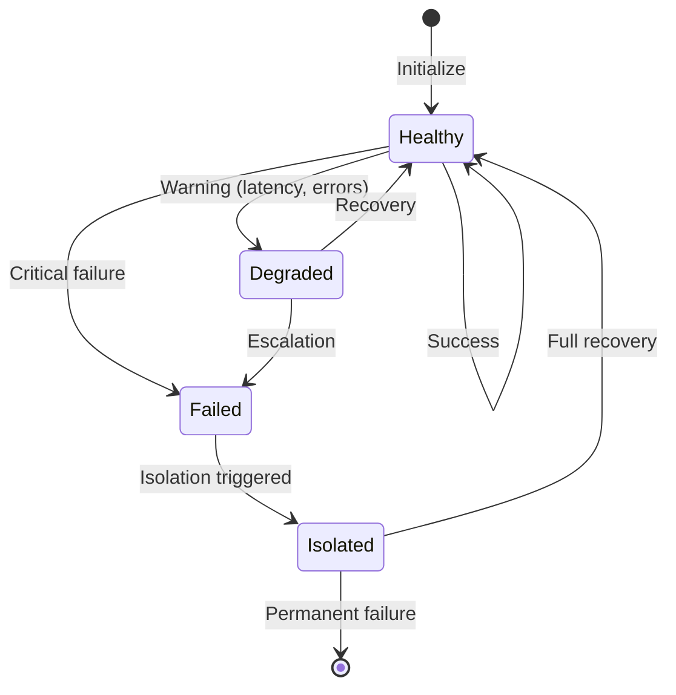
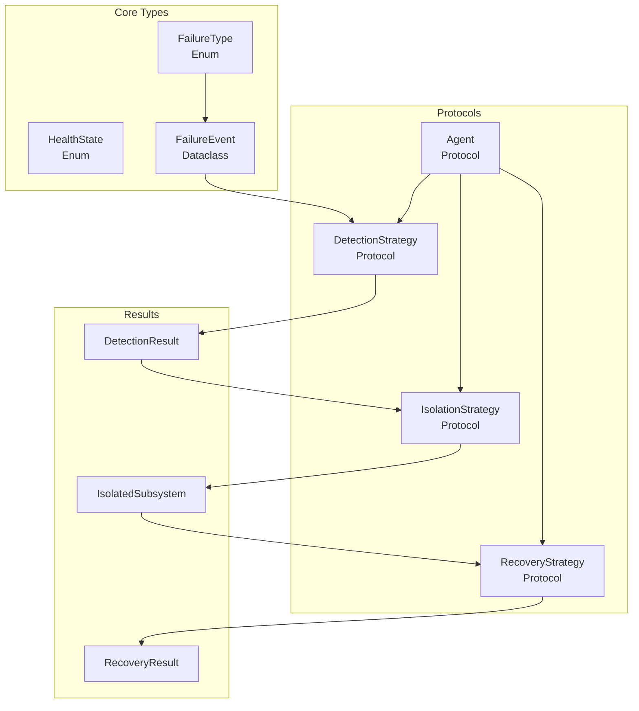

# Core Abstractions

**Part of**: [Python Architecture for Aerospace Reliability](12.0_OVERVIEW.md)

---

## TL;DR

This document defines the foundational types, protocols, and exceptions for the `aerospace_reliability` package. All components use Python's structural typing (`typing.Protocol`) for framework-agnostic design.

**Key exports**: `HealthState`, `FailureType`, `Agent`, `DetectionStrategy`, `IsolationStrategy`, `RecoveryStrategy`

---

## I. Package Structure

```
aerospace_reliability/
├── __init__.py                    # Package exports
├── py.typed                       # PEP 561 type marker
│
├── core/                          # Core types and protocols
│   ├── types.py                   # Enums, dataclasses
│   ├── protocols.py               # Abstract protocols
│   ├── context.py                 # ExecutionContext base
│   ├── events.py                  # Event types for observability
│   └── exceptions.py              # Custom exceptions
│
├── plugins/                       # Plugin system
│   ├── registry.py                # PluginRegistry
│   ├── discovery.py               # Entry point discovery
│   └── base.py                    # Plugin base classes
│
└── ... (see 12.0_OVERVIEW.md for full structure)
```

---

## II. Core Types (`core/types.py`)

### 2.1 Health State Machine

The `HealthState` enum defines agent health transitions:



**State Behaviors:**

| State | Description | Allowed Operations |
|-------|-------------|-------------------|
| `HEALTHY` | Normal operation | All requests processed |
| `DEGRADED` | Elevated error rate | Requests with monitoring |
| `FAILED` | Critical failure detected | New requests blocked |
| `ISOLATED` | Agent quarantined | Recovery attempts only |

### 2.2 Enumerations

| Enum | Values | Purpose |
|------|--------|---------|
| `HealthState` | HEALTHY, DEGRADED, FAILED, ISOLATED | Agent health tracking |
| `FailureType` | TIMEOUT, EXCEPTION, INVALID_OUTPUT, RATE_LIMIT, UNAVAILABLE, VALIDATION_FAILED, ANOMALY_DETECTED | Failure classification |
| `FaultToleranceStrategy` | NONE, RETRY, REDUNDANT, FDIR | D₅ dimension values |
| `ECSSAutonomyLevel` | E1_GROUND_CONTROL, E2_EVENT_BASED, E3_ADAPTIVE, E4_FULL_AUTONOMY | ECSS-E-ST-70-11C levels |
| `CircuitState` | CLOSED, OPEN, HALF_OPEN | Circuit breaker states |
| `RecoveryLevel` | L0_RETRY, L1_FALLBACK, L2_DEGRADATION, L3_SAFE_MODE | Escalation ladder |

### 2.3 Data Classes

| Class | Fields | Purpose |
|-------|--------|---------|
| `FailureEvent` | failure_type, timestamp, agent_id, message, context, exception | Immutable failure record |
| `DetectionResult` | is_healthy, confidence, failure_type, evidence, severity | Detection phase output |
| `RecoveryResult` | success, level_used, result, escalate, reason | Recovery phase output |
| `IsolatedSubsystem` | agent_id, failure_event, state_snapshot, isolation_time | Isolated agent state |

> **Full Implementation**: See [12.6_EXAMPLES.md](12.6_EXAMPLES.md#core-types) for complete code.

---

## III. Core Protocols (`core/protocols.py`)

All protocols use `typing.Protocol` for structural (duck) typing. Any class implementing the required methods is compatible without explicit inheritance.

### 3.1 ExecutionContext Protocol

```python
@runtime_checkable
class ExecutionContext(Protocol):
    """Framework-agnostic execution context."""

    @property
    def session_state(self) -> Dict[str, Any]: ...

    @property
    def metadata(self) -> Dict[str, Any]: ...

    def get(self, key: str, default: Any = None) -> Any: ...
    def set(self, key: str, value: Any) -> None: ...
```

**Purpose**: Provides access to session state and metadata without coupling to specific frameworks.

### 3.2 Agent Protocol

```python
@runtime_checkable
class Agent(Protocol[T, R]):
    """Framework-agnostic agent interface."""

    @property
    def name(self) -> str: ...

    async def execute(
        self,
        input: T,
        context: ExecutionContext
    ) -> AsyncIterator[R]: ...
```

**Key Properties**:
- Generic over input type `T` and result type `R`
- Async iterator enables streaming responses
- Any callable can be adapted to this interface

### 3.3 Strategy Protocols

| Protocol | Key Method | Phase | Purpose |
|----------|------------|-------|---------|
| `DetectionStrategy` | `detect(observation, context) → DetectionResult` | FDIR-D | Fault detection |
| `IsolationStrategy` | `isolate(event, agent, context) → IsolatedSubsystem` | FDIR-I | Fault containment |
| `RecoveryStrategy` | `recover(event, agent, context) → RecoveryResult` | FDIR-R | Fault recovery |
| `VotingStrategy` | `vote(results) → Any` | Composition | Consensus selection |
| `HealthMonitor` | `check_health() → DetectionResult` | Monitoring | Proactive detection |
| `MetricsCollector` | `get_mtbf(agent_id) → float` | Observability | Reliability metrics |

### 3.4 CompositionOperator Protocol

```python
class CompositionOperator(Protocol[T]):
    """Reliability-aware composition operator."""

    @property
    def name(self) -> str: ...

    @property
    def algebraic_properties(self) -> Dict[str, Any]:
        """Returns: associative, commutative, identity element"""
        ...

    def compose(self, *agents: Agent) -> Agent:
        """Compose agents into a single agent (closure property)."""
        ...
```

**Closure Property**: All operators must satisfy `compose: Agent × Agent × ... → Agent`, enabling arbitrary nesting.

---

## IV. Exception Hierarchy (`core/exceptions.py`)

```
AerospaceReliabilityError (base)
├── DetectionError          # Fault detection phase failure
├── IsolationError          # Fault isolation phase failure
├── RecoveryError           # Fault recovery phase failure
│   └── RecoveryExhaustedError  # All strategies exhausted
├── CircuitOpenError        # Circuit breaker blocking requests
├── NoConsensusError        # TMR/NMR voting failed
├── SafeModeError           # System entered safe mode
├── ConfigurationError      # Invalid configuration
└── AdapterError            # Framework adapter failure
```

### Exception Details

| Exception | Attributes | Raised When |
|-----------|------------|-------------|
| `RecoveryExhaustedError` | `levels_tried`, `last_error` | All recovery strategies failed |
| `CircuitOpenError` | `agent_id`, `recovery_time` | Request blocked by circuit breaker |
| `NoConsensusError` | `results`, `reason` | TMR voting couldn't reach consensus |
| `SafeModeError` | `trigger` | System entered minimal operation mode |

---

## V. Plugin System

### 5.1 Plugin Registry

The `PluginRegistry` enables extensibility without modifying core code:

```python
# Pre-configured registries
detection_registry = PluginRegistry['DetectionStrategy']("aerospace_reliability.detection")
isolation_registry = PluginRegistry['IsolationStrategy']("aerospace_reliability.isolation")
recovery_registry = PluginRegistry['RecoveryStrategy']("aerospace_reliability.recovery")
voting_registry = PluginRegistry['VotingStrategy']("aerospace_reliability.voting")
```

**Registration Methods**:

| Method | Use Case |
|--------|----------|
| Programmatic | `registry.register(name="custom", factory=CustomClass)` |
| Entry Points | `pyproject.toml` configuration |
| Configuration | YAML/JSON files |

### 5.2 Entry Point Configuration

Third-party plugins register via `pyproject.toml`:

```toml
[project.entry-points."aerospace_reliability.detection"]
ml_anomaly = "my_package.detectors:MLAnomalyDetector"

[project.entry-points."aerospace_reliability.recovery"]
custom_fallback = "my_package.recovery:CustomFallbackStrategy"
```

### 5.3 Plugin Base Classes

| Base Class | Purpose | Required Methods |
|------------|---------|------------------|
| `DetectionPlugin` | Detection strategy plugins | `name`, `version`, `create_strategy(config)` |
| `IsolationPlugin` | Isolation strategy plugins | `name`, `version`, `create_strategy(config)` |
| `RecoveryPlugin` | Recovery strategy plugins | `name`, `version`, `create_strategy(config)` |
| `VotingPlugin` | Voting strategy plugins | `name`, `version`, `create_strategy(config)` |

> **Full Implementation**: See [12.6_EXAMPLES.md](12.6_EXAMPLES.md#plugin-system) for complete registry code.

---

## VI. Type Relationships



---

## VII. Design Decisions

### Why Protocols Over ABC?

| Aspect | `Protocol` | `ABC` |
|--------|-----------|-------|
| **Typing** | Structural (duck typing) | Nominal (explicit inheritance) |
| **Framework Integration** | Wrap any callable | Requires subclassing |
| **Runtime Checking** | `@runtime_checkable` optional | Always available |
| **Flexibility** | Higher | Lower |

### Why Async Iterators?

| Benefit | Description |
|---------|-------------|
| **Streaming** | Progressive result delivery |
| **Backpressure** | Consumer controls flow |
| **Cancellation** | Clean task termination |
| **Memory** | Bounded memory for large outputs |

### Why Immutable FailureEvent?

| Benefit | Description |
|---------|-------------|
| **Thread Safety** | Safe concurrent access |
| **Audit Trail** | Events can't be modified after creation |
| **Hashable** | Can be used as dict keys or in sets |

---

## Next Steps

- **Strategies**: See [12.2_FDIR_STRATEGIES.md](12.2_FDIR_STRATEGIES.md) for detection, isolation, recovery implementations
- **Composition**: See [12.3_COMPOSITION.md](12.3_COMPOSITION.md) for operator definitions
- **Code**: See [12.6_EXAMPLES.md](12.6_EXAMPLES.md) for complete implementations
