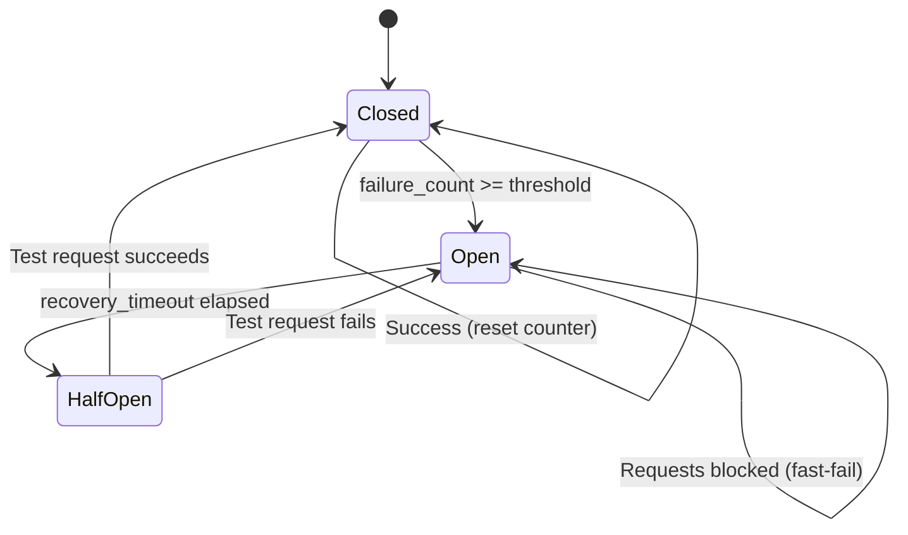

# FDIR Strategies

**Part of**: [Python Architecture for Aerospace Reliability](12.0_OVERVIEW.md)

---

## TL;DR

FDIR (Fault Detection, Isolation, Recovery) is a three-phase pipeline for managing failures:
1. **Detection (D)**: Identify when something is wrong
2. **Isolation (I)**: Contain the failure to prevent cascade
3. **Recovery (R)**: Restore normal operation

This document covers all strategy implementations for each phase.

---

## I. Four-Layer Defense Model

```
┌───────────────────────────────────────────────────────────────────┐
│                    OUTPUT QUALITY PIPELINE                         │
├───────────────────────────────────────────────────────────────────┤
│                                                                   │
│   [INPUT] → [AGENT EXECUTION] → [OUTPUT]                          │
│                                                                   │
│   Layer 1: SCHEMA ENFORCEMENT (Generation-Time)                   │
│            • JSON Schema in prompt / response_format              │
│            • ~95-98% format compliance                            │
│                                                                   │
│   Layer 2: DETECTION (Post-Execution)                             │
│            • TimeoutDetector, ExceptionDetector                   │
│            • OutputValidationDetector, AnomalyDetector            │
│                                                                   │
│   Layer 3: AUTO-CORRECTION (Inference)                            │
│            • Extract JSON from markdown blocks                    │
│            • Pydantic type coercion                               │
│                                                                   │
│   Layer 4: RECOVERY WITH FEEDBACK (Retry)                         │
│            • RetryStrategy with error context                     │
│            • Exponential backoff                                  │
│                                                                   │
└───────────────────────────────────────────────────────────────────┘
```

**Reliability Composition:**
```
P(success) = 1 - (1-P_schema)(1-P_detect)(1-P_correct)^retries

Example: Schema(95%) + Correction(70%) + 2 retries(20% each)
         = 1 - (0.05)(0.30)(0.20)² = 99.94%
```

---

## II. Detection Strategies (FDIR-D)

Detection identifies when agents are failing or about to fail.

### 2.1 Strategy Selection Guide

| Detector | Use When | Detection Rule | Latency |
|----------|----------|----------------|---------|
| `TimeoutDetector` | Response time matters | `elapsed > threshold` | ~0ms |
| `ExceptionDetector` | Catching runtime errors | `exception is not None` | ~0ms |
| `OutputValidationDetector` | Structured output required | `not validator(output)` | ~1ms |
| `StatisticalAnomalyDetector` | Detecting drift | `zscore > threshold` | ~5ms |
| `CompositeDetector` | Multiple conditions | `any(detectors)` | Sum |

### 2.2 TimeoutDetector

**Purpose**: Detects failures based on response time exceeding threshold.

```python
@dataclass
class TimeoutDetectorConfig:
    timeout_seconds: float = 30.0
    warning_threshold: float = 0.8  # Warn at 80% of timeout
```

**Detection Logic:**
```
if elapsed > timeout_seconds:
    return Failure(TIMEOUT, severity=1.0)
elif elapsed > timeout_seconds * warning_threshold:
    return Healthy(severity=0.5, warning=True)
else:
    return Healthy(severity=0.0)
```

### 2.3 OutputValidationDetector

**Purpose**: Validates agent output against configurable rules.

```python
@dataclass
class ValidationDetectorConfig:
    validator: Optional[Callable[[Any], bool]] = None
    min_length: Optional[int] = None
    max_length: Optional[int] = None
    required_fields: List[str] = None
```

**Validation Order:**
1. Check output is not None
2. Run custom validator function
3. Check length constraints
4. Verify required fields (for dict output)

### 2.4 StatisticalAnomalyDetector

**Purpose**: Detects anomalies using z-score analysis on response time and output characteristics.

```python
@dataclass
class AnomalyDetectorConfig:
    zscore_threshold: float = 3.0      # Standard deviations
    window_size: int = 100             # Rolling window
    min_samples: int = 10              # Minimum before detection
    metrics: List[str] = field(default_factory=lambda: ["elapsed", "output_length"])
```

**Algorithm:**
```
z_score = (observation - mean) / std_dev

if abs(z_score) > threshold:
    return Failure(ANOMALY_DETECTED, confidence=min(1.0, abs(z_score)/5))
else:
    return Healthy()
```

**Key Features:**
- Rolling window for adaptive baseline
- Multiple metric support (latency, output size, token count)
- Configurable sensitivity via z-score threshold
- Graceful handling of insufficient samples

### 2.5 CompositeDetector

**Purpose**: Combines multiple detection strategies with configurable aggregation.

```python
class CompositeDetector:
    def __init__(
        self,
        strategies: List[DetectionStrategy],
        fail_fast: bool = True  # Return on first failure vs run all
    ): ...
```

**Aggregation Modes:**
- `fail_fast=True`: Return immediately on first unhealthy result
- `fail_fast=False`: Run all strategies, return worst result

---

## III. Isolation Strategies (FDIR-I)

Isolation contains failures to prevent cascade effects across the system.

### 3.1 Strategy Selection Guide

| Isolator | Use When | Mechanism | Scope |
|----------|----------|-----------|-------|
| `CircuitBreakerIsolation` | Repeated failures | State machine | Per-agent |
| `HierarchicalIsolation` | Parent-child agents | Propagation | Subtree |
| `BulkheadIsolation` | Resource exhaustion | Thread pools | Per-resource |

### 3.2 CircuitBreakerIsolation

**Purpose**: Prevents cascade failures by fast-failing when service is unhealthy.

```python
@dataclass
class CircuitBreakerConfig:
    failure_threshold: int = 5       # Open after N failures
    recovery_timeout: float = 30.0   # Seconds before half-open
    half_open_max_calls: int = 1     # Test calls in half-open
```

**State Machine:**



**State Behaviors:**

| State | Request Behavior | Transition Trigger |
|-------|------------------|-------------------|
| `CLOSED` | Pass through | failures >= threshold |
| `OPEN` | Raise `CircuitOpenError` | timeout elapsed |
| `HALF_OPEN` | Allow 1 test request | success → CLOSED, fail → OPEN |

### 3.3 HierarchicalIsolation

**Purpose**: Propagates isolation decisions through agent hierarchies (parent-child relationships).

```python
@dataclass
class HierarchicalIsolationConfig:
    propagate_up: bool = True     # Notify parent of child failures
    propagate_down: bool = False  # Isolate children when parent fails
    isolation_depth: int = -1     # -1 = unlimited, N = max levels
```

**Propagation Rules:**

```
On child failure:
    1. Isolate failed child
    2. If propagate_up:
        a. Increment parent's child_failure_count
        b. If child_failure_count >= threshold:
            - Mark parent as DEGRADED
            - Optionally isolate parent

On parent failure:
    1. Isolate failed parent
    2. If propagate_down:
        a. For each child up to isolation_depth:
            - Mark child as ISOLATED
            - Prevent new requests to child
```

**Use Cases:**
- Coordinator agent with sub-agents
- Multi-stage pipelines
- Hierarchical tool chains

### 3.4 BulkheadIsolation

**Purpose**: Isolates resource pools to prevent one agent from exhausting shared resources.

```python
@dataclass
class BulkheadIsolationConfig:
    max_concurrent: int = 10          # Max concurrent executions
    max_queue_size: int = 100         # Max waiting requests
    timeout_seconds: float = 30.0     # Queue wait timeout
    name: str = "default"             # Bulkhead identifier
```

**Mechanism:**

```
┌─────────────────────────────────────────────────────┐
│                   Request Flow                       │
├─────────────────────────────────────────────────────┤
│                                                     │
│   Request → [Semaphore Check] → [Queue] → [Execute] │
│                    │              │                 │
│                    ▼              ▼                 │
│              max_concurrent  max_queue_size         │
│                exceeded?      exceeded?             │
│                    │              │                 │
│                    ▼              ▼                 │
│              Wait/Timeout    Reject Fast            │
│                                                     │
└─────────────────────────────────────────────────────┘
```

**Key Features:**
- Per-agent resource pools via named bulkheads
- Configurable queue depth and timeout
- Fast rejection when queue full (no resource starvation)
- Metrics: queue_depth, active_count, rejected_count

---

## IV. Recovery Strategies (FDIR-R)

Recovery restores system function through an escalation ladder.

### 4.1 Escalation Ladder

```
┌─────────────────────────────────────────────────────┐
│                RECOVERY ESCALATION                   │
├─────────────────────────────────────────────────────┤
│                                                     │
│  Failure Detected                                   │
│       │                                             │
│       ▼                                             │
│  ┌─────────────┐                                    │
│  │ L0: RETRY   │ Same agent, exponential backoff    │
│  └──────┬──────┘                                    │
│         │ exhausted                                 │
│         ▼                                           │
│  ┌─────────────┐                                    │
│  │ L1: FALLBACK│ Alternative agent                  │
│  └──────┬──────┘                                    │
│         │ exhausted                                 │
│         ▼                                           │
│  ┌─────────────┐                                    │
│  │L2: DEGRADE  │ Reduced functionality              │
│  └──────┬──────┘                                    │
│         │ exhausted                                 │
│         ▼                                           │
│  ┌─────────────┐                                    │
│  │L3: SAFE MODE│ Minimal operation                  │
│  └─────────────┘                                    │
│                                                     │
└─────────────────────────────────────────────────────┘
```

### 4.2 Strategy Selection Guide

| Strategy | Level | Use When | Mechanism |
|----------|-------|----------|-----------|
| `RetryStrategy` | L0 | Transient failures | Exponential backoff |
| `FallbackStrategy` | L1 | Primary unavailable | Sequential alternatives |
| `DegradationStrategy` | L2 | Partial function OK | Capability reduction |
| `SafeModeStrategy` | L3 | Must not fail | Minimal operation |

### 4.3 RetryStrategy

**Purpose**: Retry with exponential backoff and jitter.

```python
@dataclass
class RetryConfig:
    max_retries: int = 3
    base_delay: float = 1.0
    max_delay: float = 60.0
    backoff_factor: float = 2.0
    jitter: float = 0.1
    retryable_failures: Tuple[FailureType, ...] = (
        FailureType.TIMEOUT,
        FailureType.RATE_LIMIT,
        FailureType.UNAVAILABLE,
    )
```

**Backoff Formula:**
```
delay = min(base_delay * backoff_factor^attempt, max_delay)
delay += random.uniform(-jitter * delay, jitter * delay)
```

**Example Timeline:**
```
Attempt 0: immediate
Attempt 1: ~1.0s (1.0 * 2^0)
Attempt 2: ~2.0s (1.0 * 2^1)
Attempt 3: ~4.0s (1.0 * 2^2)
```

### 4.4 FallbackStrategy

**Purpose**: Try alternative agents sequentially until one succeeds.

```python
@dataclass
class FallbackConfig:
    fallback_agents: List[Agent]
    stop_on_success: bool = True
```

**Execution Flow:**
```
for agent in [primary] + fallback_agents:
    try:
        result = await agent.execute(input, context)
        if stop_on_success:
            return result
    except Exception:
        continue

raise RecoveryExhaustedError(levels_tried=[L1_FALLBACK])
```

### 4.5 DegradationStrategy

**Purpose**: Reduce functionality to maintain core operation.

```python
@dataclass
class DegradationConfig:
    capability_levels: List[CapabilityLevel]
    min_capability: CapabilityLevel
    degradation_timeout: float = 300.0  # Auto-restore after 5min

@dataclass
class CapabilityLevel:
    name: str
    features_enabled: Set[str]
    max_complexity: int
    description: str
```

**Example Capability Levels:**
```python
capability_levels = [
    CapabilityLevel(
        name="full",
        features_enabled={"search", "analysis", "synthesis", "visualization"},
        max_complexity=100,
        description="All features enabled"
    ),
    CapabilityLevel(
        name="reduced",
        features_enabled={"search", "analysis"},
        max_complexity=50,
        description="Core analysis only"
    ),
    CapabilityLevel(
        name="minimal",
        features_enabled={"search"},
        max_complexity=10,
        description="Search only, no analysis"
    ),
]
```

**Degradation Logic:**
```
on failure at level N:
    if N < len(capability_levels) - 1:
        current_level = capability_levels[N + 1]
        schedule_restoration(degradation_timeout)
        return Degraded(level=current_level)
    else:
        escalate to L3_SAFE_MODE
```

### 4.6 SafeModeStrategy

**Purpose**: Enter minimal operation mode, typically with human escalation.

```python
@dataclass
class SafeModeConfig:
    safe_response: Any = "System is in safe mode. Please contact support."
    notify_channels: List[str] = field(default_factory=list)
    auto_restore: bool = False
    restore_after_seconds: float = 3600.0
```

**Safe Mode Behavior:**
1. All new requests return `safe_response`
2. Alert sent to `notify_channels`
3. System logs SafeModeError with trigger information
4. If `auto_restore`, schedule restoration attempt

### 4.7 EscalationLadder

**Purpose**: Orchestrate recovery attempts through escalation levels.

```python
class EscalationLadder:
    def __init__(self, strategies: List[RecoveryStrategy]):
        # Sorted by RecoveryLevel (L0 → L3)
        self.strategies = sorted(strategies, key=lambda s: s.level.value)

    async def recover(
        self,
        failure_event: FailureEvent,
        agent: Agent,
        context: ExecutionContext
    ) -> RecoveryResult:
        for strategy in self.strategies:
            if not strategy.can_handle(failure_event.failure_type):
                continue

            result = await strategy.recover(failure_event, agent, context)
            if result.success:
                return result
            if not result.escalate:
                break

        raise RecoveryExhaustedError(levels_tried=[...])
```

---

## V. Gating Mechanisms

Six gating mechanisms control execution flow through the pipeline:

| Gate | Mechanism | Trigger | Use Case |
|------|-----------|---------|----------|
| **Output Validation** | `OutputValidationDetector` | Schema mismatch | Structured output |
| **LLM-as-Judge** | Binary True/False | Quality criteria | Subjective goals |
| **TMR/Consensus** | `MajorityVoting` | No agreement | Critical decisions |
| **Circuit Breaker** | `CircuitBreakerIsolation` | Failure threshold | Cascade prevention |
| **Timeout** | `TimeoutDetector` | Response time | Latency bounds |
| **Rate Limit** | Request counter | Quota exceeded | API protection |

**Combined Gating Stack:**
```
Input → RateLimiter → CircuitBreaker → Agent → OutputValidator → LLMJudge → TMR → Output
```

---

## VI. Auto-Correction Strategies

Auto-correction attempts to repair malformed outputs before triggering retry:

| Strategy | Technique | Success Rate |
|----------|-----------|--------------|
| **JSON Extraction** | Extract from markdown code blocks | ~90% |
| **Type Coercion** | Pydantic automatic conversion | ~95% |
| **Syntax Repair** | Fix trailing commas, quotes | ~80% |
| **LLM Repair** | Ask LLM to fix malformed output | ~85% |

```python
class CompositeCorrector:
    """Chain multiple correction strategies."""

    def __init__(self, strategies: List[CorrectionStrategy]):
        self.strategies = strategies

    async def correct(self, output, schema, error) -> CorrectionResult:
        for strategy in self.strategies:
            result = await strategy.correct(output, schema, error)
            if result.success:
                return result
        return CorrectionResult(success=False, reason="All strategies exhausted")
```

---

## Next Steps

- **Composition**: See [12.3_COMPOSITION.md](12.3_COMPOSITION.md) for combining strategies
- **Patterns**: See [12.4_PATTERNS.md](12.4_PATTERNS.md) for high-level FDIRAgent
- **Code**: See [12.6_EXAMPLES.md](12.6_EXAMPLES.md) for complete implementations
