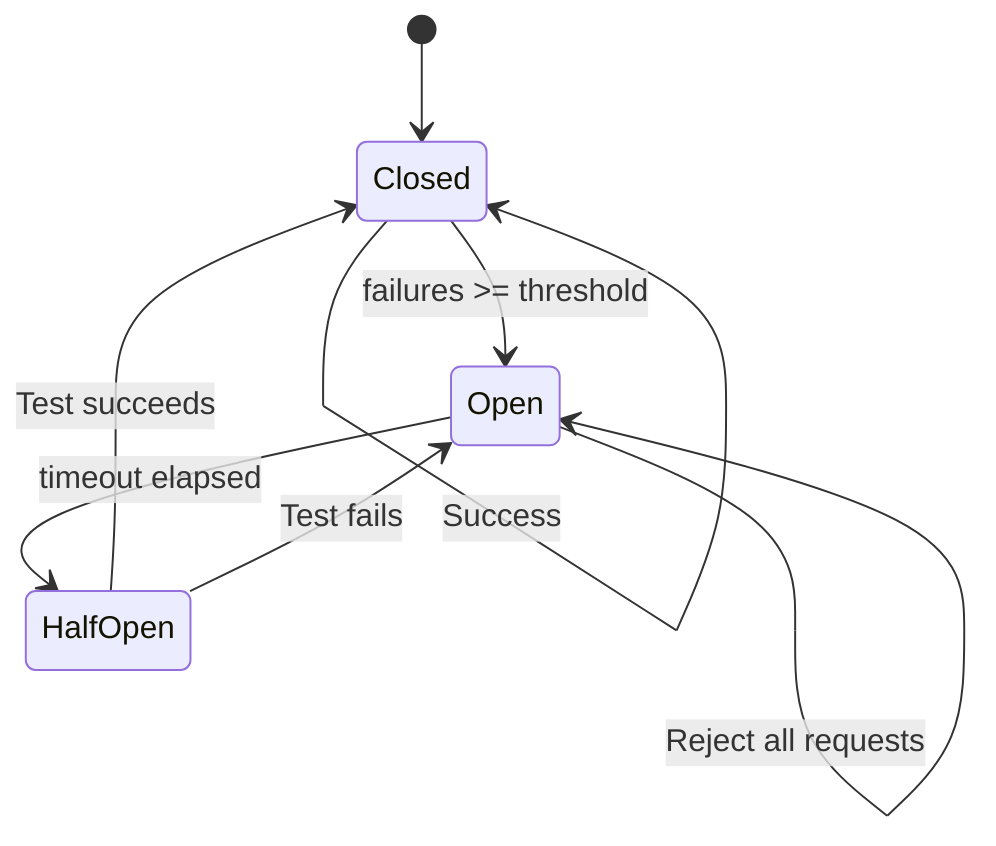

# High-Level Patterns

**Part of**: [Python Architecture for Aerospace Reliability](12.0_OVERVIEW.md)

---

## TL;DR

High-level patterns compose strategies and operators into ready-to-use agents:
- **FDIRAgent**: Complete fault handling (Detection → Isolation → Recovery)
- **TMRAgent**: Triple modular redundancy with voting
- **RetryAgent**: Simple retry wrapper with backoff
- **FallbackChainAgent**: Sequential fallback through alternatives
- **HealthMonitorAgent**: Continuous health monitoring with proactive detection
- **CircuitBreakerAgent**: Fast-fail on repeated failures

---

## I. Pattern Selection Guide

```
                    What's your reliability need?
                              │
        ┌─────────────────────┼─────────────────────┐
        ▼                     ▼                     ▼
   Transient           Critical            Continuous
   failures?          decisions?          monitoring?
        │                     │                     │
        ▼                     ▼                     ▼
┌───────────────┐    ┌───────────────┐    ┌───────────────┐
│ RetryAgent    │    │ TMRAgent      │    │HealthMonitor  │
│ CircuitBreaker│    │               │    │Agent          │
└───────┬───────┘    └───────┬───────┘    └───────┬───────┘
        │                     │                     │
        └─────────────────────┴─────────────────────┘
                              │
                    Need all of the above?
                              │
                              ▼
                      ┌───────────────┐
                      │  FDIRAgent    │
                      │ (Complete)    │
                      └───────────────┘
```

### Pattern Matrix

| Pattern | D₅ Level | ECSS | Complexity | Use Case |
|---------|----------|------|------------|----------|
| RetryAgent | Retry | E2 | Low | API rate limits, transient errors |
| CircuitBreakerAgent | Retry | E2 | Low | Cascade prevention |
| FallbackChainAgent | Retry | E2 | Medium | Provider redundancy |
| TMRAgent | Redundant | E3 | Medium | Critical decisions |
| HealthMonitorAgent | FDIR | E3-E4 | Medium | Proactive monitoring |
| FDIRAgent | FDIR | E4 | High | Mission-critical systems |

---

## II. RetryAgent

**Purpose**: Wrap any agent with retry logic and exponential backoff.

### Configuration

```python
@dataclass
class RetryAgentConfig:
    agent: Agent
    max_retries: int = 3
    base_delay: float = 1.0
    max_delay: float = 60.0
    backoff_factor: float = 2.0
    retryable_exceptions: Tuple[Type[Exception], ...] = (Exception,)
```

### Behavior

```
Request → Agent → Success → Return
              ↓
           Failure
              ↓
         Retryable? ──No──→ Raise
              │
             Yes
              ↓
         Wait (backoff)
              ↓
         Retry count < max? ──No──→ Raise
              │
             Yes
              ↓
         Loop back to Agent
```

### Usage

```python
retry_agent = RetryAgent(
    agent=my_llm_agent,
    config=RetryAgentConfig(max_retries=3, base_delay=1.0)
)

# Automatically retries on failure
result = await retry_agent.execute(input, context)
```

---

## III. CircuitBreakerAgent

**Purpose**: Prevent cascade failures by fast-failing when upstream is unhealthy.

### Configuration

```python
@dataclass
class CircuitBreakerAgentConfig:
    agent: Agent
    failure_threshold: int = 5
    recovery_timeout: float = 30.0
    half_open_max_calls: int = 1
```

### State Machine



### Usage

```python
cb_agent = CircuitBreakerAgent(
    agent=external_api_agent,
    config=CircuitBreakerAgentConfig(
        failure_threshold=5,
        recovery_timeout=30.0
    )
)

try:
    result = await cb_agent.execute(input, context)
except CircuitOpenError as e:
    print(f"Circuit open, retry in {e.recovery_time}s")
```

---

## IV. FallbackChainAgent

**Purpose**: Try agents sequentially until one succeeds.

### Configuration

```python
@dataclass
class FallbackChainConfig:
    primary: Agent
    fallbacks: List[Agent]
    return_first_success: bool = True
```

### Behavior

```
Request → Primary → Success → Return
              ↓
           Failure
              ↓
         Fallback[0] → Success → Return
              ↓
           Failure
              ↓
         Fallback[1] → ...
              ↓
         All failed → Raise RecoveryExhaustedError
```

### Usage

```python
chain = FallbackChainAgent(
    primary=gpt4_agent,
    fallbacks=[
        gpt35_agent,      # Cheaper fallback
        cached_agent,      # Offline fallback
        default_response   # Static fallback
    ]
)
```

---

## V. TMRAgent

**Purpose**: Triple Modular Redundancy with configurable voting.

### Configuration

```python
@dataclass
class TMRAgentConfig:
    agents: List[Agent]  # Typically 3, but supports NMR
    voting_strategy: VotingStrategy = MajorityVoting()
    timeout: float = 30.0
    min_successful: int = 2
```

### Behavior

```
Request ──┬──→ Agent₁ ──┐
          │             │
          ├──→ Agent₂ ──┼──→ Vote ──→ Consensus ──→ Return
          │             │
          └──→ Agent₃ ──┘
                        │
                   < min_successful
                        │
                        ▼
                 NoConsensusError
```

### Fault Tolerance

| N (Agents) | Failures Tolerated | Min for Consensus |
|------------|-------------------|-------------------|
| 3 (TMR) | 1 | 2 |
| 5 | 2 | 3 |
| 7 | 3 | 4 |
| N | ⌊(N-1)/2⌋ | ⌈N/2⌉ |

### Usage

```python
tmr = TMRAgent(
    agents=[
        openai_agent,
        anthropic_agent,
        google_agent
    ],
    voting_strategy=MajorityVoting(similarity_threshold=0.85)
)

# Executes all three, votes on result
result = await tmr.execute("Analyze this document", context)
```

---

## VI. HealthMonitorAgent

**Purpose**: Continuous health monitoring with proactive fault detection.

### Configuration

```python
@dataclass
class HealthMonitorConfig:
    agent: Agent
    check_interval: float = 60.0      # Seconds between health checks
    health_check_input: Any = None    # Input for health check calls
    degraded_threshold: float = 0.8   # Error rate for DEGRADED
    failed_threshold: float = 0.95    # Error rate for FAILED
    window_size: int = 100            # Rolling window for metrics
    auto_isolate: bool = True         # Isolate on FAILED state
```

### Health Metrics

| Metric | Calculation | Threshold |
|--------|-------------|-----------|
| `error_rate` | failures / total | > degraded_threshold |
| `avg_latency` | mean(response_times) | > timeout * 0.8 |
| `p99_latency` | percentile(response_times, 99) | > timeout |
| `consecutive_failures` | count since last success | > 3 |

### State Transitions

```python
# Health state machine
on each_request:
    if success:
        record_success(latency)
        if health_state == DEGRADED and error_rate < degraded_threshold * 0.5:
            transition(HEALTHY)
    else:
        record_failure(error)
        if error_rate > failed_threshold:
            transition(FAILED)
            if auto_isolate:
                isolate_agent()
        elif error_rate > degraded_threshold:
            transition(DEGRADED)
```

### Proactive Health Checks

```python
class HealthMonitorAgent:
    async def _health_check_loop(self):
        """Background task for periodic health checks."""
        while self._running:
            await asyncio.sleep(self.config.check_interval)

            try:
                start = time.monotonic()
                await self.agent.execute(
                    self.config.health_check_input,
                    self._create_health_check_context()
                )
                latency = time.monotonic() - start
                await self._record_health_check_success(latency)

            except Exception as e:
                await self._record_health_check_failure(e)
                if self.consecutive_failures > 3:
                    await self._trigger_proactive_isolation()
```

### Usage

```python
monitored = HealthMonitorAgent(
    agent=api_agent,
    config=HealthMonitorConfig(
        check_interval=30.0,
        health_check_input={"ping": True},
        degraded_threshold=0.1,  # 10% error rate
        failed_threshold=0.5     # 50% error rate
    )
)

# Start monitoring
await monitored.start()

# Use normally - health is tracked automatically
result = await monitored.execute(input, context)

# Check current health
print(f"Health: {monitored.health_state}")  # HEALTHY, DEGRADED, or FAILED
print(f"Error rate: {monitored.metrics['error_rate']:.2%}")
```

---

## VII. FDIRAgent

**Purpose**: Complete FDIR pipeline integrating all strategies.

### Configuration

```python
@dataclass
class FDIRAgentConfig:
    agent: Agent

    # Detection
    detectors: List[DetectionStrategy] = field(default_factory=lambda: [
        TimeoutDetector(timeout_seconds=30.0),
        ExceptionDetector(),
        OutputValidationDetector()
    ])

    # Isolation
    isolation_strategy: IsolationStrategy = CircuitBreakerIsolation()

    # Recovery
    recovery_strategies: List[RecoveryStrategy] = field(default_factory=lambda: [
        RetryStrategy(max_retries=3),
        FallbackStrategy(fallback_agents=[]),
        DegradationStrategy(),
        SafeModeStrategy()
    ])

    # Health monitoring
    enable_health_monitoring: bool = True
    health_config: HealthMonitorConfig = HealthMonitorConfig()
```

### Pipeline Flow

```
┌─────────────────────────────────────────────────────────────┐
│                       FDIRAgent                              │
├─────────────────────────────────────────────────────────────┤
│                                                             │
│   Request                                                   │
│      │                                                      │
│      ▼                                                      │
│   ┌──────────────────────────────────────────────────┐      │
│   │ Health Check: Is agent available?                │      │
│   └──────────────────────────────────────────────────┘      │
│      │                                                      │
│      ├── ISOLATED → Return cached/safe response             │
│      │                                                      │
│      ▼                                                      │
│   ┌──────────────────────────────────────────────────┐      │
│   │ Execute: Run wrapped agent                       │      │
│   └──────────────────────────────────────────────────┘      │
│      │                                                      │
│      ▼                                                      │
│   ┌──────────────────────────────────────────────────┐      │
│   │ Detect: Run all detectors                        │      │
│   └──────────────────────────────────────────────────┘      │
│      │                                                      │
│      ├── HEALTHY → Return result                            │
│      │                                                      │
│      ▼                                                      │
│   ┌──────────────────────────────────────────────────┐      │
│   │ Isolate: Contain failure                         │      │
│   └──────────────────────────────────────────────────┘      │
│      │                                                      │
│      ▼                                                      │
│   ┌──────────────────────────────────────────────────┐      │
│   │ Recover: Escalation ladder (L0 → L3)             │      │
│   └──────────────────────────────────────────────────┘      │
│      │                                                      │
│      ├── SUCCESS → Return recovered result                  │
│      │                                                      │
│      ▼                                                      │
│   Raise RecoveryExhaustedError                              │
│                                                             │
└─────────────────────────────────────────────────────────────┘
```

### State Management

```python
@dataclass
class FDIRState:
    health_state: HealthState = HealthState.HEALTHY
    failure_count: int = 0
    last_failure: Optional[FailureEvent] = None
    recovery_level: RecoveryLevel = RecoveryLevel.L0_RETRY
    isolated_at: Optional[datetime] = None
    metrics: Dict[str, float] = field(default_factory=dict)
```

### Usage

```python
fdir_agent = FDIRAgent(
    agent=production_agent,
    config=FDIRAgentConfig(
        detectors=[
            TimeoutDetector(timeout_seconds=30.0),
            OutputValidationDetector(
                validator=lambda x: "error" not in x.lower()
            ),
            StatisticalAnomalyDetector(zscore_threshold=3.0)
        ],
        recovery_strategies=[
            RetryStrategy(max_retries=3),
            FallbackStrategy(fallback_agents=[backup_agent]),
            SafeModeStrategy(safe_response="Service temporarily unavailable")
        ]
    )
)

# Full FDIR protection
try:
    result = await fdir_agent.execute(input, context)
except RecoveryExhaustedError:
    # All recovery strategies exhausted
    handle_critical_failure()
```

---

## VIII. Pattern Composition

Patterns can be composed for complex reliability requirements.

### Example 1: TMR with FDIR Protection

```python
# Each TMR agent has individual FDIR protection
agents = [
    FDIRAgent(agent=openai_agent, config=fdir_config),
    FDIRAgent(agent=anthropic_agent, config=fdir_config),
    FDIRAgent(agent=google_agent, config=fdir_config)
]

# TMR over FDIR-protected agents
system = TMRAgent(agents=agents, voting_strategy=MajorityVoting())
```

### Example 2: Fallback Chain with Health Monitoring

```python
# Each tier is health-monitored
tiers = [
    HealthMonitorAgent(agent=premium_agent),
    HealthMonitorAgent(agent=standard_agent),
    HealthMonitorAgent(agent=basic_agent)
]

# Fallback only to healthy agents
system = FallbackChainAgent(
    primary=tiers[0],
    fallbacks=[t for t in tiers[1:] if t.health_state != HealthState.FAILED]
)
```

### Example 3: Iterative Refinement with Circuit Breaker

```python
# Protected inner agent
protected = CircuitBreakerAgent(agent=refinement_agent)

# Iterative refinement with protection
system = ResilientIterativeAgent(
    agent=protected,
    convergence_predicate=quality_judge,
    max_iterations=5
)
```

---

## Next Steps

- **Integration**: See [12.5_INTEGRATION.md](12.5_INTEGRATION.md) for framework adapters
- **Code**: See [12.6_EXAMPLES.md](12.6_EXAMPLES.md) for complete implementations
- **Reference**: See [12.7_REFERENCE.md](12.7_REFERENCE.md) for quick lookup
