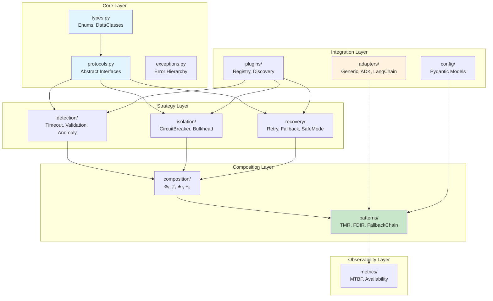
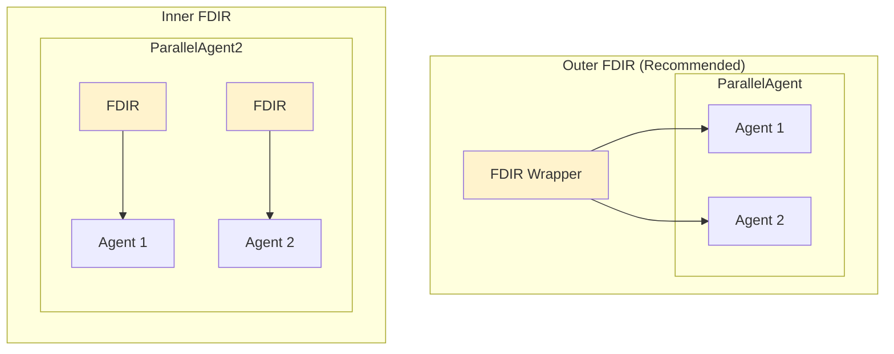

# Python Package Architecture for Aerospace Reliability Patterns

**A Framework-Agnostic, Extensible Implementation Design**

---

## Abstract

This document presents a high-level Python package architecture for implementing aerospace-grade reliability patterns in agentic AI systems. Building on the theoretical foundations established in [11_AEROSPACE_RELIABILITY_PATTERNS.md](11_AEROSPACE_RELIABILITY_PATTERNS.md), this architecture provides:

1. **Framework-Agnostic Design**: Abstract protocols that work with any LLM framework (Google ADK, LangChain, OpenAI, custom implementations)
2. **Extensible Plugin System**: Registry-based architecture for custom detection, isolation, and recovery strategies
3. **Complete Pattern Library**: RetryAgent, CircuitBreaker, TMR, FallbackChain, HealthMonitor, FDIRAgent
4. **Composition Operators**: Reliability-aware operators (⊗ᵣ, ;f, ★ᵣ, +ₚ) for building complex systems
5. **Production-Ready Configuration**: Pydantic models with YAML/JSON/environment variable support

**Target Audience**: Software architects and engineers building production agentic systems requiring high availability, fault tolerance, and graceful degradation.

---

## Table of Contents

1. [Package Overview](#i-package-overview)
2. [Package Structure](#ii-package-structure)
3. [Core Abstractions](#iii-core-abstractions)
4. [Plugin System](#iv-plugin-system)
5. [Detection Strategies](#v-detection-strategies)
6. [Isolation Strategies](#vi-isolation-strategies)
7. [Recovery Strategies](#vii-recovery-strategies)
8. [Composition Operators](#viii-composition-operators)
9. [High-Level Patterns](#ix-high-level-patterns)
10. [Framework Adapters](#x-framework-adapters)
11. [Metrics and Monitoring](#xi-metrics-and-monitoring)
12. [Configuration System](#xii-configuration-system)
13. [Usage Examples](#xiii-usage-examples)
14. [Appendices](#appendices)

---

## I. Package Overview

### 1.1 Design Philosophy

The `aerospace_reliability` package follows these principles:

| Principle | Description |
|-----------|-------------|
| **Protocol-Oriented** | Use Python's `typing.Protocol` for structural typing, enabling duck-typed flexibility |
| **Async-First** | All execution paths use `async`/`await` with `AsyncIterator` for streaming results |
| **Dependency Injection** | Framework-specific code injected via adapters, not hard-coded |
| **Configuration-Driven** | Behavior controlled via Pydantic models, loaded from multiple sources |
| **Plugin-Extensible** | New strategies added via registry without modifying core code |

### 1.2 Relationship to Theoretical Framework

This architecture implements the **5-dimensional design space** from [11_AEROSPACE_RELIABILITY_PATTERNS.md](11_AEROSPACE_RELIABILITY_PATTERNS.md):

```
Λ' = D₁ × D₂ × D₃ × D₄ × D₅

Where D₅ (Fault Tolerance) = {None, Retry, Redundant, FDIR}
```

Each D₅ value maps to specific patterns:

| D₅ Value | ECSS Level | Primary Pattern | Implementation |
|----------|------------|-----------------|----------------|
| None | E1 | No protection | Direct execution |
| Retry | E2 | RetryAgent, CircuitBreaker | `recovery/retry.py` |
| Redundant | E3 | TMRAgent | `composition/redundant_parallel.py` |
| FDIR | E4 | FDIRAgent | `patterns/fdir_agent.py` |

---

## II. Package Structure

```
aerospace_reliability/
├── __init__.py                    # Package exports
├── py.typed                       # PEP 561 type marker
│
├── core/                          # Core types and protocols
│   ├── __init__.py
│   ├── types.py                   # Enums, dataclasses
│   ├── protocols.py               # Abstract protocols
│   ├── context.py                 # ExecutionContext base
│   ├── events.py                  # Event types for observability
│   └── exceptions.py              # Custom exceptions
│
├── detection/                     # Fault Detection (FDIR-D)
│   ├── __init__.py
│   ├── base.py                    # DetectionStrategy protocol
│   ├── timeout.py                 # TimeoutDetector
│   ├── exception.py               # ExceptionDetector
│   ├── validation.py              # OutputValidationDetector
│   ├── anomaly.py                 # StatisticalAnomalyDetector
│   └── composite.py               # CompositeDetector
│
├── isolation/                     # Fault Isolation (FDIR-I)
│   ├── __init__.py
│   ├── base.py                    # IsolationStrategy protocol
│   ├── circuit_breaker.py         # CircuitBreakerIsolation
│   ├── hierarchical.py            # HierarchicalIsolation
│   └── bulkhead.py                # BulkheadIsolation
│
├── recovery/                      # Fault Recovery (FDIR-R)
│   ├── __init__.py
│   ├── base.py                    # RecoveryStrategy protocol
│   ├── retry.py                   # RetryStrategy
│   ├── fallback.py                # FallbackStrategy
│   ├── degradation.py             # DegradationStrategy
│   ├── safe_mode.py               # SafeModeStrategy
│   └── escalation.py              # EscalationLadder
│
├── composition/                   # Reliability-aware operators
│   ├── __init__.py
│   ├── base.py                    # CompositionOperator protocol
│   ├── redundant_parallel.py      # ⊗ᵣ operator
│   ├── fallback_sequential.py     # ;f operator
│   ├── resilient_iterative.py     # ★ᵣ operator
│   └── protected_augmentation.py  # +ₚ operator
│
├── patterns/                      # High-level patterns
│   ├── __init__.py
│   ├── retry_agent.py             # RetryAgent wrapper
│   ├── circuit_breaker_agent.py   # CircuitBreakerAgent
│   ├── tmr_agent.py               # TMRAgent
│   ├── fallback_chain_agent.py    # FallbackChainAgent
│   ├── health_monitor_agent.py    # HealthMonitorAgent
│   └── fdir_agent.py              # FDIRAgent (complete pipeline)
│
├── metrics/                       # Reliability metrics
│   ├── __init__.py
│   ├── base.py                    # MetricsCollector protocol
│   ├── mtbf.py                    # MTBF calculations
│   ├── availability.py            # Availability calculations
│   ├── health_checks.py           # Health check implementations
│   └── reporters.py               # Prometheus, StatsD, etc.
│
├── adapters/                      # Framework adapters
│   ├── __init__.py
│   ├── base.py                    # FrameworkAdapter protocol
│   ├── generic.py                 # Generic callable adapter
│   ├── google_adk.py              # Google ADK adapter
│   ├── langchain.py               # LangChain adapter
│   └── openai.py                  # OpenAI Assistants adapter
│
├── config/                        # Configuration system
│   ├── __init__.py
│   ├── models.py                  # Pydantic config models
│   ├── loaders.py                 # YAML/JSON/env loaders
│   └── validation.py              # Config validation
│
├── plugins/                       # Plugin system
│   ├── __init__.py
│   ├── registry.py                # PluginRegistry
│   ├── discovery.py               # Entry point discovery
│   └── base.py                    # Plugin base classes
│
└── utils/                         # Utilities
    ├── __init__.py
    ├── async_helpers.py           # Async utilities
    ├── backoff.py                 # Backoff algorithms
    └── voting.py                  # Voting implementations
```



*Figure 1: Package module dependency graph.*

---

## III. Core Abstractions

### 3.1 Core Types (`core/types.py`)

```python
"""Core type definitions for aerospace reliability patterns."""

from enum import Enum, auto
from dataclasses import dataclass, field
from typing import Any, Optional, Dict
from datetime import datetime


class HealthState(Enum):
    """
    Agent health state from FDIR state machine.
    See: 11_AEROSPACE_RELIABILITY_PATTERNS.md Section III.1
    """
    HEALTHY = auto()
    DEGRADED = auto()
    FAILED = auto()
    ISOLATED = auto()


class FailureType(Enum):
    """
    Failure classification taxonomy.
    See: 11_AEROSPACE_RELIABILITY_PATTERNS.md Definition 2
    """
    TIMEOUT = auto()           # Response time exceeded threshold
    EXCEPTION = auto()         # Runtime error caught
    INVALID_OUTPUT = auto()    # Output fails validation
    RATE_LIMIT = auto()        # API quota exceeded
    UNAVAILABLE = auto()       # Service not reachable
    VALIDATION_FAILED = auto() # Custom validation failure
    ANOMALY_DETECTED = auto()  # Statistical deviation


class FaultToleranceStrategy(Enum):
    """
    D₅ dimension values from extended 5D design space.
    See: 11_AEROSPACE_RELIABILITY_PATTERNS.md Section II.2
    """
    NONE = auto()       # No fault tolerance (ECSS E1)
    RETRY = auto()      # Retry with backoff (ECSS E2)
    REDUNDANT = auto()  # N-modular redundancy (ECSS E3)
    FDIR = auto()       # Full FDIR pipeline (ECSS E4)


class ECSSAutonomyLevel(Enum):
    """
    ECSS-E-ST-70-11C autonomy levels.
    See: 11_AEROSPACE_RELIABILITY_PATTERNS.md Section V
    """
    E1_GROUND_CONTROL = auto()   # Human-in-the-loop
    E2_EVENT_BASED = auto()      # Pre-planned contingencies
    E3_ADAPTIVE = auto()         # Re-planning capability
    E4_FULL_AUTONOMY = auto()    # Complete self-management


class CircuitState(Enum):
    """Circuit breaker states."""
    CLOSED = auto()      # Normal operation
    OPEN = auto()        # Failing fast
    HALF_OPEN = auto()   # Testing recovery


class RecoveryLevel(Enum):
    """Recovery escalation levels."""
    L0_RETRY = auto()
    L1_FALLBACK = auto()
    L2_DEGRADATION = auto()
    L3_SAFE_MODE = auto()


@dataclass(frozen=True)
class FailureEvent:
    """Immutable failure event record."""
    failure_type: FailureType
    timestamp: datetime
    agent_id: str
    message: str
    context: Optional[Dict[str, Any]] = None
    exception: Optional[Exception] = None


@dataclass
class DetectionResult:
    """Result from fault detection phase."""
    is_healthy: bool
    confidence: float  # 0.0-1.0
    failure_type: Optional[FailureType] = None
    evidence: Optional[Dict[str, Any]] = None
    severity: float = 0.0  # 0.0 = healthy, 1.0 = critical


@dataclass
class RecoveryResult:
    """Result from recovery attempt."""
    success: bool
    level_used: RecoveryLevel
    result: Optional[Any] = None
    escalate: bool = False
    reason: Optional[str] = None


@dataclass
class IsolatedSubsystem:
    """Represents an isolated agent/subsystem."""
    agent_id: str
    failure_event: FailureEvent
    state_snapshot: Dict[str, Any]
    isolation_time: float = field(default_factory=lambda: datetime.now().timestamp())
```

### 3.2 Core Protocols (`core/protocols.py`)

```python
"""
Abstract protocols defining framework-agnostic interfaces.

These protocols use Python's structural typing (typing.Protocol)
to enable duck-typed compatibility with any LLM framework.
"""

from typing import (
    Protocol, AsyncIterator, Any, TypeVar,
    Generic, Optional, Dict, List, runtime_checkable
)
from abc import abstractmethod
from .types import (
    DetectionResult, FailureEvent, HealthState,
    RecoveryResult, RecoveryLevel, FailureType
)

T = TypeVar('T')  # Input type
R = TypeVar('R')  # Result type


@runtime_checkable
class ExecutionContext(Protocol):
    """
    Abstract execution context - framework-agnostic.

    Provides access to session state and metadata without
    coupling to specific framework implementations.
    """

    @property
    def session_state(self) -> Dict[str, Any]:
        """Mutable session/state storage."""
        ...

    @property
    def metadata(self) -> Dict[str, Any]:
        """Immutable execution metadata (user_id, session_id, etc.)."""
        ...

    def get(self, key: str, default: Any = None) -> Any:
        """Get value from session state."""
        ...

    def set(self, key: str, value: Any) -> None:
        """Set value in session state."""
        ...


@runtime_checkable
class Agent(Protocol[T, R]):
    """
    Abstract agent protocol - framework-agnostic.

    Any class implementing this protocol can be used with
    reliability patterns. Adapters wrap framework-specific
    agents to this interface.
    """

    @property
    def name(self) -> str:
        """Unique agent identifier."""
        ...

    async def execute(
        self,
        input: T,
        context: ExecutionContext
    ) -> AsyncIterator[R]:
        """
        Execute the agent and yield results.

        Args:
            input: Task input
            context: Execution context with state access

        Yields:
            Result events/chunks
        """
        ...


class CompositionOperator(Protocol[T]):
    """
    Composition operator protocol for reliability-aware composition.

    All operators must satisfy the **closure property**: composing agents
    produces another agent. This enables arbitrary nesting and combination
    of reliability patterns.

    See: 11_AEROSPACE_RELIABILITY_PATTERNS.md Theorem 10 (Operator Closure)
    """

    @property
    def name(self) -> str:
        """Operator identifier."""
        ...

    @property
    def algebraic_properties(self) -> Dict[str, Any]:
        """
        Returns algebraic properties of this operator.

        Keys:
            - associative: bool - (A ∘ B) ∘ C = A ∘ (B ∘ C)
            - commutative: bool - A ∘ B = B ∘ A
            - identity: Agent | None - element e where A ∘ e = A
        """
        ...

    def compose(self, *agents: Agent) -> Agent:
        """
        Compose multiple agents into a single agent.

        This is the core operation that must satisfy closure:
            compose: Agent × Agent × ... → Agent

        Args:
            *agents: Agents to compose

        Returns:
            A new Agent that encapsulates the composition
        """
        ...


class DetectionStrategy(Protocol):
    """
    Fault detection strategy protocol.
    Implements the Detection phase of FDIR.

    See: 11_AEROSPACE_RELIABILITY_PATTERNS.md Section III.2
    """

    @property
    def detection_type(self) -> str:
        """Identifier for this detection strategy."""
        ...

    @abstractmethod
    async def detect(
        self,
        observation: Dict[str, Any],
        context: ExecutionContext
    ) -> DetectionResult:
        """
        Analyze observation for faults.

        Args:
            observation: Data to analyze (response, timing, etc.)
            context: Execution context

        Returns:
            DetectionResult with health assessment
        """
        ...


class IsolationStrategy(Protocol):
    """
    Fault isolation strategy protocol.
    Implements the Isolation phase of FDIR.

    See: 11_AEROSPACE_RELIABILITY_PATTERNS.md Section III.3
    """

    @abstractmethod
    async def isolate(
        self,
        failure_event: FailureEvent,
        agent: Agent,
        context: ExecutionContext
    ) -> 'IsolatedSubsystem':
        """
        Isolate the failed agent to prevent cascade failures.

        Args:
            failure_event: Details of the failure
            agent: The failed agent
            context: Execution context

        Returns:
            IsolatedSubsystem containing agent and state
        """
        ...

    @abstractmethod
    async def release(self, isolated: 'IsolatedSubsystem') -> None:
        """Release isolation after successful recovery."""
        ...


class RecoveryStrategy(Protocol):
    """
    Fault recovery strategy protocol.
    Implements the Recovery phase of FDIR.

    See: 11_AEROSPACE_RELIABILITY_PATTERNS.md Section III.4
    """

    @property
    def level(self) -> RecoveryLevel:
        """Recovery escalation level (L0-L3)."""
        ...

    @abstractmethod
    async def recover(
        self,
        failure_event: FailureEvent,
        agent: Agent,
        context: ExecutionContext
    ) -> RecoveryResult:
        """
        Attempt recovery from failure.

        Args:
            failure_event: Details of the failure
            agent: The failed agent (or fallback)
            context: Execution context

        Returns:
            RecoveryResult indicating success or need for escalation
        """
        ...

    @abstractmethod
    def can_handle(self, failure_type: FailureType) -> bool:
        """Check if this strategy can handle the failure type."""
        ...


class VotingStrategy(Protocol):
    """
    Voting strategy for redundant execution (TMR/NMR).

    See: 11_AEROSPACE_RELIABILITY_PATTERNS.md Section II.2.3
    """

    @property
    def min_results_required(self) -> int:
        """Minimum results needed for voting."""
        ...

    @abstractmethod
    def vote(self, results: List[Any]) -> Any:
        """
        Select consensus from multiple results.

        Args:
            results: List of agent outputs

        Returns:
            Selected consensus result

        Raises:
            NoConsensusError: If no consensus reached
        """
        ...


class HealthMonitor(Protocol):
    """
    Continuous health monitoring protocol.
    Provides proactive fault detection.

    See: 11_AEROSPACE_RELIABILITY_PATTERNS.md Section VI.5
    """

    @property
    def health_state(self) -> HealthState:
        """Current health state."""
        ...

    @property
    def metrics(self) -> Dict[str, float]:
        """Current health metrics (error_rate, avg_latency, etc.)."""
        ...

    @abstractmethod
    async def record_success(
        self,
        response_time: float,
        output: Any
    ) -> None:
        """Record successful execution."""
        ...

    @abstractmethod
    async def record_failure(self, failure_event: FailureEvent) -> None:
        """Record failed execution."""
        ...

    @abstractmethod
    async def check_health(self) -> DetectionResult:
        """Perform health check based on collected metrics."""
        ...


class MetricsCollector(Protocol):
    """
    Metrics collection for reliability calculations.

    See: 11_AEROSPACE_RELIABILITY_PATTERNS.md Section IV.3
    """

    @abstractmethod
    def record_execution(
        self,
        agent_id: str,
        success: bool,
        duration: float,
        metadata: Dict[str, Any]
    ) -> None:
        """Record an execution attempt."""
        ...

    @abstractmethod
    def get_mtbf(self, agent_id: str) -> float:
        """Get Mean Time Between Failures."""
        ...

    @abstractmethod
    def get_availability(self, agent_id: str) -> float:
        """Get availability (0.0-1.0)."""
        ...

    @abstractmethod
    def get_error_rate(self, agent_id: str, window_seconds: float) -> float:
        """Get error rate over time window."""
        ...
```

### 3.3 Custom Exceptions (`core/exceptions.py`)

```python
"""Exception hierarchy for aerospace reliability patterns."""


class AerospaceReliabilityError(Exception):
    """Base exception for all reliability patterns."""
    pass


class DetectionError(AerospaceReliabilityError):
    """Error during fault detection phase."""
    pass


class IsolationError(AerospaceReliabilityError):
    """Error during fault isolation phase."""
    pass


class RecoveryError(AerospaceReliabilityError):
    """Error during fault recovery phase."""
    pass


class RecoveryExhaustedError(RecoveryError):
    """All recovery strategies in escalation ladder exhausted."""

    def __init__(self, levels_tried: list, last_error: str = None):
        self.levels_tried = levels_tried
        self.last_error = last_error
        super().__init__(
            f"Recovery exhausted after trying: {levels_tried}. "
            f"Last error: {last_error}"
        )


class CircuitOpenError(AerospaceReliabilityError):
    """Circuit breaker is open - requests blocked."""

    def __init__(self, agent_id: str, recovery_time: float):
        self.agent_id = agent_id
        self.recovery_time = recovery_time
        super().__init__(
            f"Circuit breaker open for '{agent_id}'. "
            f"Recovery in {recovery_time:.1f}s"
        )


class NoConsensusError(AerospaceReliabilityError):
    """No consensus reached in TMR/NMR voting."""

    def __init__(self, results: list, reason: str = None):
        self.results = results
        self.reason = reason
        super().__init__(
            f"No consensus among {len(results)} results. "
            f"Reason: {reason or 'Insufficient agreement'}"
        )


class SafeModeError(AerospaceReliabilityError):
    """System entered safe mode - minimal functionality."""

    def __init__(self, trigger: str):
        self.trigger = trigger
        super().__init__(f"Safe mode activated: {trigger}")


class ConfigurationError(AerospaceReliabilityError):
    """Invalid configuration provided."""
    pass


class AdapterError(AerospaceReliabilityError):
    """Error in framework adapter."""
    pass
```

---

## IV. Plugin System

### 4.1 Plugin Registry (`plugins/registry.py`)

The plugin system enables extensibility without modifying core code:

```python
"""
Generic plugin registry with entry point discovery.

Supports registration via:
1. Programmatic registration
2. Entry points (pyproject.toml)
3. Configuration files
"""

from typing import (
    Dict, Type, TypeVar, Generic, Optional,
    Callable, Any, List
)
from dataclasses import dataclass
import importlib.metadata
import logging

T = TypeVar('T')
logger = logging.getLogger(__name__)


@dataclass
class PluginInfo:
    """Metadata about a registered plugin."""
    name: str
    version: str
    description: str
    plugin_type: str
    factory: Callable[..., Any]
    config_schema: Optional[Type] = None


class PluginRegistry(Generic[T]):
    """
    Generic plugin registry with lazy entry point discovery.

    Usage:
        # Create registry for detection strategies
        detection_registry = PluginRegistry[DetectionStrategy](
            "aerospace_reliability.detection"
        )

        # Register programmatically
        detection_registry.register(
            name="custom_detector",
            factory=CustomDetector,
            version="1.0.0"
        )

        # Get instance
        detector = detection_registry.get("custom_detector", threshold=0.9)
    """

    def __init__(self, entry_point_group: str):
        """
        Args:
            entry_point_group: Entry point group name for discovery
                (e.g., "aerospace_reliability.detection")
        """
        self._plugins: Dict[str, PluginInfo] = {}
        self._entry_point_group = entry_point_group
        self._discovered = False

    def register(
        self,
        name: str,
        factory: Callable[..., T],
        version: str = "0.0.0",
        description: str = "",
        config_schema: Optional[Type] = None
    ) -> None:
        """
        Register a plugin programmatically.

        Args:
            name: Unique plugin identifier
            factory: Factory function/class to create plugin instance
            version: Plugin version string
            description: Human-readable description
            config_schema: Optional Pydantic model for validation
        """
        if name in self._plugins:
            logger.warning(f"Overwriting existing plugin: {name}")

        self._plugins[name] = PluginInfo(
            name=name,
            version=version,
            description=description,
            plugin_type=self._entry_point_group,
            factory=factory,
            config_schema=config_schema
        )
        logger.debug(f"Registered plugin: {name} v{version}")

    def get(self, name: str, **kwargs) -> T:
        """
        Get a plugin instance by name.

        Args:
            name: Plugin identifier
            **kwargs: Arguments passed to factory

        Returns:
            Plugin instance

        Raises:
            KeyError: Plugin not found
        """
        self._ensure_discovered()

        if name not in self._plugins:
            available = ", ".join(self._plugins.keys())
            raise KeyError(
                f"Plugin '{name}' not found. Available: {available}"
            )

        info = self._plugins[name]

        # Validate config if schema provided
        if info.config_schema and kwargs:
            validated = info.config_schema(**kwargs)
            kwargs = validated.dict()

        return info.factory(**kwargs)

    def list_plugins(self) -> List[PluginInfo]:
        """List all registered plugins."""
        self._ensure_discovered()
        return list(self._plugins.values())

    def has(self, name: str) -> bool:
        """Check if plugin is registered."""
        self._ensure_discovered()
        return name in self._plugins

    def _ensure_discovered(self) -> None:
        """Discover plugins from entry points (lazy, once)."""
        if self._discovered:
            return
        self._discover_entry_points()
        self._discovered = True

    def _discover_entry_points(self) -> None:
        """Discover and register plugins from entry points."""
        try:
            eps = importlib.metadata.entry_points(
                group=self._entry_point_group
            )
            for ep in eps:
                try:
                    factory = ep.load()
                    self.register(
                        name=ep.name,
                        factory=factory,
                        description=f"Entry point: {ep.value}"
                    )
                    logger.info(f"Discovered plugin via entry point: {ep.name}")
                except Exception as e:
                    logger.warning(
                        f"Failed to load entry point {ep.name}: {e}"
                    )
        except Exception as e:
            logger.debug(f"Entry point discovery failed: {e}")


# Pre-configured registries for each strategy type
detection_registry = PluginRegistry['DetectionStrategy'](
    "aerospace_reliability.detection"
)

isolation_registry = PluginRegistry['IsolationStrategy'](
    "aerospace_reliability.isolation"
)

recovery_registry = PluginRegistry['RecoveryStrategy'](
    "aerospace_reliability.recovery"
)

voting_registry = PluginRegistry['VotingStrategy'](
    "aerospace_reliability.voting"
)
```

### 4.2 Entry Point Configuration

Third-party plugins can register via `pyproject.toml`:

```toml
# In third-party package's pyproject.toml
[project.entry-points."aerospace_reliability.detection"]
ml_anomaly = "my_package.detectors:MLAnomalyDetector"
semantic_validator = "my_package.detectors:SemanticValidator"

[project.entry-points."aerospace_reliability.recovery"]
custom_fallback = "my_package.recovery:CustomFallbackStrategy"
```

### 4.3 Plugin Base Classes (`plugins/base.py`)

```python
"""Base classes for plugin implementations."""

from abc import ABC, abstractmethod
from typing import Any, Dict, Type


class DetectionPlugin(ABC):
    """Base class for detection strategy plugins."""

    @property
    @abstractmethod
    def name(self) -> str:
        """Plugin name for registration."""
        ...

    @property
    @abstractmethod
    def version(self) -> str:
        """Plugin version."""
        ...

    @property
    def config_schema(self) -> Type | None:
        """Optional Pydantic config schema."""
        return None

    @abstractmethod
    def create_strategy(self, config: Dict[str, Any]) -> 'DetectionStrategy':
        """Create configured detection strategy instance."""
        ...


class IsolationPlugin(ABC):
    """Base class for isolation strategy plugins."""

    @property
    @abstractmethod
    def name(self) -> str:
        ...

    @property
    @abstractmethod
    def version(self) -> str:
        ...

    @abstractmethod
    def create_strategy(self, config: Dict[str, Any]) -> 'IsolationStrategy':
        ...


class RecoveryPlugin(ABC):
    """Base class for recovery strategy plugins."""

    @property
    @abstractmethod
    def name(self) -> str:
        ...

    @property
    @abstractmethod
    def version(self) -> str:
        ...

    @abstractmethod
    def create_strategy(self, config: Dict[str, Any]) -> 'RecoveryStrategy':
        ...


class VotingPlugin(ABC):
    """Base class for voting strategy plugins."""

    @property
    @abstractmethod
    def name(self) -> str:
        ...

    @property
    @abstractmethod
    def version(self) -> str:
        ...

    @abstractmethod
    def create_strategy(self, config: Dict[str, Any]) -> 'VotingStrategy':
        ...
```

---

## V. Detection Strategies

Detection implements the **D** phase of FDIR, identifying when agents are failing or about to fail.

### 5.1 Strategy Interface

```python
# detection/base.py
"""Base detection strategy interface and utilities."""

from abc import ABC, abstractmethod
from typing import Dict, Any
from ..core.protocols import ExecutionContext
from ..core.types import DetectionResult


class BaseDetector(ABC):
    """Abstract base class for detection strategies."""

    @property
    @abstractmethod
    def detection_type(self) -> str:
        """Unique identifier for this detector type."""
        ...

    @abstractmethod
    async def detect(
        self,
        observation: Dict[str, Any],
        context: ExecutionContext
    ) -> DetectionResult:
        """
        Analyze observation for faults.

        Standard observation keys:
            - output: Agent response
            - elapsed: Response time in seconds
            - exception: Caught exception (if any)
            - metadata: Additional context
        """
        ...
```

### 5.2 Built-in Detectors

| Detector | File | Detection Rule | Observation Keys |
|----------|------|----------------|------------------|
| `TimeoutDetector` | `timeout.py` | `elapsed > threshold` | `elapsed` |
| `ExceptionDetector` | `exception.py` | `exception is not None` | `exception` |
| `OutputValidationDetector` | `validation.py` | `not validator(output)` | `output` |
| `StatisticalAnomalyDetector` | `anomaly.py` | `zscore > threshold` | `elapsed`, `output` |
| `CompositeDetector` | `composite.py` | `any(detectors)` | all |

```python
# detection/timeout.py
"""Timeout-based fault detection."""

import time
from dataclasses import dataclass
from typing import Dict, Any

from ..core.types import DetectionResult, FailureType
from ..core.protocols import ExecutionContext
from .base import BaseDetector


@dataclass
class TimeoutDetectorConfig:
    """Configuration for timeout detection."""
    timeout_seconds: float = 30.0
    warning_threshold: float = 0.8  # Warn at 80% of timeout


class TimeoutDetector(BaseDetector):
    """
    Detects failures based on response time.

    Implements Detection Rule 1 from FDIR model:
        if response_time > timeout_threshold:
            return Failure(Timeout, response_time)
    """

    def __init__(self, config: TimeoutDetectorConfig = None):
        self.config = config or TimeoutDetectorConfig()
        self._start_time: float = 0.0

    @property
    def detection_type(self) -> str:
        return "timeout"

    def start_timer(self) -> None:
        """Start timing an operation."""
        self._start_time = time.monotonic()

    async def detect(
        self,
        observation: Dict[str, Any],
        context: ExecutionContext
    ) -> DetectionResult:
        elapsed = observation.get(
            "elapsed",
            time.monotonic() - self._start_time
        )

        # Critical failure: exceeded timeout
        if elapsed > self.config.timeout_seconds:
            return DetectionResult(
                is_healthy=False,
                confidence=1.0,
                failure_type=FailureType.TIMEOUT,
                evidence={
                    "elapsed": elapsed,
                    "timeout": self.config.timeout_seconds
                },
                severity=1.0
            )

        # Warning: approaching timeout
        warning_threshold = (
            self.config.timeout_seconds * self.config.warning_threshold
        )
        if elapsed > warning_threshold:
            return DetectionResult(
                is_healthy=True,
                confidence=0.7,
                severity=0.5,
                evidence={"elapsed": elapsed, "warning": True}
            )

        # Healthy
        return DetectionResult(
            is_healthy=True,
            confidence=0.95,
            evidence={"elapsed": elapsed}
        )
```

```python
# detection/validation.py
"""Output validation detection."""

from typing import Callable, Any, Optional, List, Dict
from dataclasses import dataclass

from ..core.types import DetectionResult, FailureType
from ..core.protocols import ExecutionContext
from .base import BaseDetector


@dataclass
class ValidationDetectorConfig:
    """Configuration for validation detection."""
    validator: Optional[Callable[[Any], bool]] = None
    min_length: Optional[int] = None
    max_length: Optional[int] = None
    required_fields: List[str] = None
    forbidden_patterns: List[str] = None


class OutputValidationDetector(BaseDetector):
    """
    Validates agent output against configurable rules.

    Implements Detection Rule 3 from FDIR model:
        if not validate(output, schema):
            return Failure(InvalidOutput, output)
    """

    def __init__(self, config: ValidationDetectorConfig = None):
        self.config = config or ValidationDetectorConfig()

    @property
    def detection_type(self) -> str:
        return "validation"

    async def detect(
        self,
        observation: Dict[str, Any],
        context: ExecutionContext
    ) -> DetectionResult:
        output = observation.get("output")

        if output is None:
            return DetectionResult(
                is_healthy=False,
                confidence=1.0,
                failure_type=FailureType.INVALID_OUTPUT,
                evidence={"reason": "output_is_none"},
                severity=0.9
            )

        # Custom validator
        if self.config.validator:
            try:
                if not self.config.validator(output):
                    return DetectionResult(
                        is_healthy=False,
                        confidence=1.0,
                        failure_type=FailureType.VALIDATION_FAILED,
                        evidence={"reason": "custom_validator_failed"},
                        severity=0.8
                    )
            except Exception as e:
                return DetectionResult(
                    is_healthy=False,
                    confidence=0.9,
                    failure_type=FailureType.VALIDATION_FAILED,
                    evidence={"reason": "validator_exception", "error": str(e)},
                    severity=0.7
                )

        # Length validation
        output_str = str(output)
        if self.config.min_length and len(output_str) < self.config.min_length:
            return DetectionResult(
                is_healthy=False,
                confidence=0.9,
                failure_type=FailureType.INVALID_OUTPUT,
                evidence={
                    "reason": "output_too_short",
                    "length": len(output_str),
                    "min_required": self.config.min_length
                },
                severity=0.6
            )

        if self.config.max_length and len(output_str) > self.config.max_length:
            return DetectionResult(
                is_healthy=False,
                confidence=0.9,
                failure_type=FailureType.INVALID_OUTPUT,
                evidence={
                    "reason": "output_too_long",
                    "length": len(output_str),
                    "max_allowed": self.config.max_length
                },
                severity=0.5
            )

        # Required fields (for dict output)
        if self.config.required_fields and isinstance(output, dict):
            missing = [
                f for f in self.config.required_fields
                if f not in output
            ]
            if missing:
                return DetectionResult(
                    is_healthy=False,
                    confidence=0.95,
                    failure_type=FailureType.INVALID_OUTPUT,
                    evidence={"reason": "missing_fields", "missing": missing},
                    severity=0.7
                )

        # All validations passed
        return DetectionResult(
            is_healthy=True,
            confidence=0.9,
            evidence={"validations_passed": True}
        )
```

```python
# detection/composite.py
"""Composite detector combining multiple strategies."""

from typing import List, Dict, Any
from ..core.types import DetectionResult
from ..core.protocols import ExecutionContext, DetectionStrategy
from .base import BaseDetector


class CompositeDetector(BaseDetector):
    """
    Combines multiple detection strategies.

    Modes:
        - fail_fast=True: Return on first failure
        - fail_fast=False: Run all, return worst result
    """

    def __init__(
        self,
        strategies: List[DetectionStrategy],
        fail_fast: bool = True
    ):
        self.strategies = strategies
        self.fail_fast = fail_fast

    @property
    def detection_type(self) -> str:
        types = [s.detection_type for s in self.strategies]
        return f"composite({','.join(types)})"

    async def detect(
        self,
        observation: Dict[str, Any],
        context: ExecutionContext
    ) -> DetectionResult:
        results: List[DetectionResult] = []

        for strategy in self.strategies:
            result = await strategy.detect(observation, context)
            results.append(result)

            # Fail fast on first unhealthy result
            if self.fail_fast and not result.is_healthy:
                return result

        if not results:
            return DetectionResult(is_healthy=True, confidence=1.0)

        # Aggregate results
        all_healthy = all(r.is_healthy for r in results)
        avg_confidence = sum(r.confidence for r in results) / len(results)
        worst = max(results, key=lambda r: r.severity)

        return DetectionResult(
            is_healthy=all_healthy,
            confidence=avg_confidence,
            failure_type=worst.failure_type if not all_healthy else None,
            severity=worst.severity,
            evidence={
                "sub_results": [
                    {"type": s.detection_type, "healthy": r.is_healthy}
                    for s, r in zip(self.strategies, results)
                ]
            }
        )
```

---

## VI. Isolation Strategies

Isolation implements the **I** phase of FDIR, containing failures to prevent cascade effects.

### 6.1 Circuit Breaker (`isolation/circuit_breaker.py`)

```python
"""
Circuit Breaker isolation strategy.

State machine:
    CLOSED → OPEN: failure_count >= threshold
    OPEN → HALF_OPEN: after recovery_timeout
    HALF_OPEN → CLOSED: test succeeds
    HALF_OPEN → OPEN: test fails
"""

import asyncio
import time
from dataclasses import dataclass, field
from typing import Optional

from ..core.types import (
    FailureEvent, CircuitState, IsolatedSubsystem
)
from ..core.protocols import Agent, ExecutionContext, IsolationStrategy
from ..core.exceptions import CircuitOpenError


@dataclass
class CircuitBreakerConfig:
    """Circuit breaker configuration."""
    failure_threshold: int = 5
    recovery_timeout: float = 30.0
    half_open_max_calls: int = 1


class CircuitBreakerIsolation:
    """
    Circuit breaker pattern for fault isolation.

    Prevents cascade failures by fast-failing when service is unhealthy.
    See: 11_AEROSPACE_RELIABILITY_PATTERNS.md Section III.3.3
    """

    def __init__(self, config: CircuitBreakerConfig = None):
        self.config = config or CircuitBreakerConfig()
        self._state = CircuitState.CLOSED
        self._failure_count = 0
        self._last_failure_time = 0.0
        self._half_open_calls = 0
        self._lock = asyncio.Lock()

    @property
    def state(self) -> CircuitState:
        """Current state with automatic OPEN → HALF_OPEN transition."""
        if self._state == CircuitState.OPEN:
            elapsed = time.monotonic() - self._last_failure_time
            if elapsed >= self.config.recovery_timeout:
                self._state = CircuitState.HALF_OPEN
                self._half_open_calls = 0
        return self._state

    @property
    def time_until_recovery(self) -> float:
        """Seconds until circuit transitions to HALF_OPEN."""
        if self._state != CircuitState.OPEN:
            return 0.0
        elapsed = time.monotonic() - self._last_failure_time
        return max(0, self.config.recovery_timeout - elapsed)

    async def check_request_allowed(self) -> bool:
        """
        Check if request should be allowed through.

        Returns:
            True if request allowed

        Raises:
            CircuitOpenError: If circuit is open
        """
        async with self._lock:
            state = self.state

            if state == CircuitState.CLOSED:
                return True

            if state == CircuitState.OPEN:
                raise CircuitOpenError(
                    agent_id="circuit_breaker",
                    recovery_time=self.time_until_recovery
                )

            # HALF_OPEN: Allow limited test calls
            if state == CircuitState.HALF_OPEN:
                if self._half_open_calls < self.config.half_open_max_calls:
                    self._half_open_calls += 1
                    return True
                raise CircuitOpenError(
                    agent_id="circuit_breaker",
                    recovery_time=self.config.recovery_timeout
                )

        return False

    async def record_success(self) -> None:
        """Record successful call - reset circuit."""
        async with self._lock:
            self._failure_count = 0
            if self._state == CircuitState.HALF_OPEN:
                self._state = CircuitState.CLOSED

    async def record_failure(self) -> None:
        """Record failed call - may trip circuit."""
        async with self._lock:
            self._failure_count += 1
            self._last_failure_time = time.monotonic()

            if self._state == CircuitState.HALF_OPEN:
                # Failed during test - back to OPEN
                self._state = CircuitState.OPEN
            elif self._failure_count >= self.config.failure_threshold:
                # Threshold exceeded - trip circuit
                self._state = CircuitState.OPEN

    async def isolate(
        self,
        failure_event: FailureEvent,
        agent: Agent,
        context: ExecutionContext
    ) -> IsolatedSubsystem:
        """Isolate the failed agent via circuit breaker."""
        await self.record_failure()
        return IsolatedSubsystem(
            agent_id=agent.name,
            failure_event=failure_event,
            state_snapshot=dict(context.session_state)
        )

    async def release(self, isolated: IsolatedSubsystem) -> None:
        """Release isolation after recovery."""
        await self.record_success()
```

---

## VII. Recovery Strategies

Recovery implements the **R** phase of FDIR, restoring system function through an escalation ladder.

### 7.1 Escalation Ladder (`recovery/escalation.py`)

```python
"""
Recovery escalation ladder.

Levels:
    L0_RETRY: Same agent, exponential backoff
    L1_FALLBACK: Alternative agent/service
    L2_DEGRADATION: Reduced functionality
    L3_SAFE_MODE: Minimal operation, human escalation
"""

from typing import List, Optional
from ..core.types import (
    FailureEvent, RecoveryResult, RecoveryLevel
)
from ..core.protocols import RecoveryStrategy, Agent, ExecutionContext
from ..core.exceptions import RecoveryExhaustedError


class EscalationLadder:
    """
    Recovery escalation ladder.

    Tries strategies in order from least to most disruptive.
    See: 11_AEROSPACE_RELIABILITY_PATTERNS.md Section III.4.1
    """

    def __init__(self, strategies: List[RecoveryStrategy]):
        # Sort by escalation level
        self.strategies = sorted(
            strategies,
            key=lambda s: s.level.value
        )

    async def recover(
        self,
        failure_event: FailureEvent,
        agent: Agent,
        context: ExecutionContext
    ) -> RecoveryResult:
        """
        Attempt recovery through escalation ladder.

        Tries each strategy in order until one succeeds.
        """
        levels_tried = []
        last_reason = None

        for strategy in self.strategies:
            # Check if strategy can handle this failure type
            if not strategy.can_handle(failure_event.failure_type):
                continue

            levels_tried.append(strategy.level)

            result = await strategy.recover(
                failure_event, agent, context
            )

            if result.success:
                return result

            last_reason = result.reason

            # Strategy says don't escalate further
            if not result.escalate:
                break

        # All strategies exhausted
        raise RecoveryExhaustedError(
            levels_tried=levels_tried,
            last_error=last_reason
        )
```

### 7.2 Retry Strategy (`recovery/retry.py`)

```python
"""Retry with exponential backoff recovery strategy."""

import asyncio
import random
from dataclasses import dataclass, field
from typing import Tuple

from ..core.types import (
    FailureEvent, RecoveryResult, RecoveryLevel, FailureType
)
from ..core.protocols import RecoveryStrategy, Agent, ExecutionContext


@dataclass
class RetryConfig:
    """Retry strategy configuration."""
    max_retries: int = 3
    base_delay: float = 1.0
    max_delay: float = 60.0
    backoff_factor: float = 2.0
    jitter: float = 0.1
    retryable_failures: Tuple[FailureType, ...] = field(
        default_factory=lambda: (
            FailureType.TIMEOUT,
            FailureType.RATE_LIMIT,
            FailureType.UNAVAILABLE,
        )
    )


class RetryStrategy:
    """
    Retry with exponential backoff.

    Implements Recovery Level 0 (L0_RETRY) from escalation ladder.
    See: 11_AEROSPACE_RELIABILITY_PATTERNS.md Section VI.1

    Backoff formula:
        delay = min(base_delay * backoff_factor^attempt + jitter, max_delay)
    """

    def __init__(self, config: RetryConfig = None):
        self.config = config or RetryConfig()

    @property
    def level(self) -> RecoveryLevel:
        return RecoveryLevel.L0_RETRY

    def can_handle(self, failure_type: FailureType) -> bool:
        return failure_type in self.config.retryable_failures

    def _calculate_delay(self, attempt: int) -> float:
        """Calculate delay with exponential backoff and jitter."""
        delay = min(
            self.config.base_delay * (self.config.backoff_factor ** attempt),
            self.config.max_delay
        )
        # Add jitter to prevent thundering herd
        jitter_range = delay * self.config.jitter
        delay += random.uniform(-jitter_range, jitter_range)
        return max(0, delay)

    async def recover(
        self,
        failure_event: FailureEvent,
        agent: Agent,
        context: ExecutionContext
    ) -> RecoveryResult:
        """Attempt recovery via retry with backoff."""

        if not self.can_handle(failure_event.failure_type):
            return RecoveryResult(
                success=False,
                level_used=self.level,
                escalate=True,
                reason=f"Cannot handle {failure_event.failure_type}"
            )

        original_input = failure_event.context.get("input") if failure_event.context else None

        for attempt in range(self.config.max_retries):
            delay = self._calculate_delay(attempt)

            if delay > 0:
                await asyncio.sleep(delay)

            try:
                results = []
                async for event in agent.execute(original_input, context):
                    results.append(event)

                return RecoveryResult(
                    success=True,
                    level_used=self.level,
                    result=results
                )

            except Exception as e:
                if attempt == self.config.max_retries - 1:
                    return RecoveryResult(
                        success=False,
                        level_used=self.level,
                        escalate=True,
                        reason=f"Retry exhausted after {self.config.max_retries} attempts: {e}"
                    )

        return RecoveryResult(
            success=False,
            level_used=self.level,
            escalate=True,
            reason="Retry exhausted"
        )
```

### 7.3 Fallback Strategy (`recovery/fallback.py`)

```python
"""Fallback to alternative agent recovery strategy."""

from typing import List
from ..core.types import (
    FailureEvent, RecoveryResult, RecoveryLevel, FailureType
)
from ..core.protocols import RecoveryStrategy, Agent, ExecutionContext


class FallbackStrategy:
    """
    Fallback to alternative agents.

    Implements Recovery Level 1 (L1_FALLBACK) from escalation ladder.
    See: 11_AEROSPACE_RELIABILITY_PATTERNS.md Section VI.4
    """

    def __init__(
        self,
        fallback_agents: List[Agent],
        timeout_per_agent: float = 30.0
    ):
        self.fallback_agents = fallback_agents
        self.timeout_per_agent = timeout_per_agent

    @property
    def level(self) -> RecoveryLevel:
        return RecoveryLevel.L1_FALLBACK

    def can_handle(self, failure_type: FailureType) -> bool:
        # Fallback can handle any failure type
        return True

    async def recover(
        self,
        failure_event: FailureEvent,
        agent: Agent,  # Original failed agent (ignored)
        context: ExecutionContext
    ) -> RecoveryResult:
        """Try fallback agents in sequence."""
        import asyncio

        original_input = failure_event.context.get("input") if failure_event.context else None
        last_error = None

        for i, fallback in enumerate(self.fallback_agents):
            try:
                results = []

                async def collect():
                    async for event in fallback.execute(original_input, context):
                        results.append(event)

                await asyncio.wait_for(
                    collect(),
                    timeout=self.timeout_per_agent
                )

                return RecoveryResult(
                    success=True,
                    level_used=self.level,
                    result=results
                )

            except asyncio.TimeoutError:
                last_error = f"Fallback {i} ({fallback.name}) timed out"
            except Exception as e:
                last_error = f"Fallback {i} ({fallback.name}) failed: {e}"

        return RecoveryResult(
            success=False,
            level_used=self.level,
            escalate=True,
            reason=f"All {len(self.fallback_agents)} fallbacks exhausted. {last_error}"
        )
```

---

## VIII. Composition Operators

Reliability-aware composition operators extend the standard operators from [10_UNIFIED_THEORY.md](10_UNIFIED_THEORY.md).

### 8.1 Operator Summary

| Operator | Symbol | Semantics | D₅ Value |
|----------|--------|-----------|----------|
| Redundant Parallel | ⊗ᵣ | Execute same task on N agents, vote on result | Redundant |
| Fallback Sequential | ;f | Try agents until success | Retry |
| Resilient Iterative | ★ᵣ | Loop with per-iteration retry | Retry |
| Protected Augmentation | +ₚ | Tools wrapped with circuit breaker | Retry |

### 8.2 Redundant Parallel (`composition/redundant_parallel.py`)

```python
"""
Redundant parallel composition operator (⊗ᵣ).

Implements TMR/NMR pattern with configurable voting.
"""

import asyncio
from typing import List, Any, AsyncIterator, Optional, Tuple

from ..core.protocols import Agent, ExecutionContext, VotingStrategy
from ..core.exceptions import NoConsensusError


class RedundantParallelOperator:
    """
    Redundant parallel composition (⊗ᵣ operator).

    Executes same task on multiple agents and uses voting
    to determine consensus result.

    Properties:
        - Commutative: A ⊗ᵣ B = B ⊗ᵣ A
        - Associative: (A ⊗ᵣ B) ⊗ᵣ C = A ⊗ᵣ (B ⊗ᵣ C)
        - Fault Tolerant: Tolerates ⌊(n-1)/2⌋ failures

    See: 11_AEROSPACE_RELIABILITY_PATTERNS.md Section IV.1.1
    """

    def __init__(
        self,
        agents: List[Agent],
        voting_strategy: VotingStrategy,
        min_successful: Optional[int] = None,
        timeout_per_agent: float = 30.0
    ):
        if len(agents) < 2:
            raise ValueError("Redundant parallel requires at least 2 agents")

        self.agents = agents
        self.voting_strategy = voting_strategy
        self.min_successful = min_successful or voting_strategy.min_results_required
        self.timeout_per_agent = timeout_per_agent

    @property
    def name(self) -> str:
        return f"RedundantParallel({len(self.agents)})"

    async def execute(
        self,
        input: Any,
        context: ExecutionContext
    ) -> AsyncIterator[Any]:
        """Execute all agents in parallel and vote on result."""

        async def run_agent(
            agent: Agent
        ) -> Tuple[str, Optional[List[Any]], Optional[Exception]]:
            """Run single agent with timeout."""
            try:
                results = []

                async def collect():
                    async for event in agent.execute(input, context):
                        results.append(event)

                await asyncio.wait_for(
                    collect(),
                    timeout=self.timeout_per_agent
                )
                return (agent.name, results, None)

            except Exception as e:
                return (agent.name, None, e)

        # Execute all agents concurrently
        tasks = [run_agent(agent) for agent in self.agents]
        agent_results = await asyncio.gather(*tasks)

        # Separate successes and failures
        successes = []
        failures = []
        for name, result, error in agent_results:
            if error:
                failures.append((name, str(error)))
            else:
                successes.append(result)

        # Check minimum threshold
        if len(successes) < self.min_successful:
            raise NoConsensusError(
                results=successes,
                reason=f"Only {len(successes)}/{len(self.agents)} succeeded, "
                       f"need {self.min_successful}. Failures: {failures}"
            )

        # Vote on results
        try:
            consensus = self.voting_strategy.vote(successes)
            yield consensus
        except Exception as e:
            raise NoConsensusError(
                results=successes,
                reason=f"Voting failed: {e}"
            )
```

### 8.3 Fallback Sequential (`composition/fallback_sequential.py`)

```python
"""
Fallback sequential composition operator (;f).

Tries agents in sequence until one succeeds.
"""

import asyncio
from typing import List, Any, AsyncIterator, Optional

from ..core.protocols import Agent, ExecutionContext


class FallbackSequentialOperator:
    """
    Fallback sequential composition (;f operator).

    Tries agents in sequence until one succeeds.
    Implements graceful degradation.

    Properties:
        - Non-commutative: A ;f B ≠ B ;f A (order matters)
        - Associative: (A ;f B) ;f C = A ;f (B ;f C)
        - Short-circuit: Stops on first success
        - Cost: cost(A ;f B) ≤ cost(A) + cost(B)

    See: 11_AEROSPACE_RELIABILITY_PATTERNS.md Section IV.1.2
    """

    def __init__(
        self,
        agents: List[Agent],
        timeout_per_agent: float = 30.0
    ):
        if not agents:
            raise ValueError("Fallback chain requires at least 1 agent")

        self.agents = agents
        self.timeout_per_agent = timeout_per_agent

    @property
    def name(self) -> str:
        return f"FallbackChain({len(self.agents)})"

    async def execute(
        self,
        input: Any,
        context: ExecutionContext
    ) -> AsyncIterator[Any]:
        """Try agents in sequence until success."""
        last_error: Optional[str] = None

        for i, agent in enumerate(self.agents):
            level = "Primary" if i == 0 else f"Fallback-{i}"

            try:
                results = []

                async def collect():
                    async for event in agent.execute(input, context):
                        results.append(event)

                await asyncio.wait_for(
                    collect(),
                    timeout=self.timeout_per_agent
                )

                # Success - yield results and return
                for result in results:
                    yield result
                return

            except asyncio.TimeoutError:
                last_error = f"{level} ({agent.name}) timed out"
            except Exception as e:
                last_error = f"{level} ({agent.name}) failed: {e}"

        # All agents failed
        raise RuntimeError(
            f"Fallback chain exhausted after {len(self.agents)} attempts. "
            f"Last error: {last_error}"
        )
```

### 8.4 Voting Strategies (`utils/voting.py`)

```python
"""Voting strategy implementations for redundant execution."""

from typing import List, Any
from collections import Counter

from ..core.protocols import VotingStrategy
from ..core.exceptions import NoConsensusError


class MajorityVoting:
    """
    Simple majority voting (>50% agreement).

    Requires at least 2 results for meaningful voting.
    """

    @property
    def min_results_required(self) -> int:
        return 2

    def vote(self, results: List[Any]) -> Any:
        if len(results) < self.min_results_required:
            raise NoConsensusError(
                results=results,
                reason=f"Need at least {self.min_results_required} results"
            )

        # Convert results to hashable for counting
        hashable = [str(r) for r in results]
        counter = Counter(hashable)
        winner_str, count = counter.most_common(1)[0]

        # Check majority threshold
        if count <= len(results) // 2:
            raise NoConsensusError(
                results=results,
                reason=f"No majority: {dict(counter)}"
            )

        # Return original result (not string)
        winner_idx = hashable.index(winner_str)
        return results[winner_idx]


class UnanimousVoting:
    """
    Unanimous voting (100% agreement).

    All results must be identical.
    """

    @property
    def min_results_required(self) -> int:
        return 2

    def vote(self, results: List[Any]) -> Any:
        if len(results) < self.min_results_required:
            raise NoConsensusError(
                results=results,
                reason=f"Need at least {self.min_results_required} results"
            )

        hashable = [str(r) for r in results]
        if len(set(hashable)) != 1:
            raise NoConsensusError(
                results=results,
                reason=f"No unanimity: {len(set(hashable))} distinct results"
            )

        return results[0]


class WeightedVoting:
    """
    Weighted voting based on confidence scores.

    Each result must include a confidence score.
    """

    def __init__(self, threshold: float = 0.5):
        self.threshold = threshold

    @property
    def min_results_required(self) -> int:
        return 2

    def vote(self, results: List[tuple]) -> Any:
        """
        Args:
            results: List of (result, confidence) tuples
        """
        if len(results) < self.min_results_required:
            raise NoConsensusError(
                results=results,
                reason=f"Need at least {self.min_results_required} results"
            )

        # Group by result value
        groups = {}
        for result, confidence in results:
            key = str(result)
            if key not in groups:
                groups[key] = {"result": result, "total_weight": 0}
            groups[key]["total_weight"] += confidence

        # Find winner
        total_weight = sum(g["total_weight"] for g in groups.values())
        winner = max(groups.values(), key=lambda g: g["total_weight"])

        # Check threshold
        if winner["total_weight"] / total_weight < self.threshold:
            raise NoConsensusError(
                results=results,
                reason=f"No weighted consensus above threshold {self.threshold}"
            )

        return winner["result"]
```

### 8.5 Algebraic Properties

The following table summarizes the algebraic properties of each composition operator:

| Operator | Symbol | Closure | Associative | Commutative | Identity |
|----------|--------|---------|-------------|-------------|----------|
| Redundant Parallel | ⊗ᵣ | ✓ Agent | ✓ | ✓ | None |
| Fallback Sequential | ;f | ✓ Agent | ✓ | ✗ | None |
| Resilient Iterative | ★ᵣ | ✓ Agent | N/A (unary) | N/A | None |
| Protected Augmentation | +ₚ | ✓ Agent | N/A (unary) | N/A | ∅ (empty tools) |

**Legend:**
- **Closure**: Output type is always `Agent` (enables composition)
- **Associative**: `(A ∘ B) ∘ C = A ∘ (B ∘ C)`
- **Commutative**: `A ∘ B = B ∘ A`
- **Identity**: Element `e` such that `A ∘ e = e ∘ A = A`

### 8.6 Composition Guarantees

This section establishes the theoretical foundation that enables arbitrary composition of reliability patterns. These theorems mirror those in [11_AEROSPACE_RELIABILITY_PATTERNS.md](11_AEROSPACE_RELIABILITY_PATTERNS.md).

#### Theorem 10: Operator Closure

**Statement:** All composition operators are closed under the `Agent` type—composing agents always produces an agent.

```
∀ operators ∘ ∈ {⊗ᵣ, ;f, ★ᵣ, +ₚ}:
    A₁: Agent, A₂: Agent ⟹ (A₁ ∘ A₂): Agent
```

**Proof Sketch:**

Each operator implementation returns a class that satisfies the `Agent` protocol:

1. **⊗ᵣ (RedundantParallelOperator)**: Returns object with `name` property and `execute()` async generator
2. **;f (FallbackSequentialOperator)**: Returns object with `name` property and `execute()` async generator
3. **★ᵣ (ResilientIterativeOperator)**: Returns object with `name` property and `execute()` async generator
4. **+ₚ (ProtectedAugmentationOperator)**: Returns object with `name` property and `execute()` async generator

Since all return types implement `Agent`, closure holds. ∎

**Implication:** Any depth of nesting is valid:

```python
# Valid: arbitrary nesting
deeply_nested = FallbackSequentialOperator([
    TMRAgent([
        RetryAgent(agent1),
        RetryAgent(agent2),
        RetryAgent(agent3),
    ]),
    RetryAgent(fallback_agent),
])
```

#### Theorem 11: Mixed Composition

**Statement:** Reliability operators compose with standard operators (from [10_UNIFIED_THEORY.md](10_UNIFIED_THEORY.md)).

```
# Standard operators: ⊗ (parallel), ; (sequential), ★ (iterative), + (augment)
# Reliability operators: ⊗ᵣ, ;f, ★ᵣ, +ₚ

(A₁ ⊗ᵣ A₂) ; A₃     ✓ Valid - TMR followed by sequential
A₁ ;f (A₂ ⊗ A₃)     ✓ Valid - Fallback to parallel gathering
(A★ᵣ) ⊗ B           ✓ Valid - Resilient loop in parallel with B
```

**Proof:** By Theorem 10, each reliability operator returns an `Agent`. Standard operators accept `Agent` inputs. Therefore, the output of any reliability operator can be input to any standard operator. ∎

**Example:**

```python
# Mixed composition: standard + reliability operators
pipeline = SequentialOperator([           # Standard ;
    ParallelOperator([                     # Standard ⊗
        data_gatherer_1,
        data_gatherer_2,
    ]),
    TMRAgent([                             # Reliability ⊗ᵣ
        analyzer_1,
        analyzer_2,
        analyzer_3,
    ], voting_strategy=MajorityVoting()),
    RetryAgent(synthesizer),               # Reliability wrapper
])
```

#### Theorem 9: FDIR Composition

**Statement:** FDIR composes with standard operators up to behavioral equivalence.

```
FDIR(A₁ ⊗ A₂) ≈ FDIR(A₁) ⊗ FDIR(A₂)   (parallel)
FDIR(A₁ ; A₂) ≈ FDIR(A₁) ; FDIR(A₂)   (sequential)
FDIR(A★)      ≈ (FDIR(A))★             (iterative)
```

Where **≈ (behavioral equivalence)** means:
1. Same success/failure outcomes for all inputs
2. Same final results when successful
3. Similar recovery behavior (within one escalation level)

**Outer vs Inner FDIR:**

| Approach | Pros | Cons |
|----------|------|------|
| **Outer FDIR**: `FDIR(A₁ ⊗ A₂)` | Single monitoring point, lower overhead, handles coordination failures | Coarse-grained recovery |
| **Inner FDIR**: `FDIR(A₁) ⊗ FDIR(A₂)` | Independent recovery, fine-grained control | Higher overhead, no coordination fault handling |



*Figure: Outer vs Inner FDIR placement.*

**Nesting Semantics:** When FDIR wrappers are nested:
1. Inner FDIR handles failures first
2. If inner recovery exhausts, failure propagates to outer FDIR
3. Outer FDIR treats inner failure as atomic failure event
4. Recovery level accumulates: max(inner_level, outer_level)

---

## IX. High-Level Patterns

### 9.1 Pattern Overview

| Pattern | Module | D₅ | ECSS | Primary Use Case |
|---------|--------|----|----|------------------|
| `RetryAgent` | `retry_agent.py` | Retry | E2 | Transient failures |
| `CircuitBreakerAgent` | `circuit_breaker_agent.py` | Retry | E2 | Cascade prevention |
| `TMRAgent` | `tmr_agent.py` | Redundant | E3 | Critical decisions |
| `FallbackChainAgent` | `fallback_chain_agent.py` | Retry | E2 | Graceful degradation |
| `HealthMonitorAgent` | `health_monitor_agent.py` | FDIR | E4 | Proactive detection |
| `FDIRAgent` | `fdir_agent.py` | FDIR | E4 | Mission-critical |

### 9.2 FDIRAgent (`patterns/fdir_agent.py`)

The complete FDIR implementation:

```python
"""
Full FDIR (Fault Detection, Isolation, Recovery) agent.

Implements ECSS E4 (Full Autonomy) with complete fault management pipeline.
"""

import asyncio
from typing import List, AsyncIterator, Any, Optional
from dataclasses import dataclass

from ..core.types import (
    HealthState, FailureEvent, FailureType,
    RecoveryLevel
)
from ..core.protocols import Agent, ExecutionContext
from ..core.exceptions import RecoveryExhaustedError, SafeModeError
from ..detection.composite import CompositeDetector
from ..detection.timeout import TimeoutDetector, TimeoutDetectorConfig
from ..detection.validation import OutputValidationDetector
from ..isolation.circuit_breaker import (
    CircuitBreakerIsolation, CircuitBreakerConfig
)
from ..recovery.escalation import EscalationLadder
from ..recovery.retry import RetryStrategy, RetryConfig
from ..recovery.fallback import FallbackStrategy
from ..recovery.degradation import DegradationStrategy
from ..recovery.safe_mode import SafeModeStrategy


@dataclass
class FDIRConfig:
    """FDIR agent configuration."""
    # Detection
    timeout: float = 30.0
    validation_min_length: int = 0

    # Isolation
    circuit_breaker_threshold: int = 5
    circuit_recovery_timeout: float = 30.0

    # Recovery
    max_retries: int = 3
    retry_base_delay: float = 1.0
    enable_safe_mode: bool = True
    safe_mode_response: str = (
        "Service temporarily unavailable. Please try again later."
    )


class FDIRAgent:
    """
    Complete FDIR (Fault Detection, Isolation, Recovery) agent.

    Implements the full aerospace-grade fault management pipeline:
        1. Detection: Health monitoring, anomaly detection
        2. Isolation: Circuit breaker, blast radius limitation
        3. Recovery: Escalation ladder (retry → fallback → degradation → safe mode)

    Maps to ECSS E4 (Full Autonomy).
    See: 11_AEROSPACE_RELIABILITY_PATTERNS.md Section VI.6
    """

    def __init__(
        self,
        primary_agent: Agent,
        fallback_agents: List[Agent] = None,
        config: FDIRConfig = None,
        name: str = "FDIRAgent"
    ):
        self._name = name
        self.config = config or FDIRConfig()
        self.primary_agent = primary_agent
        self.fallback_agents = fallback_agents or []

        # Initialize FDIR components
        self._detector = self._create_detector()
        self._isolator = self._create_isolator()
        self._recovery_ladder = self._create_recovery_ladder()

        # State
        self._health_state = HealthState.HEALTHY
        self._in_safe_mode = False

    @property
    def name(self) -> str:
        return self._name

    @property
    def health_state(self) -> HealthState:
        return self._health_state

    def _create_detector(self) -> CompositeDetector:
        """Create composite detector with timeout and validation."""
        return CompositeDetector(
            strategies=[
                TimeoutDetector(TimeoutDetectorConfig(
                    timeout_seconds=self.config.timeout
                )),
                OutputValidationDetector(),
            ],
            fail_fast=True
        )

    def _create_isolator(self) -> CircuitBreakerIsolation:
        """Create circuit breaker isolator."""
        return CircuitBreakerIsolation(CircuitBreakerConfig(
            failure_threshold=self.config.circuit_breaker_threshold,
            recovery_timeout=self.config.circuit_recovery_timeout
        ))

    def _create_recovery_ladder(self) -> EscalationLadder:
        """Create recovery escalation ladder."""
        strategies = [
            RetryStrategy(RetryConfig(
                max_retries=self.config.max_retries,
                base_delay=self.config.retry_base_delay
            )),
        ]

        if self.fallback_agents:
            strategies.append(FallbackStrategy(
                fallback_agents=self.fallback_agents
            ))

        strategies.append(DegradationStrategy())

        if self.config.enable_safe_mode:
            strategies.append(SafeModeStrategy(
                response=self.config.safe_mode_response
            ))

        return EscalationLadder(strategies)

    async def execute(
        self,
        input: Any,
        context: ExecutionContext
    ) -> AsyncIterator[Any]:
        """
        Execute with full FDIR protection.

        Flow:
            1. Check safe mode
            2. Check circuit breaker
            3. Execute with detection
            4. On failure: isolate → recover
        """
        # Check safe mode
        if self._in_safe_mode:
            yield f"[SAFE MODE] {self.config.safe_mode_response}"
            return

        # Check circuit breaker
        try:
            await self._isolator.check_request_allowed()
        except Exception as e:
            self._health_state = HealthState.DEGRADED
            yield f"[CIRCUIT OPEN] {e}"
            return

        # Execute with detection
        import time
        start_time = time.monotonic()

        try:
            results = []
            async for event in self.primary_agent.execute(input, context):
                results.append(event)

            # Detect issues in output
            elapsed = time.monotonic() - start_time
            detection = await self._detector.detect(
                {"output": results, "elapsed": elapsed},
                context
            )

            if detection.is_healthy:
                await self._isolator.record_success()
                self._health_state = HealthState.HEALTHY
                for result in results:
                    yield result
                return

            # Detection found issues - treat as failure
            failure = FailureEvent(
                failure_type=detection.failure_type or FailureType.INVALID_OUTPUT,
                timestamp=__import__('datetime').datetime.now(),
                agent_id=self.primary_agent.name,
                message=str(detection.evidence),
                context={"input": input}
            )

        except Exception as e:
            elapsed = time.monotonic() - start_time
            failure = FailureEvent(
                failure_type=FailureType.EXCEPTION,
                timestamp=__import__('datetime').datetime.now(),
                agent_id=self.primary_agent.name,
                message=str(e),
                exception=e,
                context={"input": input}
            )

        # FDIR: Isolate
        self._health_state = HealthState.DEGRADED
        isolated = await self._isolator.isolate(
            failure, self.primary_agent, context
        )

        # FDIR: Recover
        try:
            result = await self._recovery_ladder.recover(
                failure, self.primary_agent, context
            )

            if result.success:
                self._health_state = HealthState.HEALTHY
                await self._isolator.release(isolated)

                if result.result:
                    for r in result.result:
                        yield r
                return

        except RecoveryExhaustedError as e:
            self._health_state = HealthState.FAILED
            self._in_safe_mode = self.config.enable_safe_mode
            yield f"[FDIR] Recovery exhausted: {e}"

        except SafeModeError:
            self._health_state = HealthState.FAILED
            self._in_safe_mode = True
            yield f"[SAFE MODE] {self.config.safe_mode_response}"
```

---

## X. Framework Adapters

### 10.1 Adapter Protocol (`adapters/base.py`)

```python
"""Framework adapter protocol for integrating with different LLM frameworks."""

from typing import Protocol, TypeVar, Any
from ..core.protocols import Agent, ExecutionContext

T = TypeVar('T')  # Framework-specific agent type


class FrameworkAdapter(Protocol[T]):
    """
    Adapter protocol for framework integration.

    Enables the reliability patterns to work with any LLM framework
    by providing a consistent interface.
    """

    def wrap(self, framework_agent: T) -> Agent:
        """
        Wrap a framework-specific agent to unified Agent protocol.

        Args:
            framework_agent: Agent from specific framework

        Returns:
            Agent implementation wrapping the framework agent
        """
        ...

    def create_context(self, **kwargs) -> ExecutionContext:
        """
        Create an execution context from framework-specific parameters.

        Args:
            **kwargs: Framework-specific context parameters

        Returns:
            ExecutionContext implementation
        """
        ...

    def unwrap_result(self, result: Any) -> Any:
        """
        Convert result back to framework format if needed.

        Args:
            result: Result from agent execution

        Returns:
            Framework-native result format
        """
        ...
```

### 10.2 Generic Adapter (`adapters/generic.py`)

Works with any async callable:

```python
"""Generic adapter for wrapping any async callable as an Agent."""

from typing import (
    AsyncIterator, Any, Callable, Awaitable,
    Union, Dict
)
import asyncio
import inspect

from ..core.protocols import Agent, ExecutionContext


class GenericContext:
    """Simple dict-based execution context."""

    def __init__(
        self,
        state: Dict[str, Any] = None,
        metadata: Dict[str, Any] = None
    ):
        self._state = state or {}
        self._metadata = metadata or {}

    @property
    def session_state(self) -> Dict[str, Any]:
        return self._state

    @property
    def metadata(self) -> Dict[str, Any]:
        return self._metadata

    def get(self, key: str, default: Any = None) -> Any:
        return self._state.get(key, default)

    def set(self, key: str, value: Any) -> None:
        self._state[key] = value


class CallableAgentWrapper:
    """
    Wraps any async callable as an Agent.

    Supports:
        - Async functions
        - Sync functions (run in executor)
        - Methods
        - Lambdas
    """

    def __init__(
        self,
        func: Union[Callable[..., Awaitable[Any]], Callable[..., Any]],
        name: str = None
    ):
        self._func = func
        self._name = name or getattr(func, '__name__', 'unnamed_agent')

    @property
    def name(self) -> str:
        return self._name

    async def execute(
        self,
        input: Any,
        context: ExecutionContext
    ) -> AsyncIterator[Any]:
        """Execute the callable and yield result."""

        if inspect.iscoroutinefunction(self._func):
            result = await self._func(input, context)
        else:
            # Run sync function in thread pool executor
            loop = asyncio.get_event_loop()
            result = await loop.run_in_executor(
                None,
                lambda: self._func(input, context)
            )

        yield result


class GenericAdapter:
    """
    Adapter for generic callables.

    Makes any function work with reliability patterns.

    Example:
        adapter = GenericAdapter()

        async def my_llm_call(input: str, context) -> str:
            return f"Response to: {input}"

        agent = adapter.wrap(my_llm_call, name="my_agent")
        context = adapter.create_context(user_id="123")

        async for result in agent.execute("Hello", context):
            print(result)
    """

    def wrap(
        self,
        func: Callable,
        name: str = None
    ) -> Agent:
        """Wrap callable as Agent."""
        return CallableAgentWrapper(func, name)

    def create_context(
        self,
        state: Dict[str, Any] = None,
        **metadata
    ) -> ExecutionContext:
        """Create generic execution context."""
        return GenericContext(state=state, metadata=metadata)

    def unwrap_result(self, result: Any) -> Any:
        """Pass through result unchanged."""
        return result
```

### 10.3 Google ADK Adapter (`adapters/google_adk.py`)

```python
"""Adapter for Google Agent Development Kit (ADK)."""

from typing import AsyncIterator, Any, Dict

from ..core.protocols import Agent, ExecutionContext


class GoogleADKContext:
    """ExecutionContext wrapping Google ADK InvocationContext."""

    def __init__(self, invocation_context):
        self._ctx = invocation_context

    @property
    def session_state(self) -> Dict[str, Any]:
        return dict(self._ctx.session.state)

    @property
    def metadata(self) -> Dict[str, Any]:
        return {
            "user_id": getattr(self._ctx, 'user_id', None),
            "session_id": getattr(self._ctx, 'session_id', None),
        }

    def get(self, key: str, default: Any = None) -> Any:
        return self._ctx.session.state.get(key, default)

    def set(self, key: str, value: Any) -> None:
        self._ctx.session.state[key] = value


class GoogleADKAgentWrapper:
    """Wraps Google ADK agent (LlmAgent, BaseAgent, etc.)."""

    def __init__(self, adk_agent):
        self._agent = adk_agent

    @property
    def name(self) -> str:
        return self._agent.name

    async def execute(
        self,
        input: Any,
        context: ExecutionContext
    ) -> AsyncIterator[Any]:
        """Execute ADK agent via run_async."""
        # Get underlying ADK context if available
        adk_context = getattr(context, '_ctx', None)

        if adk_context:
            async for event in self._agent.run_async(adk_context):
                yield event
        else:
            raise ValueError(
                "GoogleADKAgentWrapper requires GoogleADKContext"
            )


class GoogleADKAdapter:
    """
    Framework adapter for Google ADK.

    Example:
        from google.adk.agents import LlmAgent

        adk_agent = LlmAgent(
            name="MyAgent",
            model="gemini-2.0-flash-exp",
            instruction="..."
        )

        adapter = GoogleADKAdapter()
        agent = adapter.wrap(adk_agent)

        # In ADK runner context:
        context = adapter.create_context(invocation_context)
        async for event in agent.execute(input, context):
            yield event
    """

    def wrap(self, adk_agent) -> Agent:
        """Wrap ADK agent to unified protocol."""
        return GoogleADKAgentWrapper(adk_agent)

    def create_context(self, invocation_context) -> ExecutionContext:
        """Create context from ADK InvocationContext."""
        return GoogleADKContext(invocation_context)

    def unwrap_result(self, result: Any) -> Any:
        """Pass through ADK events unchanged."""
        return result
```

---

## XI. Metrics and Monitoring

### 11.1 MTBF Calculator (`metrics/mtbf.py`)

```python
"""
MTBF (Mean Time Between Failures) calculations.

Implements reliability composition formulas from Section IV.3.
"""

from typing import Dict, List
from dataclasses import dataclass, field
import time
import statistics


@dataclass
class ExecutionRecord:
    """Record of a single execution."""
    timestamp: float
    success: bool
    duration: float


class MTBFCalculator:
    """
    MTBF calculator with composition formulas.

    Formulas:
        Series (all must succeed):
            MTBF = 1 / (λ₁ + λ₂) where λ = 1/MTBF

        Parallel (any can succeed):
            MTBF = (MTBF₁ + MTBF₂) / 2

        TMR (2-out-of-3):
            MTBF = (5/6) × MTBF_single
    """

    def __init__(self):
        self._records: Dict[str, List[ExecutionRecord]] = {}

    def record(
        self,
        agent_id: str,
        success: bool,
        duration: float
    ) -> None:
        """Record an execution attempt."""
        if agent_id not in self._records:
            self._records[agent_id] = []

        self._records[agent_id].append(ExecutionRecord(
            timestamp=time.time(),
            success=success,
            duration=duration
        ))

    def get_mtbf(self, agent_id: str) -> float:
        """
        Calculate MTBF for an agent.

        MTBF = Total uptime / Number of failures
        """
        if agent_id not in self._records:
            return float('inf')

        records = self._records[agent_id]
        failures = [r for r in records if not r.success]

        if not failures:
            return float('inf')

        failure_times = [r.timestamp for r in failures]
        if len(failure_times) < 2:
            total_time = records[-1].timestamp - records[0].timestamp
            return total_time if total_time > 0 else float('inf')

        intervals = [
            failure_times[i+1] - failure_times[i]
            for i in range(len(failure_times) - 1)
        ]

        return statistics.mean(intervals)

    @staticmethod
    def compose_series(mtbf_values: List[float]) -> float:
        """
        MTBF for series topology (all must succeed).

        MTBF = 1 / Σ(1/MTBF_i)
        """
        failure_rates = [
            1/m for m in mtbf_values
            if m != float('inf') and m > 0
        ]
        if not failure_rates:
            return float('inf')
        return 1 / sum(failure_rates)

    @staticmethod
    def compose_parallel(mtbf_values: List[float]) -> float:
        """
        MTBF for parallel topology (any can succeed).

        MTBF = Σ(MTBF_i) / n
        """
        finite = [m for m in mtbf_values if m != float('inf')]
        if not finite:
            return float('inf')
        return sum(finite) / len(finite)

    @staticmethod
    def compose_tmr(mtbf: float) -> float:
        """
        MTBF for 2-out-of-3 TMR.

        MTBF_TMR = (5/6) × MTBF_single
        """
        if mtbf == float('inf'):
            return float('inf')
        return (5/6) * mtbf
```

### 11.2 Availability Calculator (`metrics/availability.py`)

```python
"""
Availability calculations.

A = MTBF / (MTBF + MTTR)
"""

from dataclasses import dataclass


@dataclass
class AvailabilityCalculator:
    """
    Availability calculations with composition formulas.

    Formulas:
        TMR (2-out-of-3):
            A_TMR = 3A² - 2A³

        Fallback:
            A = 1 - (1-A₁)(1-A₂)
    """

    @staticmethod
    def from_mtbf(mtbf: float, mttr: float) -> float:
        """
        Calculate availability from MTBF and MTTR.

        A = MTBF / (MTBF + MTTR)
        """
        if mtbf == float('inf'):
            return 1.0
        if mtbf <= 0:
            return 0.0
        return mtbf / (mtbf + mttr)

    @staticmethod
    def compose_tmr(availability: float) -> float:
        """
        Availability for 2-out-of-3 TMR.

        A_TMR = 3A² - 2A³
        """
        a = availability
        return 3 * (a ** 2) - 2 * (a ** 3)

    @staticmethod
    def compose_fallback(a1: float, a2: float) -> float:
        """
        Availability for fallback chain.

        A = 1 - (1-A₁)(1-A₂)
        """
        return 1 - (1 - a1) * (1 - a2)

    @staticmethod
    def compose_series(availabilities: list) -> float:
        """
        Availability for series (all must be available).

        A = A₁ × A₂ × ... × Aₙ
        """
        result = 1.0
        for a in availabilities:
            result *= a
        return result
```

---

## XII. Configuration System

### 12.1 Configuration Models (`config/models.py`)

```python
"""Pydantic configuration models."""

from typing import Optional, List, Tuple
from pydantic import BaseModel, Field, validator
from enum import Enum

from ..core.types import FaultToleranceStrategy, ECSSAutonomyLevel


class RetryConfig(BaseModel):
    """Retry strategy configuration."""
    max_retries: int = Field(default=3, ge=0, le=100)
    base_delay: float = Field(default=1.0, ge=0)
    max_delay: float = Field(default=60.0, ge=0)
    backoff_factor: float = Field(default=2.0, ge=1.0)
    jitter: float = Field(default=0.1, ge=0, le=1.0)

    class Config:
        frozen = True


class CircuitBreakerConfig(BaseModel):
    """Circuit breaker configuration."""
    failure_threshold: int = Field(default=5, ge=1, le=1000)
    recovery_timeout: float = Field(default=30.0, ge=0)
    half_open_max_calls: int = Field(default=1, ge=1)

    class Config:
        frozen = True


class HealthMonitorConfig(BaseModel):
    """Health monitoring configuration."""
    timeout: float = Field(default=30.0, ge=0)
    error_threshold: float = Field(default=0.5, ge=0, le=1.0)
    window_size: int = Field(default=10, ge=1)
    check_interval: float = Field(default=5.0, ge=0)

    class Config:
        frozen = True


class TMRConfig(BaseModel):
    """Triple Modular Redundancy configuration."""
    voting_strategy: str = Field(default="majority")
    min_successful: Optional[int] = Field(default=None, ge=1)
    timeout_per_agent: float = Field(default=30.0, ge=0)

    @validator('voting_strategy')
    def validate_voting_strategy(cls, v):
        valid = ['majority', 'unanimous', 'weighted']
        if v not in valid:
            raise ValueError(f"voting_strategy must be one of {valid}")
        return v

    class Config:
        frozen = True


class FDIRConfig(BaseModel):
    """Full FDIR pipeline configuration."""
    retry: RetryConfig = Field(default_factory=RetryConfig)
    circuit_breaker: CircuitBreakerConfig = Field(
        default_factory=CircuitBreakerConfig
    )
    health_monitor: HealthMonitorConfig = Field(
        default_factory=HealthMonitorConfig
    )
    enable_safe_mode: bool = Field(default=True)
    safe_mode_response: str = Field(
        default="Service temporarily unavailable. Please try again later."
    )
    recovery_levels: List[str] = Field(
        default=["retry", "fallback", "degradation", "safe_mode"]
    )

    class Config:
        frozen = True


class PatternConfig(BaseModel):
    """Top-level pattern configuration."""
    strategy: FaultToleranceStrategy = Field(
        default=FaultToleranceStrategy.NONE
    )
    autonomy_level: ECSSAutonomyLevel = Field(
        default=ECSSAutonomyLevel.E1_GROUND_CONTROL
    )

    retry: Optional[RetryConfig] = None
    circuit_breaker: Optional[CircuitBreakerConfig] = None
    tmr: Optional[TMRConfig] = None
    fdir: Optional[FDIRConfig] = None

    class Config:
        use_enum_values = True
```

### 12.2 Configuration Loaders (`config/loaders.py`)

```python
"""Configuration loading from multiple sources."""

from typing import Dict, Any, Optional, Union
from pathlib import Path
import os
import json

from .models import PatternConfig


class ConfigLoader:
    """
    Load configuration with priority merging.

    Priority: explicit > env vars > config file > defaults
    """

    @staticmethod
    def from_dict(config: Dict[str, Any]) -> PatternConfig:
        """Load from dictionary."""
        return PatternConfig(**config)

    @staticmethod
    def from_yaml(path: Union[str, Path]) -> PatternConfig:
        """Load from YAML file."""
        import yaml
        with open(path, 'r') as f:
            data = yaml.safe_load(f)
        return PatternConfig(**data)

    @staticmethod
    def from_json(path: Union[str, Path]) -> PatternConfig:
        """Load from JSON file."""
        with open(path, 'r') as f:
            data = json.load(f)
        return PatternConfig(**data)

    @staticmethod
    def from_env(prefix: str = "AEROSPACE_") -> Dict[str, Any]:
        """
        Load from environment variables.

        Example:
            AEROSPACE_STRATEGY=RETRY
            AEROSPACE_RETRY_MAX_RETRIES=5
        """
        config = {}

        for key, value in os.environ.items():
            if not key.startswith(prefix):
                continue

            clean_key = key[len(prefix):].lower()
            parts = clean_key.split('_', 1)

            if len(parts) == 1:
                config[parts[0]] = value
            else:
                section, param = parts
                if section not in config:
                    config[section] = {}
                config[section][param] = value

        return config

    @classmethod
    def load(
        cls,
        config: Optional[Dict[str, Any]] = None,
        config_file: Optional[Union[str, Path]] = None,
        use_env: bool = True,
        env_prefix: str = "AEROSPACE_"
    ) -> PatternConfig:
        """
        Load configuration with priority merging.
        """
        merged = {}

        # Load from file
        if config_file:
            path = Path(config_file)
            if path.suffix in ('.yml', '.yaml'):
                file_config = cls.from_yaml(path)
            elif path.suffix == '.json':
                file_config = cls.from_json(path)
            else:
                raise ValueError(f"Unknown config file type: {path.suffix}")
            merged.update(file_config.dict(exclude_none=True))

        # Override with env vars
        if use_env:
            env_config = cls.from_env(env_prefix)
            merged.update(env_config)

        # Override with explicit config
        if config:
            merged.update(config)

        return PatternConfig(**merged)
```

---

## XIII. Usage Examples

### 13.1 Basic Usage with Generic Adapter

```python
from aerospace_reliability.adapters.generic import GenericAdapter
from aerospace_reliability.patterns.retry_agent import RetryAgent
from aerospace_reliability.config.models import RetryConfig

# Create adapter
adapter = GenericAdapter()

# Define your LLM call as an async function
async def my_llm_call(input: str, context) -> str:
    # Your actual LLM API call here
    import httpx
    async with httpx.AsyncClient() as client:
        response = await client.post(
            "https://api.example.com/chat",
            json={"prompt": input}
        )
        return response.json()["response"]

# Wrap as agent
agent = adapter.wrap(my_llm_call, name="my_llm_agent")

# Add retry protection
config = RetryConfig(max_retries=3, base_delay=1.0)
resilient_agent = RetryAgent(agent=agent, config=config)

# Execute
async def main():
    context = adapter.create_context(user_id="user123")
    async for result in resilient_agent.execute("Hello, world!", context):
        print(result)

import asyncio
asyncio.run(main())
```

### 13.2 TMR with Multiple LLM Providers

```python
from aerospace_reliability.adapters.generic import GenericAdapter
from aerospace_reliability.patterns.tmr_agent import TMRAgent
from aerospace_reliability.utils.voting import MajorityVoting
from aerospace_reliability.config.models import TMRConfig

adapter = GenericAdapter()

# Define agents for different providers
async def openai_agent(input: str, context):
    # OpenAI API call
    return f"OpenAI response to: {input}"

async def anthropic_agent(input: str, context):
    # Anthropic API call
    return f"Anthropic response to: {input}"

async def google_agent(input: str, context):
    # Google API call
    return f"Google response to: {input}"

# Wrap all agents
agents = [
    adapter.wrap(openai_agent, "openai"),
    adapter.wrap(anthropic_agent, "anthropic"),
    adapter.wrap(google_agent, "google"),
]

# Create TMR agent with majority voting
tmr_agent = TMRAgent(
    agents=agents,
    voting_strategy=MajorityVoting(),
    config=TMRConfig(timeout_per_agent=30.0)
)

# Execute
async def main():
    context = adapter.create_context()
    async for result in tmr_agent.execute("Summarize climate change", context):
        print(f"Consensus result: {result}")

import asyncio
asyncio.run(main())
```

### 13.3 Full FDIR Pipeline

```python
from aerospace_reliability.adapters.generic import GenericAdapter
from aerospace_reliability.patterns.fdir_agent import FDIRAgent, FDIRConfig

adapter = GenericAdapter()

# Primary and fallback agents
async def primary_agent(input: str, context):
    return f"Primary: {input}"

async def fallback_1(input: str, context):
    return f"Fallback 1: {input}"

async def fallback_2(input: str, context):
    return f"Fallback 2: {input}"

# Create FDIR agent
fdir_agent = FDIRAgent(
    primary_agent=adapter.wrap(primary_agent, "primary"),
    fallback_agents=[
        adapter.wrap(fallback_1, "fallback_1"),
        adapter.wrap(fallback_2, "fallback_2"),
    ],
    config=FDIRConfig(
        timeout=30.0,
        max_retries=3,
        circuit_breaker_threshold=5,
        enable_safe_mode=True
    )
)

# Execute with full FDIR protection
async def main():
    context = adapter.create_context()
    async for result in fdir_agent.execute("Critical task", context):
        print(result)

    # Check health state
    print(f"Health: {fdir_agent.health_state}")

import asyncio
asyncio.run(main())
```

### 13.4 Custom Plugin Registration

```python
# In your package: my_reliability_plugins/detectors.py
from aerospace_reliability.plugins.registry import detection_registry
from aerospace_reliability.core.types import DetectionResult, FailureType

class SemanticValidator:
    """Custom LLM-based semantic validation."""

    def __init__(self, llm_client, threshold: float = 0.8):
        self.llm = llm_client
        self.threshold = threshold

    @property
    def detection_type(self) -> str:
        return "semantic_validation"

    async def detect(self, observation, context) -> DetectionResult:
        output = observation.get("output", "")

        # Use LLM to score semantic correctness
        score = await self._score_output(output)

        if score < self.threshold:
            return DetectionResult(
                is_healthy=False,
                confidence=0.9,
                failure_type=FailureType.VALIDATION_FAILED,
                evidence={"semantic_score": score},
                severity=1.0 - score
            )
        return DetectionResult(is_healthy=True, confidence=score)

    async def _score_output(self, output: str) -> float:
        # Your LLM scoring logic
        response = await self.llm.complete(
            f"Rate correctness 0-1: {output[:500]}"
        )
        return float(response.strip())

# Register programmatically
detection_registry.register(
    name="semantic_validation",
    factory=lambda llm, threshold=0.8: SemanticValidator(llm, threshold),
    version="1.0.0",
    description="LLM-based semantic validation detector"
)

# Usage
detector = detection_registry.get(
    "semantic_validation",
    llm=my_llm_client,
    threshold=0.85
)
```

### 13.5 Configuration from YAML

```yaml
# config/reliability.yaml
strategy: FDIR
autonomy_level: E4_FULL_AUTONOMY

retry:
  max_retries: 3
  base_delay: 1.0
  max_delay: 30.0
  backoff_factor: 2.0
  jitter: 0.1

circuit_breaker:
  failure_threshold: 5
  recovery_timeout: 30.0
  half_open_max_calls: 1

health_monitor:
  timeout: 30.0
  error_threshold: 0.3
  window_size: 20

fdir:
  enable_safe_mode: true
  safe_mode_response: "System is recovering. Please wait."
  recovery_levels:
    - retry
    - fallback
    - degradation
    - safe_mode
```

```python
from aerospace_reliability.config.loaders import ConfigLoader
from aerospace_reliability.patterns.fdir_agent import FDIRAgent

# Load configuration
config = ConfigLoader.load(
    config_file="config/reliability.yaml",
    use_env=True  # Allow AEROSPACE_* env overrides
)

# Create FDIR agent with loaded config
fdir_agent = FDIRAgent(
    primary_agent=my_agent,
    fallback_agents=fallback_agents,
    config=config.fdir
)
```

### 13.6 Nested Composition Patterns

These examples demonstrate the compositionality guarantees from Section VIII.6, showing how reliability operators can be arbitrarily nested and combined.

#### Example 1: TMR Research → Sequential Synthesis with FDIR

A resilient research pipeline where multiple researchers vote on findings, then a synthesizer combines them—all protected by FDIR:

```python
from aerospace_reliability.adapters.generic import GenericAdapter
from aerospace_reliability.patterns import FDIRAgent, TMRAgent, RetryAgent
from aerospace_reliability.composition import FallbackSequentialOperator
from aerospace_reliability.utils.voting import MajorityVoting

adapter = GenericAdapter()

# Define research agents (different LLM providers for diversity)
async def openai_researcher(input: str, context) -> str:
    # OpenAI research call
    return f"OpenAI findings on: {input}"

async def anthropic_researcher(input: str, context) -> str:
    # Anthropic research call
    return f"Anthropic findings on: {input}"

async def google_researcher(input: str, context) -> str:
    # Google research call
    return f"Google findings on: {input}"

async def synthesizer(input: str, context) -> str:
    # Synthesize research findings
    research = context.get("tmr_result", "")
    return f"Synthesis of: {research}"

# Build nested composition:
# FDIR( TMR(researchers) ; Synthesizer )
#
# This leverages:
#   - Theorem 10 (Closure): TMR returns Agent, feeds into Sequential
#   - Theorem 11 (Mixed): Reliability TMR + standard Sequential
#   - Theorem 9 (FDIR): Outer FDIR protects entire pipeline

researchers = [
    adapter.wrap(openai_researcher, "openai"),
    adapter.wrap(anthropic_researcher, "anthropic"),
    adapter.wrap(google_researcher, "google"),
]

# TMR for redundant research (⊗ᵣ)
tmr_research = TMRAgent(
    agents=researchers,
    voting_strategy=MajorityVoting(),
    name="TMRResearch"
)

# Sequential: TMR → Synthesizer (;)
from aerospace_reliability.composition import SequentialOperator

pipeline = SequentialOperator([
    tmr_research,
    RetryAgent(adapter.wrap(synthesizer, "synthesizer")),
])

# Outer FDIR protection
resilient_pipeline = FDIRAgent(
    primary_agent=pipeline,
    fallback_agents=[
        # Fallback: single researcher + synthesizer
        RetryAgent(adapter.wrap(openai_researcher, "fallback_researcher")),
    ],
    name="ResilientResearchPipeline"
)

# Execute
async def main():
    context = adapter.create_context()
    async for result in resilient_pipeline.execute(
        "Climate change mitigation strategies",
        context
    ):
        print(result)

import asyncio
asyncio.run(main())
```

#### Example 2: Fallback with TMR at Each Level

When you need both fallback AND consensus at each tier:

```python
# Structure: (TMR₁ ;f TMR₂ ;f TMR₃)
#
# This provides:
#   - 3-way voting at primary level
#   - If primary TMR fails completely → fallback to secondary TMR
#   - If secondary fails → fallback to tertiary TMR

primary_tmr = TMRAgent(
    agents=[
        adapter.wrap(primary_agent_1, "primary_1"),
        adapter.wrap(primary_agent_2, "primary_2"),
        adapter.wrap(primary_agent_3, "primary_3"),
    ],
    voting_strategy=MajorityVoting(),
    name="PrimaryTMR"
)

secondary_tmr = TMRAgent(
    agents=[
        adapter.wrap(secondary_agent_1, "secondary_1"),
        adapter.wrap(secondary_agent_2, "secondary_2"),
        adapter.wrap(secondary_agent_3, "secondary_3"),
    ],
    voting_strategy=MajorityVoting(),
    name="SecondaryTMR"
)

tertiary_tmr = TMRAgent(
    agents=[
        adapter.wrap(tertiary_agent_1, "tertiary_1"),
        adapter.wrap(tertiary_agent_2, "tertiary_2"),
        adapter.wrap(tertiary_agent_3, "tertiary_3"),
    ],
    voting_strategy=MajorityVoting(),
    name="TertiaryTMR"
)

# Fallback chain of TMR groups (;f)
robust_pipeline = FallbackSequentialOperator(
    agents=[primary_tmr, secondary_tmr, tertiary_tmr],
    timeout_per_agent=60.0
)

# This achieves:
#   - Availability: 1 - (1-A_tmr1)(1-A_tmr2)(1-A_tmr3)
#   - Where each A_tmr = 3A² - 2A³
```

#### Example 3: Deep Nesting with Mixed Operators

Combining standard and reliability operators at multiple levels:

```python
from aerospace_reliability.composition import (
    RedundantParallelOperator,
    FallbackSequentialOperator,
    SequentialOperator,
    ParallelOperator,  # Standard parallel (different tasks)
)

# Architecture:
#
#   FDIR(
#       [Standard ⊗: gather data]
#       ; [Reliability ⊗ᵣ: analyze with TMR]
#       ; [Retry: synthesize]
#   )
#   ;f
#   [Simple fallback agent]

# Layer 1: Parallel data gathering (standard ⊗ - different tasks)
data_gatherers = ParallelOperator([
    adapter.wrap(fetch_from_api_1, "api1"),
    adapter.wrap(fetch_from_api_2, "api2"),
    adapter.wrap(fetch_from_database, "db"),
])

# Layer 2: TMR analysis (reliability ⊗ᵣ - same task, voting)
tmr_analyzers = TMRAgent(
    agents=[
        adapter.wrap(gpt4_analyzer, "gpt4"),
        adapter.wrap(claude_analyzer, "claude"),
        adapter.wrap(gemini_analyzer, "gemini"),
    ],
    voting_strategy=MajorityVoting(),
)

# Layer 3: Retry-protected synthesizer
retry_synthesizer = RetryAgent(
    agent=adapter.wrap(synthesizer, "synth"),
    max_retries=3
)

# Primary pipeline: gather ; analyze ; synthesize
primary_pipeline = SequentialOperator([
    data_gatherers,
    tmr_analyzers,
    retry_synthesizer,
])

# Wrap with FDIR
fdir_pipeline = FDIRAgent(
    primary_agent=primary_pipeline,
    fallback_agents=[],  # Rely on internal redundancy
)

# Fallback to simple agent if FDIR exhausts
final_pipeline = FallbackSequentialOperator([
    fdir_pipeline,
    adapter.wrap(simple_fallback, "fallback"),
])

# Composition tree visualization:
#
#                    FallbackSequential (;f)
#                    /                    \
#               FDIRAgent              simple_fallback
#                   |
#            SequentialOperator (;)
#            /       |          \
#     Parallel   TMRAgent    RetryAgent
#     (⊗)         (⊗ᵣ)          |
#    / | \       / | \      synthesizer
#  a1 a2 db   g  c  ge
```

#### Example 4: Dynamic Composition with Factory Functions

Creating compositions programmatically based on requirements:

```python
def create_resilient_agent(
    agent: Agent,
    reliability_level: str = "basic",
    fallbacks: list = None
) -> Agent:
    """
    Factory function that composes reliability wrappers
    based on required level.

    Levels:
        - "none": No protection
        - "basic": Retry only
        - "standard": Retry + Circuit Breaker
        - "high": TMR with fallbacks
        - "critical": Full FDIR
    """
    if reliability_level == "none":
        return agent

    if reliability_level == "basic":
        return RetryAgent(agent, max_retries=3)

    if reliability_level == "standard":
        return CircuitBreakerAgent(
            agent=RetryAgent(agent, max_retries=3),
            failure_threshold=5
        )

    if reliability_level == "high":
        if not fallbacks or len(fallbacks) < 2:
            raise ValueError("High reliability requires 2+ fallback agents")
        return TMRAgent(
            agents=[agent] + fallbacks[:2],
            voting_strategy=MajorityVoting()
        )

    if reliability_level == "critical":
        return FDIRAgent(
            primary_agent=agent,
            fallback_agents=fallbacks or [],
            enable_safe_mode=True
        )

    raise ValueError(f"Unknown reliability level: {reliability_level}")


# Usage
basic_agent = adapter.wrap(my_llm_call, "my_agent")
resilient = create_resilient_agent(
    basic_agent,
    reliability_level="critical",
    fallbacks=[
        adapter.wrap(fallback_1, "fb1"),
        adapter.wrap(fallback_2, "fb2"),
    ]
)
```

---

## Appendices

### Appendix A: Quick Reference

#### A.1 Import Cheatsheet

```python
# Core types
from aerospace_reliability.core.types import (
    HealthState, FailureType, FaultToleranceStrategy,
    ECSSAutonomyLevel, CircuitState, RecoveryLevel,
    FailureEvent, DetectionResult, RecoveryResult
)

# Protocols
from aerospace_reliability.core.protocols import (
    Agent, ExecutionContext, DetectionStrategy,
    IsolationStrategy, RecoveryStrategy, VotingStrategy,
    HealthMonitor, MetricsCollector
)

# Exceptions
from aerospace_reliability.core.exceptions import (
    CircuitOpenError, NoConsensusError, RecoveryExhaustedError,
    SafeModeError, ConfigurationError
)

# Patterns
from aerospace_reliability.patterns import (
    RetryAgent, CircuitBreakerAgent, TMRAgent,
    FallbackChainAgent, HealthMonitorAgent, FDIRAgent
)

# Adapters
from aerospace_reliability.adapters import (
    GenericAdapter, GoogleADKAdapter, LangChainAdapter
)

# Configuration
from aerospace_reliability.config import (
    ConfigLoader, PatternConfig, FDIRConfig, RetryConfig
)

# Plugins
from aerospace_reliability.plugins import (
    detection_registry, isolation_registry,
    recovery_registry, voting_registry
)
```

#### A.2 Pattern Selection Guide

| Situation | Recommended Pattern | D₅ | ECSS |
|-----------|--------------------|----|------|
| Dev/testing | None | None | E1 |
| API with rate limits | `RetryAgent` | Retry | E2 |
| High-traffic service | `CircuitBreakerAgent` | Retry | E2 |
| Critical decisions | `TMRAgent` | Redundant | E3 |
| Multiple fallback options | `FallbackChainAgent` | Retry | E2 |
| Need health visibility | `HealthMonitorAgent` | FDIR | E4 |
| Mission-critical | `FDIRAgent` | FDIR | E4 |

### Appendix B: Dependency Injection Points

| Interface | Purpose | Example Implementation |
|-----------|---------|------------------------|
| `Agent[T, R]` | Wrap any LLM | `CallableAgentWrapper`, `GoogleADKAgentWrapper` |
| `ExecutionContext` | Session/state access | `GenericContext`, `GoogleADKContext` |
| `DetectionStrategy` | Custom fault detection | `SemanticValidator`, `MLAnomalyDetector` |
| `IsolationStrategy` | Custom isolation | `BulkheadIsolation`, `HierarchicalIsolation` |
| `RecoveryStrategy` | Custom recovery | `CustomFallbackStrategy` |
| `VotingStrategy` | Custom consensus | `LLMJudgeVoting`, `WeightedVoting` |
| `MetricsCollector` | Custom metrics backend | `PrometheusCollector`, `StatsDCollector` |

### Appendix C: Testing Strategy

```
tests/
├── unit/                          # Unit tests
│   ├── test_types.py
│   ├── test_detection/
│   │   ├── test_timeout.py
│   │   ├── test_validation.py
│   │   └── test_composite.py
│   ├── test_isolation/
│   │   └── test_circuit_breaker.py
│   ├── test_recovery/
│   │   ├── test_retry.py
│   │   └── test_escalation.py
│   └── test_composition/
│       ├── test_redundant_parallel.py
│       └── test_fallback_sequential.py
│
├── integration/                   # Integration tests
│   ├── test_google_adk_adapter.py
│   ├── test_langchain_adapter.py
│   └── test_fdir_pipeline.py
│
├── fixtures/                      # Test fixtures
│   ├── mock_agents.py
│   ├── mock_contexts.py
│   └── mock_llm_responses.py
│
└── conftest.py                    # Pytest configuration
```

---

## References

### Internal Documentation

- [10_UNIFIED_THEORY.md](10_UNIFIED_THEORY.md) - Base 4D design space framework
- [11_AEROSPACE_RELIABILITY_PATTERNS.md](11_AEROSPACE_RELIABILITY_PATTERNS.md) - Theoretical foundations, FDIR semantics
- [02_CORE_CONCEPTS.md](02_CORE_CONCEPTS.md) - Session state, events, tools

### External Standards

- **ECSS-E-ST-70-11C**: Space Segment Operability (European Cooperation for Space Standardization)
- **PEP 544**: Protocols: Structural subtyping (static duck typing)
- **PEP 561**: Distributing and Packaging Type Information

---

**Document Version:** 1.0
**Last Updated:** 2025-12-08
**Author:** Derived from 11_AEROSPACE_RELIABILITY_PATTERNS.md
**License:** MIT (same as parent project)

---

**End of Document**
